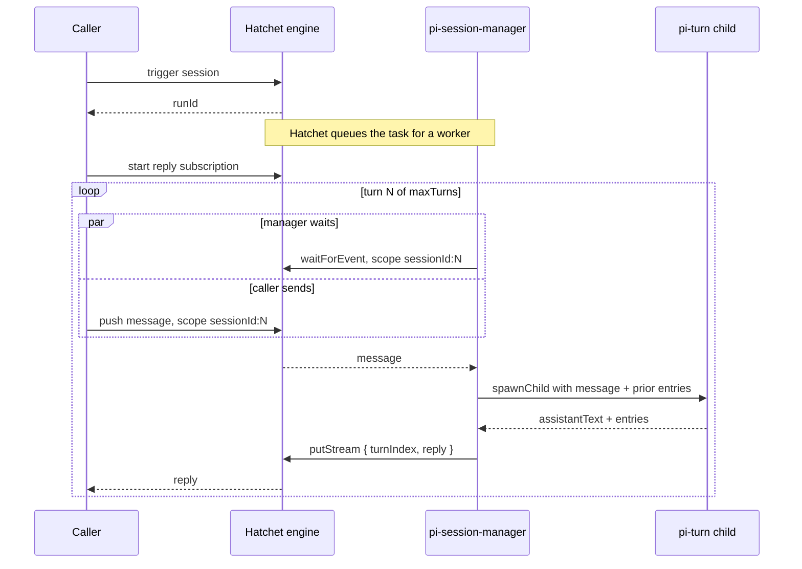

import { Callout } from "@/components/nextra-compat";
import { snippets } from "@/lib/generated/snippets";
import { Snippet } from "@/components/code";

# Durable multi-turn Pi agent sessions with Hatchet

Agent harnesses and durable workflow orchestration solve complementary problems. This cookbook will walk you through using the Pi agent harness in an event-driven, multi-turn conversation that asks an agent a few questions about the example's own source. In the example, Pi simplifies managing the agent's session history as well as the loop between the model and its tools, while Hatchet provides durable orchestration around each turn.

## What this example builds

The example builds a conversation with three turns. In the first two turns the agent is asked to inspect the [example's own source](https://github.com/hatchet-dev/hatchet/tree/main/sdks/typescript/src/v1/examples/pi_agent) and is also given a value to remember. In the third turn, the agent is asked to recall two facts from the previous source inspections as well as two values it was given to remember. The final turn demonstrates session continuity across task executions.

## Who owns what

Model provider SDKs already provide a great deal of abstraction and functionality. They allow you to do things such as send a conversation as a list of messages, receive structured tool requests in response, and stream the model's response as it is generated. Some providers even host conversation state or tools for you. So those capabilities by themselves are not why this example uses an agent harness like Pi.

Pi's responsibility in our example is the runtime around those primitives. It registers tools so the model can request to use them, executes tools that run locally such as the file tools this example uses, delivers the results back to the model, and continues the loop until the model produces a final response. Pi can also restore a session from a previous list of `SessionEntry` values and hand back an updated list after the turn. Of course, you could build the same application using a provider SDK directly, but then the loop between the model and its tools and session-history handling would become the application's explicit responsibility.

Hatchet owns the durable orchestration around the turns. A durable task running on a worker orchestrates the sequence of turns. It waits durably for user-message events and spawns a Pi turn as a child task when one is received. Each child constructs a new Pi session and runs one turn. Hatchet checkpoints the child's result and passes the returned Pi session state into the next turn.

Your application owns the rest, including creating the session, sending user messages, processing the results, and handling application failures.

## Architecture



At the session level, every iteration of the conversation follows the same four steps:

1. The session task waits for a user-message event scoped to the turn it expects
2. spawns one `pi-turn` child with that message and the entries from any previous turns
3. records the child's result
4. publishes the reply

It is important to understand that Pi does not stay running between turns. Session continuity comes from Hatchet's durable orchestration, which checkpoints each child's returned entries and passes them into the next child, where the Pi session is reconstructed from those entries.

## Setup

### Prepare your environment

- **Node 22.19.0 or newer**, which Pi 0.85.1 requires.
- **A running Hatchet engine and a client token**, as set up in the [Quickstart](/v1/quickstart).
- **`@earendil-works/pi-coding-agent` 0.85.1**, installed separately as described below.
- **The Zod 4 API**, already available in the TypeScript SDK workspace. The example imports `zod/v4`, which Zod 3.25 and later provide.
- **A model provider that Pi supports**, authenticated through Pi's [provider configuration](https://pi.dev/docs/latest/providers.md). The commands below use `openai-codex` and `gpt-5.5` because that is the combination this example was validated against. You can choose another provider and model supported by Pi by setting `PI_MODEL_PROVIDER` and `PI_MODEL_ID`, keeping in mind that this scenario expects the model to use file tools and to follow a strict response format.

Pi is not a dependency of the Hatchet TypeScript SDK, so install it in your checkout before running the example:

```bash
cd sdks/typescript
pnpm add -D @earendil-works/pi-coding-agent@0.85.1
```

This edits `package.json` and `pnpm-lock.yaml` in your checkout. Keep those changes local and do not commit them.

Pi ships as ESM, so run the worker and the caller with `tsx`. The SDK's default `ts-node` CommonJS runner cannot load Pi's package exports.

### Define the conversation scenario

All three prompts are defined in `messages.ts`. The first two ask the agent to read a file, remember a supplied value, and return the value of a named constant defined in that file:

<Snippet
  src={
    snippets.typescript.pi_agent.messages.ask_pi_to_inspect_the_example_source
  }
/>

The filenames and the names of the constants are included in the prompts, but not the source contents or the values of the constants. Both prompts provide explicit instructions for the agent to use its read-only file tools to discover those values. The intention is to exercise Pi's file tools. The third message tells the agent not to read any files and instead answer from the conversation alone by returning the values of the two named constants along with the two values it was asked to remember:

<Snippet
  src={
    snippets.typescript.pi_agent.messages
      .ask_pi_to_answer_from_session_history_alone
  }
/>

### Run one Pi turn

`piTurn` is declared as a regular [Hatchet task](/v1/tasks). Each invocation runs one Pi turn. Since a model turn can take longer than Hatchet's default task timeout, `piTurn` is configured with a longer [execution timeout](/v1/timeouts#task-level-timeouts). We will walk through its implementation in pieces, starting with the task declaration.

<Snippet src={snippets.typescript.pi_agent.turn.define_the_pi_turn_task} />

Since Pi ships as an ESM package, its runtime API is loaded with a dynamic `await import` inside the task. The task then resolves the configured provider and model, throwing an error if that model is not available to the worker.

<Snippet
  src={snippets.typescript.pi_agent.turn.load_pi_and_resolve_the_model}
/>

Before running the prompt, the task must construct a Pi session from `priorEntries` if there are some, or begin with an empty session otherwise. Pi associates a session with a working directory, so this example resolves that directory from `PI_WORKSPACE_DIR` or the current working directory of the worker process. Since this scenario only needs to read the example's source code, the session is created with a read-only tool set.

<Snippet
  src={snippets.typescript.pi_agent.turn.restore_and_create_the_pi_session}
/>

As the name suggests, `SessionManager.inMemory` maintains the session state in memory and does not write to disk. It also restores prior history from the supplied entries if there are any.

Finally, the turn runs one prompt and returns the updated history:

<Snippet
  src={snippets.typescript.pi_agent.turn.run_the_turn_and_return_its_entries}
/>

On success, the task returns the assistant text along with the updated session entries.

<Callout type="warning">
  `session.prompt(...)` does not throw when the provider fails. Instead, Pi
  records a provider failure as part of the final assistant message and includes
  a stop reason. Check if the stop reason is `error` or `aborted` and throw
  explicitly so Hatchet can treat the task as failed and apply any configured
  [retry policy](/v1/retry-policies).
</Callout>

<Callout type="info">
  Pi's `SessionEntry` type does not satisfy Hatchet's task input and output type
  constraint. Since the entries used by this example are JSON-serializable, the
  task casts the incoming entries to `SessionEntry[]` and the updated entries
  back to Hatchet's JSON type before returning them as part of the output.
</Callout>

<Callout type="info">
  If a Hatchet turn is retried, the whole Pi turn runs again, including its tool
  calls. That is why the `tools` option is explicitly set to `READ_ONLY_TOOLS`,
  which limits the set of tools available to the agent. Read-only tools avoid
  repeated workspace mutations, but keep in mind that filesystem state may
  change between reads.
</Callout>

### Orchestrate the durable session

`piSessionManager` is a [`hatchet.durableTask`](/v1/durable-tasks) that orchestrates the sequence of turns.

<Snippet
  src={snippets.typescript.pi_agent.manager.define_the_pi_session_manager}
/>

Each iteration begins by [waiting](/v1/durable-event-waits) for the user message scoped to that turn:

<Snippet
  src={snippets.typescript.pi_agent.manager.wait_for_the_next_user_message}
/>

When the message arrives, the manager [spawns](/v1/child-spawning) the `piTurn` child task and hands it the entries from any previous turns:

<Snippet src={snippets.typescript.pi_agent.manager.spawn_a_pi_turn} />

Finally, the manager [publishes](/v1/streaming#publishing-stream-events) the reply so the caller can process it before the next turn:

<Snippet src={snippets.typescript.pi_agent.manager.publish_the_turn_reply} />

<Callout type="info">
  Hatchet may [replay](/v1/durable-tasks#determinism-in-durable-tasks) durable
  task code when recovering a run. Since a Pi turn is nondeterministic, recovery
  of the parent should not invoke the model again when replaying successfully
  completed turns. By isolating Pi execution in a child task, Hatchet can reuse
  a completed child result instead. Since the child key is derived from the
  session id and the turn index, a replay will issue the same key and resolve to
  the same recorded result.
</Callout>

### Register the worker

Both tasks are registered with the same worker:

<Snippet src={snippets.typescript.pi_agent.worker.register_the_worker} />

### Drive the session from the caller

Every user message is a [Hatchet event](/v1/events#pushing-events-to-hatchet), with a scope that is uniquely identified by the session id and the turn it starts:

<Snippet src={snippets.typescript.pi_agent.run.send_a_user_message} />

The caller triggers the session, subscribes to a reply stream, and sends the first message. After that, it iterates over the reply stream, sending each subsequent message only after the reply that precedes it:

<Snippet src={snippets.typescript.pi_agent.run.drive_a_pi_session} />

`subscribeToStream(...)` returns an async iterator which begins the subscription when `replies.next()` is first invoked. The `turnIndex` in each reply is used by the caller to identify and ignore duplicate replies for the same turn.

<Callout type="info">
  The subscription is started before the first message is sent, because the
  reply stream has no replay and a reply published with no subscriber attached
  is lost.
</Callout>

### Test it

Before running the example, make sure your Hatchet instance is running and `HATCHET_CLIENT_TOKEN` is available in both the worker and caller environments. Then, start the worker from `sdks/typescript`, with `PI_WORKSPACE_DIR` set to the example directory:

```bash
cd sdks/typescript
PI_WORKSPACE_DIR=$(pwd)/src/v1/examples/pi_agent \
  pnpm exec tsx -r tsconfig-paths/register src/v1/examples/pi_agent/worker.ts
```

Although `PI_WORKSPACE_DIR` is optional and will default to the current working directory if left unset, it is best to set it for this example. That is because the prompt's instructions include reading files which Pi will resolve from its workspace. The copy under `examples/typescript/pi_agent` is a generated documentation mirror and not a runnable project, so don't set the workspace to the examples path.

In a second terminal, run the caller:

```bash
cd sdks/typescript
PI_MODEL_PROVIDER=openai-codex PI_MODEL_ID=gpt-5.5 \
  pnpm exec tsx -r tsconfig-paths/register src/v1/examples/pi_agent/run.ts
```

Each turn's reply is printed once received, and the last one includes all four values:

```text
Started Pi session run: ...
Turn 1 reply: ...
Turn 2 reply: ...
Turn 3 reply: 5m Wintergreen pi-session:user-message 4471
```

The integration test runs the same scenario and asserts the final reply:

```bash
cd sdks/typescript
PI_MODEL_PROVIDER=openai-codex PI_MODEL_ID=gpt-5.5 \
  pnpm run test:e2e -- --testPathPattern "pi_agent/pi_agent.e2e.ts"
```

## What makes the session durable

Three mechanisms do the work:

- The session task's `ctx.spawnChild` result is checkpointed, which allows a replay to reuse the recorded turn instead of re-running the model.
- `ctx.waitForEvent` lets the task wait between messages without holding a worker slot in a running function.
- The entries returned by each child become the input to the next turn, which allows the conversation state to survive across separate task executions.

## Production considerations

This example is intentionally simple so that it remains easy to reason about. Before implementing a similar pattern for production, there are a few behaviors to account for.

Hatchet publishes stream chunks as non-persistent fanout, so a chunk published while no subscriber is registered is missed. If the caller misses a reply before the end of the conversation, it never sends the next message and `piSessionManager` waits for the next event until its execution timeout. If it misses the final reply, the session still completes and `finalAssistantText` remains available in the session output.

Completed child turns remain queryable through [`hatchet.runs.list`](/reference/typescript/feature-clients/runs#list), so an application can reconcile after a missed reply. Each child includes `sessionId` and `turnIndex` as additional metadata. Since filters on additional metadata are combined with OR, you should first filter by `sessionId` and then select the desired turn on the client. For more information, see the [filters documentation](/v1/additional-metadata#filtering-semantics).

In this example, the caller's `handledTurns` `Set` prevents it from acting more than once on replies for the same turn. The set does not persist across restarts, and simply persisting it is not enough to make recovery reliable. A crash between recording a turn as handled and sending the next message can lose that message, while a crash between sending the message and recording the turn can repeat it. Event pushes also carry no idempotency key, so the application must prevent or reconcile duplicate messages sent to the same scope.

Here is the takeaway: a production application should persist enough application state to reconcile completed turns, deduplicate on restarts, and make message delivery safe to repeat.

## Scaling session state

While [Pi compaction](https://pi.dev/docs/latest/compaction#compaction) bounds the context sent to the model, it does not shrink what `getEntries()` returns. `getEntries()` returns the whole Pi session history, and it grows every turn. If history grows roughly linearly with turn count, carrying all of it on every turn makes aggregate transport and persistence have approximately quadratic growth. One strategy to improve this for long or high-volume sessions is to keep the entries in external storage and pass only the current snapshot reference through Hatchet:

```text
prior snapshot reference
  -> child loads that snapshot
  -> child runs one prompt
  -> child writes a new immutable snapshot
  -> child returns the new reference
  -> session task checkpoints that reference
  -> next child loads that exact snapshot
```

Once Hatchet checkpoints a snapshot reference, that reference must keep identifying the same state. Never overwrite a published snapshot. Content-addressed storage satisfies this and should return the same reference for identical bytes.

## Next steps

- [Hatchet Agent Tools](/cookbooks/hatchet-and-mcp): the other direction, exposing Hatchet tasks and workflows as tools an agent can call.
- [Durable execution](/v1/durable-execution): the guarantees and assumptions behind the durable session in this example.
- [Pi SDK](https://pi.dev/docs/latest/sdk.md): the harness embedded here.
