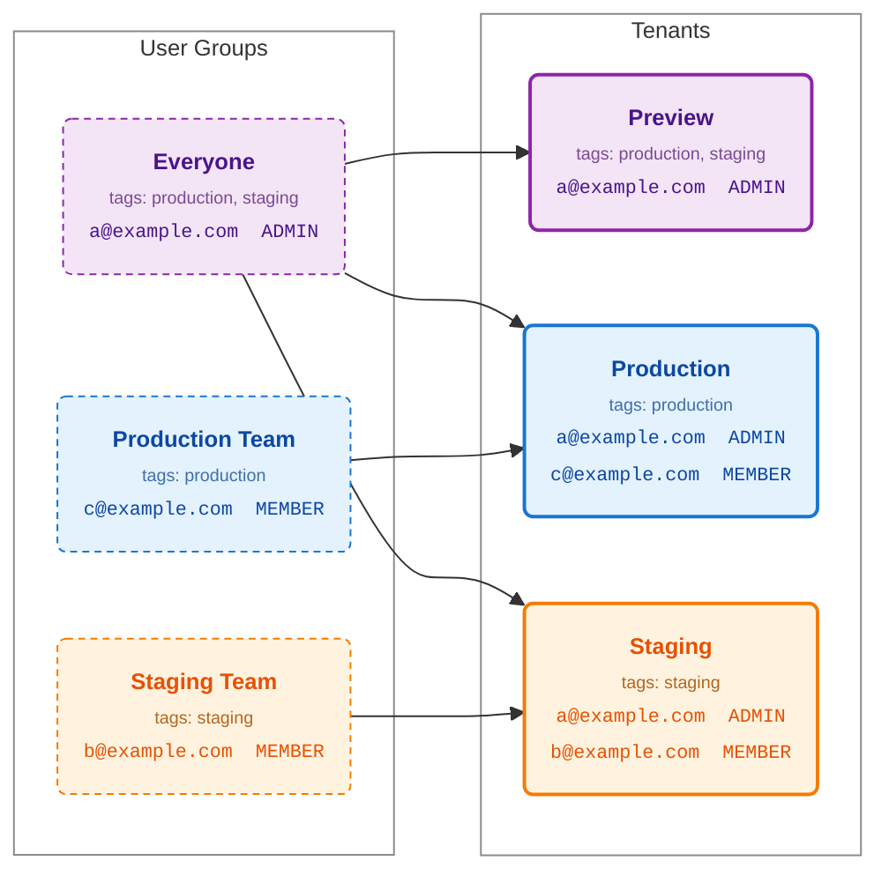

import { Callout, Card, Cards, Steps, Tabs } from "@/components/nextra-compat";

# User Groups

<Callout type="info">
  User Groups are only available through our Cloud Scale plan. See
  [pricing](https://hatchet.run/pricing) for more details.
</Callout>

User groups make granting automatic access to tenants within an organization easier.

### Creating a user group

Navigate to Settings > Team, then click on the New Group button.

<figure style={{ margin: "2rem auto", maxWidth: "100%", textAlign: "center" }}>
  
</figure>

In the modal, input the name for the group, the [tenant role](/v1/user-roles) that users synced with that group will have, and tags to determine which tenant the user group will be synced to. Groups can also restrict [payload visibility](/v1/user-roles#payload-visibility) for their members; if a user matches multiple groups, the most restrictive group wins.

<figure style={{ margin: "2rem auto", maxWidth: "50%", textAlign: "center" }}>
  
</figure>

### Adding tags to tenants

Navigate to the tenants page in Settings, and select "Edit tags" from the dropdown for a tenant.

<figure style={{ margin: "2rem auto", maxWidth: "100%", textAlign: "center" }}>
  
</figure>

Add the desired tags.

<figure style={{ margin: "2rem auto", maxWidth: "50%", textAlign: "center" }}>
  
</figure>

Tags can also be set when creating a new tenant.

<figure style={{ margin: "2rem auto", maxWidth: "50%", textAlign: "center" }}>
  
</figure>

## Tag Syncing

User groups work by automatically granting access for the users inside the group to tenants that have a _subset_
of the user group's tags. The diagram below shows an example tenant-user group setup. Three tenants — "Preview" (tagged `production` and `staging`), "Production" (tagged
`production`), and "Staging" (tagged `staging`) — alongside three user groups with the same tag combinations. Each
tenant lists the users who are synced into it automatically, based on which groups' tags are a superset of its own:

## Organization Owners

Organization owners are exempt from the tag-syncing roles, they are added to every tenant in the organization with role "OWNER".
