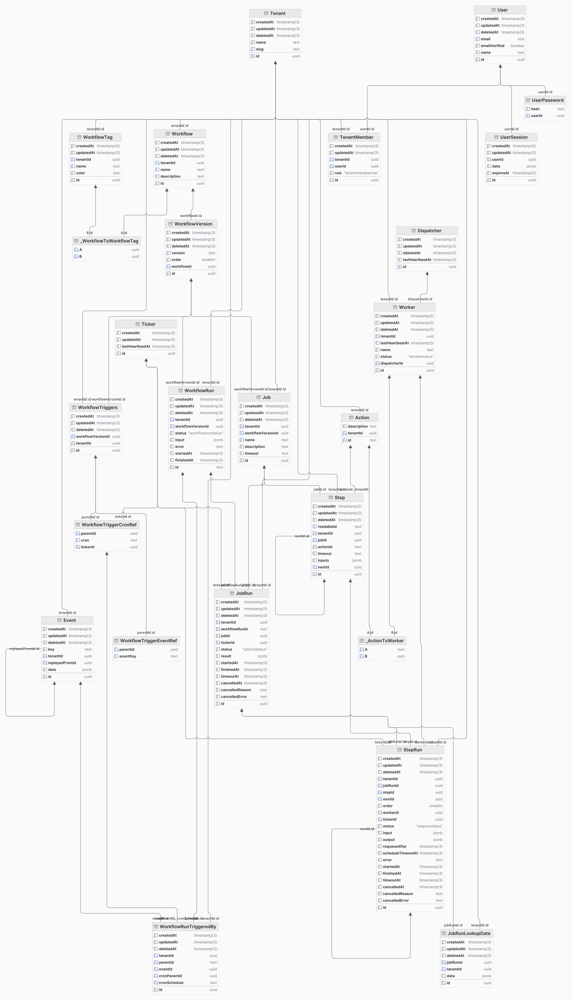

import { Callout } from "nextra/components";

# Migrating to sqlc for better performance

<div className="w-full pb-4 mx-auto border-b shadow-md flex flex-row justify-between items-center mt-10">
  <h5 className="text-xl font-bold tracking-tight text-foreground">
    Alexander Belanger
  </h5>
  <p className="font-light text-foreground">Published on November 11, 2024</p>
</div>

This week, we're removing [Prisma](https://www.prisma.io/) entirely from Hatchet's codebase. Given the recent [launch of Prisma Postgres](https://www.prisma.io/blog/announcing-prisma-postgres-early-access), which was accompanied by several interesting discussions about ORMs and Prisma's features more generally, I wanted to give our perspective on building our MVP with Prisma, scaling it to hundreds of queries/second, and eventually moving off of Prisma in favor of [sqlc](https://sqlc.dev/).

## Background

Hatchet is a computing service focused entirely on async tasks. It acts as a drop-in replacement for most queueing systems, with a primary differentiator being that the queue is built in Postgres. Much of our time is spent optimizing the queue for latency and throughput — which begs the question, why did we start with an ORM, which often break down in favor of raw SQL when performance is involved? [[1]](#1)

In my view, ORMs do three things:

1. Generate strong types for database models
2. Provide a wrapper for executing queries in a framework that integrates well with your language of choice (in our case, Go)
3. Providing a mechanism to manage a database schema (and as an extension, a mechanism to generate and execute migrations)

Using a good ORM can make prototyping and API design significantly easier, while also preserving proper type safety for models and queries. As someone who's used two of Go's most popular ORMs — [gorm](https://gorm.io/) and [ent](https://entgo.io/) — in the past, modeling schemas in Go code has always been painful, with many of the database-specific features encoded into Go tags which lack type safety and can generate unpredictable database schemas.

That's why, when playing around with Remix for a side project, I immediately fell in love with the Prisma schema — a declarative DSL that feels more intuitive and less verbose than raw SQL, with nice syntax tooling and integrations, like the [Prisma VSCode extension](https://marketplace.visualstudio.com/items?itemName=Prisma.prisma) and [Prisma Studio](https://www.prisma.io/studio).

Along the way, I discovered [`prisma-client-go`](https://github.com/steebchen/prisma-client-go) , and started playing around with using this for a couple of Go projects, and eventually Hatchet.

## The MVP

The early days of Hatchet were extremely productive — most of Hatchet's initial features were built in a month between December 1st and January 1st — in no small part due to Prisma.

### The good

#### Modeling complex object hierarchies

Prisma's DSL really shines when dealing with a set of interconnected and hierarchal tables. And while our initial schema was far from perfect, the overall structure hasn't changed since the early days of Hatchet. The most productive part of working with Prisma in the early days was being able to add new tables instantly, with built-in validation and helpers on the Prisma syntax level. Our initial schema was quite complex, but easy to work with in Prisma. Here's what our full ER diagram looked like:



For those curious, here's a link to our Prisma schema in our [first commit](https://github.com/hatchet-dev/hatchet/blob/366c79441d9260e63c24727743c3a5271cf239f4/prisma/schema.prisma)!

#### Prisma Studio

A good chunk of our time while building the initial MVP was spent in Prisma Studio, manually preparing different types of workflows and ensuring that they ran to completion with various configuration options. We also hooked up a studio instance to our staging database, which was helpful in debugging issues that we didn't see in development.

Eventually, Prisma studio became far too slow on fields with many high-cardinality relations (like our `Tenant` model), and we started exploring other data visualization tools.

#### Composite Keys and Relations

We make pretty heavy use of composite keys and relations in our system — for example, the function that each task runs in our system is represented by an `actionId`, which is simply a method name that's unique per tenant:

```txt
model Action {
  actionId String

  tenant   Tenant @relation(fields: [tenantId], references: [id], onDelete: Cascade, onUpdate: Cascade)
  tenantId String @db.Uuid

  @@unique([tenantId, actionId])
}
```

This can be referenced via:

```txt
model Step {
  action   Action @relation(fields: [actionId, tenantId], references: [actionId, tenantId])

  actionId String
  tenantId String @db.Uuid
}
```

We also have a handful of composite primary keys, such as:

```txt
model StepExpression {
  key        String
  stepId     String             @db.Uuid
  expression String
  kind       StepExpressionKind

  @@id([key, stepId, kind])
}
```

We found these simple and pleasant to write and use in the generated clients.

#### One-many, many-many relations

One-many relations are easy to write — we made heavy use of this in our `Tenant` table:

```txt
model Tenant {
  steps     Step[]
  actions   Action[]
}
```

Many-many relations are just as easy, simply declaring a corresponding array on the other side of the relation. For example, each worker can run many actions, a relation which results in a generated schema with a relation helper table:

```sql
CREATE TABLE "_ActionToWorker" (
    "B" UUID NOT NULL,
    "A" UUID NOT NULL
);
```

### The bad

#### Cancelling queries

Most of the queries in our system need to be cancellable, or at least need to time out after a certain duration. However, this isn't supported in Prisma:

[https://github.com/prisma/prisma/issues/15594](https://github.com/prisma/prisma/issues/15594)

Our temporary fix was to set a `statement_timeout` on some of our critical tables to avoid queries from piling up.

(Why is this even necessary? In many cases, these were simply non-optimized read queries that were running for several minutes without proper indices in place which saturated our connection pool or database resources. In other cases, these were pathological queries which blocked or deadlocked for reasons unknown to us, as we weren't in charge of the final query result)

#### Mandatory one-to-one relations

With several of our tables, we require a mandatory one-to-one relationship, which isn't possible to model in Prisma. For example, this schema:

```txt
model User {
  id       Int    @id @default(autoincrement())
  profile  Profile @relation(fields: [profileId], references: [id])
  profileId Int    @unique
}

model Profile {
  id     Int    @id @default(autoincrement())
  user   User   @relation(fields: [userId], references: [id])
  userId Int    @unique
}
```

Will throw an error `Error parsing attribute "@relation": The relation fields user on Model Profile and profile on Model User both provide the references argument in the @relation attribute`. The solution is to make one side of the relation optional, i.e. `user User?` on the `Profile` model.

Several Github issue answers reference being [unable to enforce this constraint at the database level](https://github.com/prisma/prisma/discussions/12866), which may be true across all supported databases, but would be possible in our case with the use of `deferrable initially deferred`:

```sql
CREATE TABLE users (
    id SERIAL PRIMARY KEY,
    profile_id INT UNIQUE
);

CREATE TABLE profiles (
    id SERIAL PRIMARY KEY,
    user_id INT UNIQUE,
    CONSTRAINT fk_user FOREIGN KEY (user_id) REFERENCES users(id) DEFERRABLE INITIALLY DEFERRED
);

ALTER TABLE users
ADD CONSTRAINT fk_profile FOREIGN KEY (profile_id) REFERENCES profiles(id) DEFERRABLE INITIALLY DEFERRED;

BEGIN;

-- Insert into both tables in a single transaction
WITH new_profile AS (
    INSERT INTO profiles DEFAULT VALUES RETURNING id
)
INSERT INTO users (profile_id)
VALUES ((SELECT id FROM new_profile));

-- Link the profile to the user
UPDATE profiles
SET user_id = (SELECT id FROM users WHERE profile_id = profiles.id);

COMMIT;
```

While this isn't a show-stopper, it places more of a burden on the application to ensure that one side of the relation isn't accidentally null.

#### `CREATE INDEX CONCURRENTLY`

At this point, some of our tables had grown to millions of rows, and we started to notice increased latency in our UI. To resolve this, we added a set of indices for filtering our primary `WorkflowRun` table which much of our monitoring is built around. Our indices on Prisma at the time looked something like the following:

```sql
@@index([tenantId])
@@index([workflowVersionId])
@@index([createdAt])
```

At this point, we had databases with 10s of millions of workflow runs, so running `CREATE INDEX` on this table could have resulted in hours of maintenance time. So we switched these to `CREATE INDEX CONCURRENTLY` in our migration files. This resulted in errors like `ERROR: CREATE INDEX CONCURRENTLY cannot run inside a transaction block`:

[https://github.com/prisma/prisma/issues/14456](https://github.com/prisma/prisma/issues/14456)

We ended up applying these manually.

#### (Initial) lack of joins

As you can probably tell from our schema, we do a lot of joins across tables, which wasn't supported by Prisma when we first started (instead, Prisma would split selects across tables into individual queries which were joined in-memory on the Prisma engine). And while Prisma recently added the option to use joins by default, they still aren't used by all queries from the engine.

In addition to joins not being utilized in all queries, there were some concerning [Github discussions](https://github.com/prisma/prisma/discussions/12715#discussioncomment-6993365) about the lack of transactional integrity across the multiple read queries when selecting from multiple tables.

#### Latency in acquiring a connection

We observed extremely high latency (>300ms) in acquiring a new connection from Prisma despite query execution being relatively fast. This occurred even with plenty of idle connections available in Postgres and a high connection limit with adequate resources on the database. This was particularly difficult to debug (we only saw the high connection latency when turning on Prisma debug logs), and was one of the primary reasons we started to question using Prisma in production.

### The raw numbers

What could the initial Hatchet MVP do, throughput-wise? After a month of working on the MVP, we could do about 30 tasks/second with a latency of ~100ms/task. Looking back, these were low numbers, but the priority at the time wasn't throughput or latency.

## Scaling, Part 1

As we started to get higher throughput (> 100 tasks/second) demands from users — including users that wanted to push hundreds of thousands of tasks at once and process them over the course of several hours on their workers — we started to send more raw queries through Prisma. While it was easy to define a return object for the raw queries, we started to lose out on some query safety as raw queries weren't type-checked before runtime. Additionally, the connection issues mentioned above started to become more common, leading to unexpected, hard-to-replicate latency spikes.

We started searching for a suitable alternative — one which still provides the benefits of an ORM (schema → model type safety, executing queries without manual type-casts, schema management), but also gives us full control over the underlying Postgres queries. This is a difficult requirement for an ORM — most ORMs act as a layer of abstraction over the queries, only providing a subset of SQL's functionality, with an unsafe option to execute raw SQL.

Enter [sqlc](https://sqlc.dev/). Traditional ORMs convert language (or DSL)-specific code into raw SQL, but `sqlc` takes the opposite approach: it generates types and methods for an existing set of queries and schema. So the following schema and queries:

```sql
CREATE TABLE axes (
  id   BIGSERIAL PRIMARY KEY,
  name text      NOT NULL,
  description text
);

-- name: GetAxe :one
SELECT * FROM axes
WHERE id = $1 LIMIT 1;

-- name: ListAxes :many
SELECT * FROM axes
ORDER BY name;
```

Are now fully type-safe and callable via:

```go
insertedAxe, _ := queries.CreateAxe(ctx, tutorial.CreateAxeParams{
	Name:        "hatchet",
	Description: pgtype.Text{String: "A small axe suitable for one-handed use, (not to be confused with https://hatchet.run)", Valid: true},
})

fetchedAxe, _ := queries.GetAxe(ctx, insertedAxe.ID)
```

While we were changing our query strategy, we also wanted to use a more powerful migration tool to manage schema migrations without needing to apply tricky migrations manually. We explored a few different options before landing on [`atlas`](https://atlasgo.io/) .

But we still had a problem: we had hundreds of queries written in Prisma, and we had quite a daunting task of migrating every query to sqlc without any errors. We briefly considered logging every existing query, parsing and grouping them by table, and then generating sqlc files for each group of queries — but this seemed too unstable, and the raw Prisma queries weren't very readable.

So we took a more incremental approach: using [`prisma migrate diff`](https://www.prisma.io/docs/orm/reference/prisma-cli-reference#migrate-diff) , we generated the schema that `sqlc` would use, copied every Prisma migration file into a format that Atlas could use as an existing migration, and with a simple script we switched over to atlas for migrations:

```sh
MIGRATION_NAME=$(psql "$DATABASE_URL" -t -c "SELECT migration_name FROM _prisma_migrations ORDER BY started_at DESC LIMIT 1;" 2>/dev/null | xargs)
MIGRATION_NAME=$(echo $MIGRATION_NAME | cut -d'_' -f1)

echo "Migration name: $MIGRATION_NAME"

if [ $? -eq 0 ] && [ -n "$MIGRATION_NAME" ]; then
  echo "Using existing prisma migration: $MIGRATION_NAME"

  atlas migrate apply \
    --url "$DATABASE_URL" \
    --baseline "$MIGRATION_NAME" \
    --dir "file://sql/migrations"
else
  echo "No prisma migration found. Applying migrations via atlas..."

  atlas migrate apply \
    --url "$DATABASE_URL" \
    --dir "file://sql/migrations"
fi
```

(we could have kept using Prisma for migrations, and this was tempting, but we still had issues with `CREATE INDEX CONCURRENTLY` that were easy to solve with atlas)

This way, we kept using the Prisma schema as the source of truth, generating a `schema.sql` file from the Prisma DSL, and used atlas for migrations in production, thereby preventing the Prisma engine from impacting anything critical. Additionally, this allowed us to only migrate queries on the critical path, and keep using the generated Prisma client for low-volume tables that didn't need any optimization. The downside is that we had a convoluted process for generating migrations which caused a few headaches during development.

Note that using the Prisma DSL as the source of truth assumes that Prisma supports everything that we'd want to change on the database level, which eventually it didn't. The first breaking point was partial indexes: we finally reached the amount of volume on our databases where partial indexes made sense to reduce index writes, but this wasn't supported in our Prisma schema. The fix here was simple — we simply concatenated an additional `.sql` file that stored our partial indexes with our auto-generated `schema.sql` file. We unfortunately now had two sources of the database schema, but as long as the additional `.sql` file was updated infrequently and only inserted resources that Prisma wasn't trying to change, this still worked well.

At this point, after 7 months of working on the queue, we could reliably do about 1k tasks/second with a latency of 50ms/task (on a suitable DB instance).

## Scaling, Part 2

We hit a breaking point with Prisma about a month ago, where we had to support bursting to over 2k tasks/second on a single queue [[2]](#2). This is a challenging number to hit: while we describe Hatchet as a queue, it's a little more complicated than that:

1. We manage the **lifecycle of a task** — like cancelling the task or marking it as failed or succeeded — with the benefits of transactional integrity and MVCC. In other words, tasks are implemented as a state machine with transitions protected by transactional guarantees, so you can't have concurrent transitions to both a cancelling and failed state, for example, or spawn a child task with a unique key at the same time as another child task.
2. Hatchet uses a **push-based queueing model** — choosing which workers to send tasks too — instead of workers pulling tasks off of the queue. We do this for a number of reasons, such as supporting scheduling parameters that require tracking a global state, like worker affinity.
3. We centrally manage **concurrency on tasks and workers**. This means that we track each function running on a worker to prevent over-assignment.

So for Hatchet to “queue” at 2k/s, not only do we have to pull items off of the queue and enqueue them at 2k/s (the easier part), we also have to update the task statuses, release slots on the workers, write results and error logs to the task tables, and check for uniqueness conditions at a rate of 2k/s.

So we put our optimization hats on, and came up with four approaches that seemed promising for optimizing our Postgres queries [[3]](#3):

1. Partition busy task tables into a “running” state versus a “final” state — the former being rapidly updated as the task is running, the latter being used for reporting but very infrequently updated.
2. Switching lingering UUID columns to identity columns or lexicographically sequential IDs
3. Offloading the writes of task events (which are used in the UI for user monitoring and debugging) to a separate table backed by a more suitable database like TimescaleDB
4. Removing several foreign key references and ensuring data integrity for a handful of relations on the application layer

Unfortunately, the first three of these optimizations aren't compatible with Prisma — it doesn't natively support [table partitioning](https://github.com/prisma/prisma/issues/1708), [identity columns](https://github.com/prisma/prisma/issues/4693), or [TimescaleDB](https://github.com/prisma/prisma/issues/3228).

And unlike the partial indexes example above, the schema generated from Prisma directly conflicts with the changes that we'd make to enable these optimizations. Even if they didn't, we'd now have two very different sources of truth for our schema, which would slow us down during development and increase the risk of a production incident.

So, for the upcoming Hatchet release, we're migrating fully off of Prisma in favor of `sqlc` and `atlas`.

## Conclusion

Hopefully this article helped those of you exploring Prisma, or wondering how far it'll take you as you start to scale. If our system wasn't so read and write heavy, we would have been able to keep using it for much longer than a year.

And a big kudos to Prisma for supporting `prisma migrate diff` and making the underlying, generating schema ejectable. This made us more confident in adopting Prisma in the beginning, and took us much further than we would have gotten with a traditional ORM.

## Footnotes

<div id="1" className="my-6">
  [1] Another reason we weren't initially focused on throughput or latency is
  that Hatchet wasn't originally built as a queue in the traditional sense. The
  idea was to build a workflow engine resembling Github actions, but with
  actions that could run with actions defined in user code. And the initial
  use-case was to provide an simple, declarative API that application workflows
  could use to run complex tasks. There is a great deal of overlap between the
  Hatchet MVP and the current Hatchet service, but it took us several iterations
  to realize that the valuable part that we're replacing is a queue, and queues
  are traditionally very high throughput and low latency.
</div>

<div id="2" className="my-6">
  [2] We were previously able to do about 3k/second _per tenant_, but had to
  re-architect so that each queue on each tenant ran as a separate thread. This
  is more difficult than it seems, because workers can subscribe to many queues
  but have a concurrency control mechanism known as `slots`, which limits the
  number of concurrently executing functions on a given worker.
</div>

<div id="3" className="my-6">
[3] This will likely be the subject of a future blog post, and isn't relevant for the discussion above, but for those curious, the performance benefits from these four items are:

1. **Partition busy task tables into a “running” state versus a “final” state — the former being rapidly updated as the task is running, the latter being used for reporting but very infrequently updated.**
   - **Reasoning:** a task updates between states in its lifecycle extremely quickly until it enters a final state, which causes table bloat on the task table. The idea here is to use a separate table for running tasks with a low fill_factor (to get HOT updates) that is also autovacuumed very aggressively to reduce bloat.
2. **Switching lingering UUID v4 columns to identity columns**
   - **Reasoning:** Using UUID v4 IDs aggressively was also an early mistake on many of these tables. The reasoning was to support consistency over the API, with each API resource containing the following metadata fields:
     ```tsx
     {
       "createdAt": Datetime,
       "updatedAt": Datetime,
       "id": UUID
     }
     ```
     However, the downside of UUID v4 IDs is that index-only scans will suffer and tables will bloat due to IDs being randomly scattered across pages of the index and visibility maps.
3. Offloading the writes of task events (which are only used in the UI for debugging) to a separate, optional table backed by TimescaleDB
   - **Reasoning:** this table accounts for 60% of the writes on the database, and while queries are usually fast and performant, these writes aren't necessary for the proper functioning of the queue.
4. Removing several foreign key references and ensuring data integrity for a handful of relations on the application layer
   - **Reasoning:** several of our load-testing databases had at some point entered a fatal state due to `multixact members limit exceeded`, which was new to us. The cause of this is likely that each table had a FK constraint to the `Tenant` table, and removing these FK constraints seemed to fix the issue.

</div>
