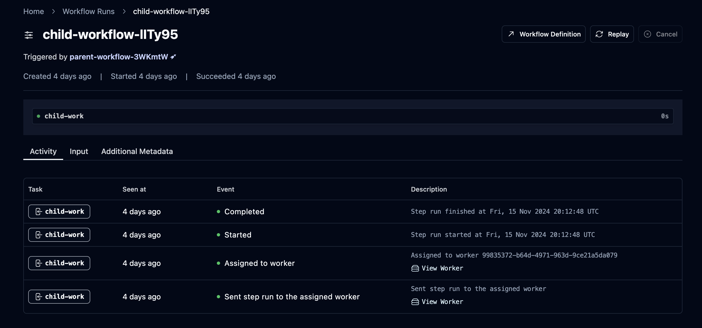

import { Callout } from "nextra/components";

# Use Postgres for your events table

<div className="w-full pb-4 mx-auto border-b shadow-md flex flex-row justify-between items-center mt-10">
  <h5 className="text-xl font-bold tracking-tight text-foreground">
    Alexander Belanger
  </h5>
  <p className="font-light text-foreground">Published on November 20, 2024</p>
</div>

If you've reached any modicum of usage with a SaaS product, you've probably been required to implement an events table. This requirement can come in several forms, for example:

1. Can you provide status updates for more visibility?
2. Can you implement an audit log for security?
3. Can you provide aggregate metrics to give an overview of activity?

These are typically backed by time-series data, segmented by some kind of resource id, along with additional stored metadata.

One trend that I've observed in recent startups — likely due to the explosion of open-source time-series databases — is the tendency to adopt a specialized OLAP stack like Kafka + Clickhouse much earlier than necessary to index and store billions of events.

You can just use Postgres, probably for longer than you think. Here's how.

<Callout type="info" emoji="🪓">

For those who would like to dive deeper into code or view full query examples that you can use in your application, check out the `pg-events` Github repo [here](https://github.com/abelanger5/postgres-events-table).

</Callout>

## What's the use-case?

There are lots of reasons to store events in your system — in this post, I'd like to focus on the three common use-cases that we've recently seen while building [Hatchet](https://hatchet.run):

- [Exposing state transitions to users](#state-transitions) - used in our system to provide a timeline of events for a task.
- [Aggregates](#aggregate-data) - used for tracking the percentage of succeeded/failed tasks over time.
- [Log data](#logs) - used for storing logs for debugging and auditing purposes.

For each use-case and example events table, I've documented common pitfalls and some strategies for scaling these events under higher load.

## State transitions

### Overview

We'll start with the simplest type of event: state transitions. These events represent a history of state changes to a set of resources. Some common patterns are:

- **Resource history** — for example, a Github PR will contain a linear feed of commits and events relating to the PR itself, like approving reviews or comments.
- **Notifications —** each notification is an event which belongs to a single user, tracking some kind of event or update within the system.
- **Package tracking events**, like those used in e-commerce and delivery systems

In our case, for every `StepRun` (the equivalent of a task in Hatchet), we store a series of events that provide timing information about state transitions of the task to the end developer. This looks something like:



Given that we're a Postgres-backed task queue, with a primary selling point being that you can get a powerful task queue simply by connecting to a Postgres DB, we didn't want to add an additional dependency for such a core feature.

### The first events table

So we began, like [many companies do](https://brandur.org/fragments/events), by tossing this data into a basic events table, with a simplified structure looking something like:

```sql
CREATE TABLE simple_events (
    id BIGSERIAL NOT NULL,
    created_at TIMESTAMPTZ,
    tenant_id UUID NOT NULL,
    resource_id UUID NOT NULL,
    data JSONB,
    PRIMARY KEY (id)
);

CREATE INDEX ON simple_events (tenant_id, resource_id);
```

Note the single index on `(tenant_id, resource_id)` — we don't want too many indexes so we can reduce the write overhead on this query. To query this, simply query by the resource ID and tenant ID, ordered by the primary key:

```sql
SELECT *
FROM simple_events
WHERE resource_id = $1 AND tenant_id = $2
ORDER BY id ASC;
```

The key here is to use as few indexes as possible, enforce a retention policy on the events, and use an auto-incrementing primary key.

### Scaling event writes

Once you start doing a very high write volume of events, you'll eventually start exhausting connections and database resources on simply writing events. At this point, you should start doing bulk inserts into your events table. This can be tricky — events typically come in asynchronously, so supporting buffered writes involves pushing to some kind of buffer or queue. At Hatchet, we've open-sourced our buffer implementation that we use internally for this exact purpose: [buffered](https://github.com/hatchet-dev/buffered) (we're very creative in naming our packages).

Buffers can be a tricky balance — you don't want buffers to be too small, otherwise you start to lose the benefits of buffered inserts. You also don't want buffers in memory for too long, otherwise you risk exhausting the memory in your system, dropping events, and graceful termination becomes more difficult. Our buffer implementation accepts three parameters for tuning a buffer:

1. A maximum number of items in the buffer
2. A maximum size of the buffer, computed by a size function for each item
3. A maximum amount of time an item can spend in the buffer

There are other small tricks in this package, like setting a concurrency limit on the number of concurrently flushing buffers to put backpressure on heavy writers, and we've been playing around with dynamic buffer resizing based on the number of concurrent writers.

How far can this get you? I've written a simple utility called `pg-events` which uses buffered inserts against a specific number of tenants and resource IDs (you can also run this utility with different parameters — see the docs [here](https://github.com/abelanger5/postgres-events-table?tab=readme-ov-file#pg-events-simple)).

Let's take an example of 10 tenants with 100k resource IDs per tenant and 10 events per tenant and resource tuple — that's 10 million rows:

```bash
pg-events simple -t 10 -r 100000 -c 10
```

What does timing look like for querying a random `(resource_id, tenant_id)`? Using a basic random sampling strategy across 1000 samples, we get an average latency of:

```txt
$ pg-events simple query
query samples: 1000
elapsed time: 469.678042ms
average time per query: 469.678µs
```

So, even with a large number of events, we still get performant list queries on single resource IDs!

At Hatchet, our step run events table on our largest database is currently at billions of rows with an p90 latency of 100 milliseconds.

## Aggregate data

### Overview

Aggregate event data is perhaps the most difficult type of data to support, because it's extremely sensitive to small variations in use-case. For example, adding support for new filters on existing aggregate data can lead to re-indexing potentially terabytes of data.

Note that Postgres is not a good fit if you need to construct arbitrary aggregate queries which are either ad-hoc or user-defined. If you need true OLAP at scale, check out [Clickhouse](https://clickhouse.com/), or if you want something with less overhead, [DuckDB](https://duckdb.org/).

In our case, we didn't need true OLAP — we just needed to provide an overview of which tasks had succeeded and failed in Hatchet, and allow users to get a birds-eye view of the health of the system:

<video controls preload="auto" className="w-full my-8">
  <source src="/monitoring-demo.mp4" type="video/mp4" />
</video>

To implement this, we explored a few different options, like using `PARTITION BY RANGE` to compute metrics for different buckets of time, and then storing results for each bucket in an aggregate view.

But there's a much simpler approach — using [TimescaleDB](https://github.com/timescale/timescaledb). If you're not familiar with Timescale, it's a Postgres extension designed for time-series data. You interact with a single table — called a hypertable in Timescale lingo — which represents a set of chunks of your data backed by different tables. These hypertables support all Postgres queries, indexes, and partitioning by additional keys (”spatial” parameters).

### The metrics table

In our case, we store a new event in a hypertable for each final state of a task — this gives us total counts of succeeded and failed events, partitioned by time. Here's a simplified model of our `metric_events` table:

```sql
 CREATE TYPE metric_event_type AS ENUM ('SUCCEEDED', 'FAILED');

 CREATE TABLE metric_events (
    id BIGSERIAL NOT NULL,
    created_at TIMESTAMPTZ NOT NULL,
    tenant_id UUID NOT NULL,
    resource_id UUID NOT NULL,
    event_type metric_event_type NOT NULL,
    data JSONB,
    CONSTRAINT metric_events_pkey PRIMARY KEY (id, created_at)
);

SELECT create_hypertable('metric_events', by_range('created_at'));
```

Since Timescale is a Postgres extension, you interact with all Timescale objects via Postgres functions.

We then create a new Timescale hypertable called a _continuous aggregate_. This is similar to a materialized view, but instead of rebuilding the materialized view every time new data comes into the system, Timescale handles updating and keeping this view in sync in the background. For this use-case, we'd like to store aggregate metrics for each bucket of time in 1 minute increments:

```sql
CREATE MATERIALIZED VIEW metric_events_summary
   WITH (timescaledb.continuous)
   AS
      SELECT
        time_bucket('1 minute', created_at) AS minute,
        tenant_id,
        resource_id,
        COUNT(*) FILTER (WHERE event_type = 'SUCCEEDED') AS succeeded_count,
        COUNT(*) FILTER (WHERE event_type = 'FAILED') AS failed_count
      FROM metric_events
      GROUP BY minute, tenant_id, resource_id
      ORDER BY minute;

CREATE INDEX metric_events_summary__tenantId_resourceId_minute_idx ON metric_events_summary (tenant_id, resource_id, minute);
```

After we insert some data, we can simply query this materialized view as we would a normal Postgres table — for example, this query:

```sql
SELECT
    time_bucket('1 hour', minute) as bucket,
    SUM(succeeded_count)::int as succeeded_count,
    SUM(failed_count)::int as failed_count
FROM
    metric_events_summary
WHERE
    tenant_id = '95e0aaaf-5f81-4b80-b5f4-5e398749ef7c' AND
    resource_id = '35fde363-065d-457d-bdf8-43f7ac107817' AND
    minute > NOW() AND
    minute < NOW() + INTERVAL '24 hours'
GROUP BY bucket
ORDER BY bucket;
```

Will return:

```sql
         bucket         | succeeded_count | failed_count
------------------------+-----------------+--------------
 2024-11-19 21:00:00+00 |              18 |           18
 2024-11-19 22:00:00+00 |              20 |           21
 2024-11-19 23:00:00+00 |              21 |           21
 2024-11-20 00:00:00+00 |              21 |           21
 2024-11-20 01:00:00+00 |              21 |           20
 -- and so on...
```

### Scaling continuous aggregates

There are a couple of gotchas when it comes to continuous aggregates. First off, Timescale benefits heavily from bulk writes (if you skipped ahead because you're excited about Timescale, see [above](#scaling-event-writes)).

Additionally, you should set a cleanup policy on your hypertables in order to prevent too many chunks from being created, causing additional overhead on queries. This is available in Timescale via `add_retention_policy` — for example, to limit retention to 24 hours:

```sql
SELECT add_retention_policy('metric_events', INTERVAL '24 hours');
```

Lastly, be careful when relying on methods like `NOW()` or using `TIMESTAMP WITHOUT TIME ZONE` . Always use `timestamptz` and precompute timestamps and pass them as parameters to your queries. The reason is that in order for Timescale to work effectively, the query planner needs to figure out which chunks to exclude from execution as early as possible (remember, chunks are just Postgres tables, so we don't want to visit tables irrelevant to the query), and is unable to do this for certain queries — see [here](https://www.timescale.com/forum/t/very-slow-query-planning-time-in-postgresql/255) for more information.

## Logs

This category is similar to storing state transition events, except that you don't expect _every_ log to be surfaced to a user. You expect thousands of entries, and you likely need to support more complex searches across log data, with the idea being that at some point in the future, a subset of this data will be relevant to the user. For example:

- Storing an audit log for all user activity within a tenant
- Storing success and failure logs for integrations and webhooks

In our case, we store actual application logs corresponding to each step run. And again, we wanted to support this use-case natively, even for smaller installations of Hatchet — so we architected our initial logs table in Postgres, in a manner very similar `simple_events` from above.

However, it's just as valid to use Timescale here, and you can get very performant full-text search across logs if you're able to limit queries by time range. With a Timescale hypertable, a basic logging table would look like:

```sql
CREATE TABLE logs (
    created_at TIMESTAMPTZ NOT NULL,
    tenant_id UUID NOT NULL,
    resource_id UUID NOT NULL,
    log TEXT
);

SELECT create_hypertable('logs', by_range('created_at'));

CREATE INDEX ON logs (tenant_id, resource_id, created_at);
```

Let's insert several hundred thousand log lines using our `pg-events` utility — in this case, [`pg-events logs`](https://github.com/abelanger5/postgres-events-table?tab=readme-ov-file#pg-events-logs) — and see how fast our log queries are:

```sql
SELECT *
FROM logs
WHERE created_at >= '2024-10-19 20:06:45.570503+00'
AND created_at <= '2024-11-19 20:06:45.570503+00'
AND tenant_id = '77b7ed39-d3e0-4dec-a28a-6d1e69315d57'
AND resource_id = 'b4d2e415-d957-438f-8340-50ef8f73badf'
ORDER BY created_at DESC;
```

When running an EXPLAIN ANALYZE on this query, we can see that each chunk properly utilizes our index on `(tenant_id, resource_id, created_at)`, and our query is extremely performant:

```sql
---------------------------------------------------------------------------------------------------------------------------------------------------------------------------------------------------------------------------------------------------------------------------------------------------------------
 Custom Scan (ChunkAppend) on logs  (cost=0.27..145.60 rows=93 width=155) (actual time=0.435..8.836 rows=847 loops=1)
   Order: logs.created_at DESC
   ->  Index Scan Backward using _hyper_8_324_chunk_logs_tenant_id_resource_id_created_at_idx on _hyper_8_324_chunk  (cost=0.27..3.57 rows=2 width=155) (actual time=0.433..0.529 rows=23 loops=1)
         Index Cond: ((tenant_id = '77b7ed39-d3e0-4dec-a28a-6d1e69315d57'::uuid) AND (resource_id = 'b4d2e415-d957-438f-8340-50ef8f73badf'::uuid) AND (created_at >= '2024-10-19 20:06:45.570503+00'::timestamp with time zone) AND (created_at <= '2024-11-19 20:06:45.570503+00'::timestamp with time zone))
   ->  Index Scan Backward using _hyper_8_323_chunk_logs_tenant_id_resource_id_created_at_idx on _hyper_8_323_chunk  (cost=0.27..4.62 rows=3 width=155) (actual time=0.312..0.315 rows=28 loops=1)
         Index Cond: ((tenant_id = '77b7ed39-d3e0-4dec-a28a-6d1e69315d57'::uuid) AND (resource_id = 'b4d2e415-d957-438f-8340-50ef8f73badf'::uuid) AND (created_at >= '2024-10-19 20:06:45.570503+00'::timestamp with time zone) AND (created_at <= '2024-11-19 20:06:45.570503+00'::timestamp with time zone))
   ->  Index Scan Backward using _hyper_8_322_chunk_logs_tenant_id_resource_id_created_at_idx on _hyper_8_322_chunk  (cost=0.27..4.64 rows=3 width=155) (actual time=0.231..0.256 rows=27 loops=1)
         Index Cond: ((tenant_id = '77b7ed39-d3e0-4dec-a28a-6d1e69315d57'::uuid) AND (resource_id = 'b4d2e415-d957-438f-8340-50ef8f73badf'::uuid) AND (created_at >= '2024-10-19 20:06:45.570503+00'::timestamp with time zone) AND (created_at <= '2024-11-19 20:06:45.570503+00'::timestamp with time zone))
   -- ... and so on...

 Planning Time: 1.615 ms
 Execution Time: 0.641 ms
```

~2ms latency to query the past month's log lines for a tenant!

## Conclusion

While I'm very excited about the different options in the world of time-series databases, I'm also a big advocate of infrastructure that's as simple as possible to maintain and deploy. There are also a number of benefits to sticking with your primary database for as long as possible:

- Your tooling stays consistent — no need to add different types of migration tools, SDKs, or monitoring for different services in your stack.
- Your team doesn't need to learn how to manage different components of infrastructure. Every database comes with a different set of horizontal and vertical scaling challenges — and although the workloads will put pressure on different parts of your database, the mechanisms you use to tune Postgres stay the same. It's much easier for your team to upskill on one database versus three.
- Easily ejectable — your data is still just in Postgres, after all. No need to write a hacky bridge to get your data out of some other provider.

<Callout type="info" emoji="🪓">
  If you've read this far, perhaps you'd be interested in checking out [Hatchet
  Cloud](https://cloud.onhatchet.run) or [Hatchet
  Github](https://github.com/hatchet-dev/hatchet). Hatchet is a task queue that
  runs on top of Postgres, and we've built a lot of eventing to give you better
  visibility into your tasks.
</Callout>
