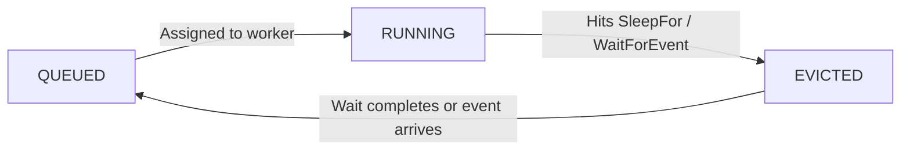

import { Callout } from "nextra/components";

# Task Eviction

When a durable task enters a wait — whether from `SleepFor`, `WaitForEvent`, or `WaitFor` — Hatchet **evicts** the task from the worker. The worker slot is released, the task's progress is persisted in the durable event log, and the task does not consume slots or hold resources while it is idle.

This is what makes durable tasks fundamentally different from regular tasks: a regular task consumes a slot and holds resources for the entire duration of execution, even if it's just sleeping. A durable task gives the slot back the moment it starts waiting.

## How eviction works

1. **Task reaches a wait.** The durable task calls `SleepFor`, `WaitForEvent`, or `WaitFor`.
2. **Checkpoint is written.** Hatchet records the current progress in the durable event log.
3. **Worker slot is freed.** The task is evicted from the worker. The slot is immediately available for other tasks.
4. **Wait completes.** When the sleep expires or the expected event arrives, Hatchet re-queues the task.
5. **Task resumes on any available worker.** A worker picks up the task, replays the event log to the last checkpoint, and continues execution from where it left off.

<Callout type="info">
  The resumed task does not need to run on the same worker that originally
  started it. Any worker that has registered the task can pick it up. If you
  need a task to resume on the same worker, use [sticky
  assignment](/concepts/sticky-assignment).
</Callout>

## Why eviction matters

Without eviction, a task that sleeps for 24 hours would consume a slot and hold resources for the entire duration — wasting capacity that could be running other work. With eviction, the slot is freed immediately and the task does not hold any resources while it waits.

This is especially important for:

- **Long waits** — Tasks that sleep for hours or days should not consume slots or hold resources.
- **Human-in-the-loop** — Waiting for a human to approve or respond could take minutes or weeks. Eviction ensures no slots are consumed and no resources are held in the meantime.
- **Large fan-outs** — A parent task that spawns thousands of children and waits for results can release its slot while the children run, preventing deadlocks where the parent holds resources that the children need.

## Eviction and separate slot pools

Durable tasks consume slots from a **separate slot pool** than regular tasks. This prevents a common deadlock: if durable and regular tasks shared the same pool, a durable task waiting on child tasks could hold the very slot those children need to execute.

By isolating slot pools, Hatchet ensures that durable tasks waiting on children never starve the workers that need to run those children.

## Eviction and determinism

Because a task may be evicted and resumed on a different worker at any time, the code between checkpoints must be [deterministic](/concepts/durable-workflows/durable-task-execution/durable-best-practices). On resume, Hatchet replays the event log — it does not re-execute completed operations. If the code has changed between the original run and the replay, the checkpoint sequence may not match, leading to unexpected behavior.

See [Best Practices](/concepts/durable-workflows/durable-task-execution/durable-best-practices) for guidelines on writing eviction-safe durable tasks.
