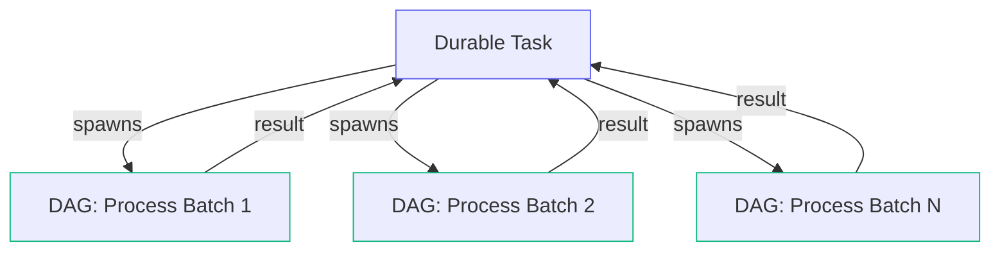
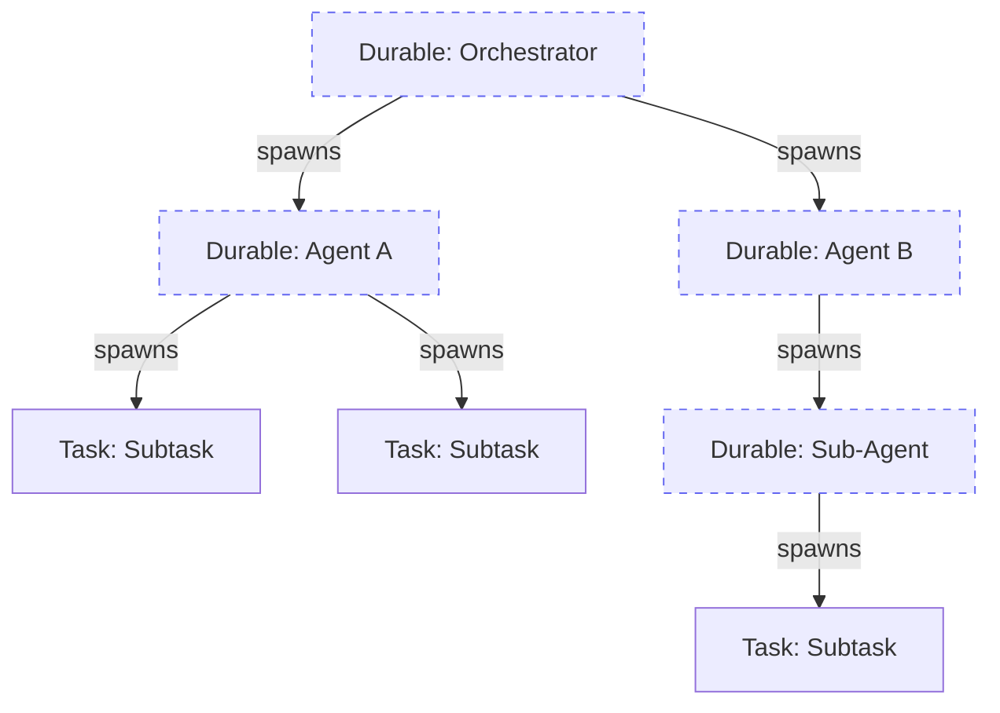

import { Callout } from "nextra/components";

# Mixing Patterns

Durable tasks and DAGs are not mutually exclusive  - you can combine them within the same application and even within the same workflow. The general rule: use a **DAG** for any portion of work whose shape you know upfront, and use a **durable task** to orchestrate the parts whose shape is dynamic. Nest them freely.

## A durable task inside a DAG

A DAG workflow can include a durable task as one of its nodes. The durable task checkpoints and waits like any other, while the rest of the DAG proceeds according to its declared dependencies.

This is useful when most of your pipeline is a fixed graph but one step needs dynamic behavior  - for example, a pipeline where one stage runs an agentic loop that decides what to do at runtime.

The durable task (`Agentic Loop`) can spawn children, sleep, wait for events, or loop until a condition is met  - while the rest of the DAG structure is declared normally. When the durable task completes, the downstream `Publish Results` task runs automatically.

## Spawning a DAG from a durable task

A durable task can spawn an entire DAG workflow as a child, wait for its result, and then continue. This lets you use procedural control flow to decide _which_ pipeline to run and _how many times_ to run it, while the pipeline itself is a well-defined graph.

The durable task decides at runtime how many batches to process, spawns a DAG workflow for each one, and collects the results. The DAG workflows run in parallel across your worker fleet while the durable task's slot is freed.

## Durable tasks spawning durable tasks

A durable task can spawn other durable tasks as children, each with their own checkpoints and event waits. This creates a tree of durable work that's entirely driven by runtime logic.

This pattern is ideal for agent-based systems where each level of the tree decides what to do next. Each durable task in the tree can sleep, wait for events, or spawn more children  - and none of them hold a worker slot while waiting.

## Choosing a pattern

| Scenario | Pattern |
| --- | --- |
| Fixed pipeline, every step is known | DAG |
| Fixed pipeline, but one step needs a long wait | DAG with a durable task node |
| Dynamic orchestration of known pipelines | Durable task spawning DAGs |
| Fully dynamic, shape decided at runtime | Durable task spawning tasks/durable tasks |
| Agent that reasons and acts in a loop | Durable task spawning children per iteration |

<Callout type="info">
  You don't have to choose one pattern for your entire application. Different workflows can use different patterns, and a single workflow can mix them. Start with the simplest pattern that fits and add complexity only when needed.
</Callout>
