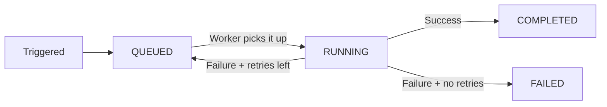

import { snippets } from "@/lib/generated/snippets";
import { Snippet } from "@/components/code";
import { Callout, Tabs } from "nextra/components";
import UniversalTabs from "@/components/UniversalTabs";

# Tasks

A task is the smallest unit of work in Hatchet. It wraps a single function—your application code—and gives Hatchet everything it needs to schedule, execute, retry, and observe that function across your infrastructure.

When you define a task, you are telling Hatchet: "here is a piece of work that a worker can pick up." The task carries a name, the function to run, and optional configuration like retry policies, timeouts, and concurrency limits. Tasks are registered on [workers](/essentials/workers), which are the long-running processes that actually execute them.

## Defining a task

<UniversalTabs items={["Python", "Typescript", "Go", "Ruby"]}>
  <Tabs.Tab title="Python">
<Snippet src={snippets.python.quickstart.workflows.first_task.simple_task} />
</Tabs.Tab>
<Tabs.Tab title="Typescript">
<Snippet src={snippets.typescript.simple.workflow.declaring_a_task} />
</Tabs.Tab>
<Tabs.Tab title="Go">
<Snippet src={snippets.go.simple.main.declaring_a_task} />
</Tabs.Tab>
<Tabs.Tab title="Ruby">
<Snippet src={snippets.ruby.quickstart.workflows.first_task.simple_task} />
</Tabs.Tab>
</UniversalTabs>

The returned object is the primary interface for interacting with the task—you use it to [run](/concepts/run-with-results), [enqueue](/concepts/run-no-wait), [schedule](/concepts/scheduled-runs), and otherwise trigger the task.

## Task lifecycle

When you trigger a task, it moves through three phases: queued, running, and a terminal state.

A task can also be **CANCELLED** at any point—either explicitly or by a [timeout](/concepts/timeouts) expiring.

## What you can configure on a task

Tasks accept configuration that controls how Hatchet handles them at runtime:

| Option | What it does |
| --- | --- |
| [Retries](/concepts/retry-policies) | Retry on failure, with optional backoff. |
| [Timeouts](/concepts/timeouts) | Limit how long a task may wait to start or how long it may run. |
| [Concurrency](/concepts/concurrency) | Control how many instances of this task run at once. |
| [Rate limits](/concepts/rate-limits) | Throttle execution over a time window. |
| [Worker affinity](/concepts/worker-affinity) | Prefer or require specific workers. |
| [Priority](/concepts/priority) | Influence scheduling order relative to other queued tasks. |

## Tasks vs. Workflows

A task on its own is a standalone runnable—you can trigger it, wait for its result, schedule it, or fire it off without waiting. When you need to coordinate multiple tasks together (run B after A, fan out across N inputs, etc.), you compose them into a [workflow](/concepts/workflows). Both share the same trigger interface (`run`, `run_no_wait`, `schedule`, etc.)—the difference is scope. A task does one thing; a workflow orchestrates many things.

Next, read about how tasks compose into [workflows](/concepts/workflows).
