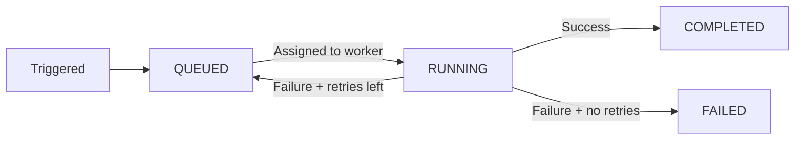

import { snippets } from "@/lib/generated/snippets";
import { Snippet } from "@/components/code";
import { Callout, Tabs } from "nextra/components";
import UniversalTabs from "@/components/UniversalTabs";

# Tasks

<Callout type="info">
  Just getting started? Check out the [essentials
  guide](/essentials/your-first-task) to declare and run your first task.
</Callout>

Everything you run in Hatchet is a **task** - a named function that you can trigger, retry, schedule, and observe. Tasks can be configured to handle the problems that come up in real systems: transient failures, resource contention, overloaded downstream services, and more.

## Defining a task

At minimum, a task needs a name and a function. The returned object is a **runnable** - you'll use it directly to [trigger](/concepts/run-with-results) the task.

<UniversalTabs items={["Python", "Typescript", "Go", "Ruby"]}>
  <Tabs.Tab title="Python">
    <Snippet
      src={snippets.python.quickstart.workflows.first_task.simple_task}
    />
  </Tabs.Tab>
  <Tabs.Tab title="Typescript">
    <Snippet src={snippets.typescript.simple.workflow.declaring_a_task} />
  </Tabs.Tab>
  <Tabs.Tab title="Go">
    <Snippet src={snippets.go.simple.main.declaring_a_task} />
  </Tabs.Tab>
  <Tabs.Tab title="Ruby">
    <Snippet src={snippets.ruby.quickstart.workflows.first_task.simple_task} />
  </Tabs.Tab>
</UniversalTabs>

When you define a task, you are telling Hatchet: "here is a piece of work that a worker can pick up." The task carries a name, the function to run, and optional configuration. Tasks are registered on [workers](/essentials/workers), which are the long-running processes that actually execute them.

## Task lifecycle

When you trigger a task, it moves through three phases: queued, running, and a terminal state.

A task can also be **CANCELLED** at any point - either explicitly or by a [timeout](/concepts/timeouts) expiring.

## Triggering a task

The runnable returned by a task definition supports several trigger methods:

| Method                               | What it does                                            |
| ------------------------------------ | ------------------------------------------------------- |
| [Run](/concepts/run-with-results)    | Trigger the task and wait for the result.               |
| [Run no wait](/concepts/run-no-wait) | Enqueue the task and return immediately.                |
| [Schedule](/concepts/scheduled-runs) | Schedule the task to run at a specific time.            |
| [Cron](/concepts/cron-runs)          | Run the task on a recurring schedule.                   |
| [Bulk run](/concepts/bulk-run)       | Trigger many instances of the task at once.             |
| [On event](/concepts/run-on-event)   | Trigger the task automatically when an event is pushed. |
| [Webhook](/concepts/webhooks)        | Trigger the task from an external HTTP request.         |

## Configuring a task

Tasks can be configured to handle common problems in distributed systems. For example, you might want to automatically retry a task when an external API returns a transient error, or limit how many instances of a task run at the same time to avoid overwhelming a downstream service.

| Concept                                      | What it does                                               |
| -------------------------------------------- | ---------------------------------------------------------- |
| [Retries](/concepts/retry-policies)          | Retry the task on failure, with optional backoff.          |
| [Timeouts](/concepts/timeouts)               | Limit how long a task may wait to be scheduled or to run.  |
| [Concurrency](/concepts/concurrency)         | Limit how many runs of this task execute at once.          |
| [Rate limits](/concepts/rate-limits)         | Throttle task execution over a time window.                |
| [Priority](/concepts/priority)               | Influence scheduling order relative to other queued tasks. |
| [Worker affinity](/concepts/worker-affinity) | Prefer or require specific workers for this task.          |

## Input and output

Every task receives an **input** - a JSON-serializable object passed when the task is triggered. The value you return from the task function becomes the task's **output**, which callers receive when they await the result.

When a task is part of a [workflow](/concepts/durable-workflows), its output is also available to downstream tasks through the context object, so data flows naturally from one step to the next. See [Accessing Parent Task Outputs](/concepts/durable-workflows/directed-acyclic-graphs#accessing-parent-task-outputs) for details.

## The context object

Every task function receives a **context** alongside its input. The context is your handle to the Hatchet runtime while the task is executing. Through it you can perform various operations:

- **Runtime information** like the task's run ID, workflow ID, and more.
- **Check for cancellation** and respond to it gracefully ([Cancellation](/concepts/cancellation)).
- **Refresh timeouts** if a long-running operation needs more time ([Timeouts](/concepts/timeouts)).
- **Release a worker slot** early to free capacity for other tasks ([Manual Slot Release](/concepts/manual-slot-release)).

## How tasks execute on workers

Tasks don't run on their own - they are assigned to and executed by [workers](/essentials/workers). A worker is a long-running process in your infrastructure that registers one or more tasks with Hatchet. When a task is triggered, Hatchet places it in a queue and assigns it to an available worker that has registered that task.

Each worker has a fixed number of **slots** that determine how many tasks it can run concurrently. When all slots are occupied, new tasks stay queued until a slot opens up. You can control this behavior further with [concurrency limits](/concepts/concurrency), [rate limits](/concepts/rate-limits), and [priority](/concepts/priority).

If you need tasks to run on specific workers - for example, because a worker has a GPU or a particular model loaded in memory - you can use [worker affinity](/concepts/worker-affinity) or [sticky assignment](/concepts/sticky-assignment) to influence where tasks are placed.

## Tasks vs. workflows

A task on its own is a standalone runnable - you can trigger it, wait for its result, schedule it, or fire it off without waiting. When you need to coordinate multiple tasks together (run B after A, fan out across N inputs, etc.), you compose them into a [workflow](/concepts/durable-workflows). Both share the same trigger interface - the difference is scope. A task does one thing; a workflow orchestrates many things.

Next, read about how tasks compose into [workflows](/concepts/durable-workflows).
