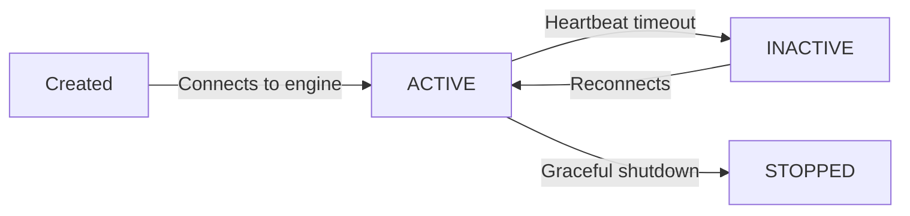

import { snippets } from "@/lib/generated/snippets";
import { Snippet } from "@/components/code";
import { Callout, Tabs } from "nextra/components";
import UniversalTabs from "@/components/UniversalTabs";

# Workers

<Callout type="info">
  Just getting started? Check out the [essentials guide](/essentials/workers) to declare and start your first worker.
</Callout>

Workers are the processes that actually execute your [tasks](/concepts/tasks). Each worker is a long-running process in your infrastructure that maintains a persistent gRPC connection to the Hatchet engine. Workers receive task assignments, run your code, and report results back. You can run them locally during development, in containers, or on VMs — and scale them independently from the rest of your stack.

## Declaring a worker

A worker needs a name and a set of tasks to handle. Call the `worker` method on the Hatchet client with both.

<UniversalTabs items={["Python", "Typescript", "Go", "Ruby"]}>
  <Tabs.Tab title="Python">
  <Snippet src={snippets.python.dag.worker.declare_a_worker}/>
</Tabs.Tab>
<Tabs.Tab title="Typescript">
  <Snippet src={snippets.typescript.simple.worker.declaring_a_worker} />
</Tabs.Tab>
<Tabs.Tab title="Go">
  <Snippet src={snippets.go.simple.main.starting_a_worker} />
</Tabs.Tab>
<Tabs.Tab title="Ruby">
  <Snippet src={snippets.ruby.dag.worker.declare_a_worker} />
</Tabs.Tab>
</UniversalTabs>

When a worker starts, it registers each of its tasks with the Hatchet engine. From that point on, Hatchet knows to route matching tasks to that worker. Multiple workers can register the same task — Hatchet distributes work across all of them.

## Worker lifecycle

A worker moves through four phases during its lifetime:

- **ACTIVE** — the worker is connected and accepting tasks.
- **INACTIVE** — the engine has not received a heartbeat within the expected window. Tasks assigned to this worker will be reassigned.
- **STOPPED** — the worker shut down gracefully. In-flight tasks are allowed to complete before the process exits.

Hatchet uses heartbeats to monitor worker health. If a worker becomes unreachable, its in-flight tasks are re-queued for other workers to pick up.

## Slots

Every worker has a fixed number of **slots** that control how many tasks it can run concurrently. If a worker has 5 slots and all 5 are occupied, it will not accept new tasks until a slot frees up.

Slots are a **local** limit — they protect the individual worker process from overcommitting resources. This is separate from [concurrency controls](/concepts/concurrency), which are a **global** limit across your entire fleet.

For I/O-heavy workloads (HTTP calls, database queries) you can safely raise the slot count. For CPU-heavy work, keep it closer to the number of available cores. See [Understanding Slots](/concepts/understanding-slots) for detailed guidance.

## Scaling workers

You can increase throughput in two ways: add more slots to a single worker, or run more worker processes. In most workloads, horizontal scaling (more workers) is the simplest path because each worker brings its own pool of slots and its own resources.

When running in Kubernetes or a similar orchestrator, you can autoscale workers based on queue depth using the [Task Stats API](/concepts/autoscaling-workers). Hatchet also supports [KEDA integration](/concepts/autoscaling-workers#autoscaling-with-keda) for event-driven autoscaling.

## Task assignment

By default, Hatchet distributes tasks to any available worker that has registered the task. You can influence this behavior in several ways:

| Concept | What it does |
| --- | --- |
| [Worker Affinity](/concepts/worker-affinity) | Prefer or require specific workers based on labels and weights. |
| [Sticky Assignment](/concepts/sticky-assignment) | Pin related tasks in a workflow to the same worker. |
| [Manual Slot Release](/concepts/manual-slot-release) | Free a worker slot before the task function returns. |

These are useful when a worker has specialized hardware (a GPU, a loaded ML model), or when co-locating related tasks on the same worker avoids redundant setup.

## Running in production

In development, the fastest way to run a worker is `hatchet worker dev`, which handles authentication and hot-reloads your code on changes. In production, you'll run workers as standalone processes or containers.

| Concept | What it does |
| --- | --- |
| [Running with Docker](/concepts/docker) | Containerize workers for deployment. |
| [Autoscaling Workers](/concepts/autoscaling-workers) | Scale workers dynamically based on queue depth. |
| [Worker Health Checks](/concepts/worker-healthchecks) | Expose `/health` and `/metrics` endpoints for monitoring. |
| [Preparing for Production](/essentials/production) | Operational best practices for monitoring, error handling, and scaling. |

## Workers and tasks

Workers and tasks have a many-to-many relationship. A single worker can register many tasks, and a single task can be registered on many workers. This means you can organize your workers by resource requirements, deployment boundary, or any other criterion — and Hatchet handles routing tasks to the right place.

If you haven't already, read about [tasks](/concepts/tasks) to understand how work is defined and configured.
