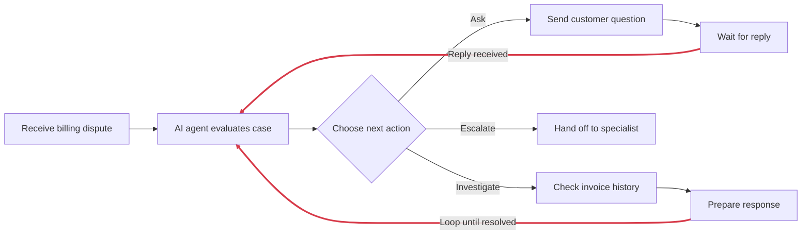
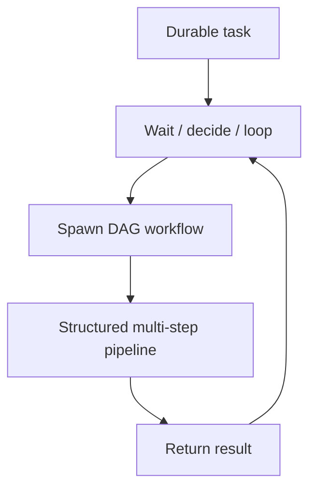

# When to Use Durable Tasks vs. DAG Workflows

Hatchet supports two ways to orchestrate durable multi-step workflows: [directed acyclic graphs (DAGs)](/v1/directed-acyclic-graphs) and [durable tasks](/v1/durable-tasks). Hatchet persists task state and results so workflows can recover without re-running completed work. The important difference is how you author the workflow, which means making an architectural decision early: should this workflow be modeled as a DAG, or should it be composed at runtime from tasks? Both are forms of [durable execution](/v1/durable-execution) in Hatchet, but they fit different kinds of workflows. The choice comes down to whether the workflow's control flow and dependencies are known at implementation time. If they are, a DAG is usually the natural choice. If they are not, durable tasks are usually the better fit. In that model, your code runs, makes decisions, waits for things, and spawns children while Hatchet persists progress along the way.

## When the structure is known up front

DAGs work best when the workflow can easily be represented as an acyclic graph at implementation time. That means all of the steps must be known in advance and child steps cannot feed back into their ancestors. Document processing, ETL pipelines, and CI/CD pipelines are good examples. The major stages are known ahead of time and can be easily sequenced in dependency order with no loops. Hatchet schedules the work, passes outputs from parents to children, and gives you a clear visual representation of the pipeline in the dashboard.

## When declarative structure stops being practical

DAGs can handle waits, conditional branches, and [or groups](/v1/directed-acyclic-graphs#waiting-on-conditions-with-or-groups), so the mere presence of a wait or a branch does not mean you need a durable task. Maintainability is often the deciding factor. A DAG becomes the wrong tool when the branching rules are so numerous or intertwined that expressing them declaratively becomes error-prone. This is also the case when the branching logic changes frequently enough that maintaining the graph is more effort than writing the same logic imperatively. However, when the workflow contains loops or steps that cannot be known until runtime, a DAG simply cannot be used at all.

Support workflows, approval flows, and agentic loops are good examples. Consider a [support agent](/cookbooks/workflow-support-agent): it triages a ticket, sends an initial response, waits for a customer reply or a timeout, then either resolves or escalates. You could express a simple version of that as a DAG with or groups and [parent conditions](/v1/directed-acyclic-graphs#branching-with-parent-conditions). But in practice the branching logic tends to grow beyond maintainability, with multiple escalation paths, multi-turn conversations, and context-dependent retries. At that point, writing it as imperative code with checkpointing is less work. Agentic loops are an even clearer case: the number of iterations is unknown, each action depends on the previous result, and the stopping condition is evaluated at runtime. That requires a cycle, which a DAG cannot express.

Durable tasks handle these cases by letting you write control flow directly in code. Hatchet checkpoints progress around waits and [child spawning](/v1/child-spawning), evicts the task from the worker slot while it waits, and resumes from the checkpoint when the wait resolves. The workflow can pause for an arbitrary duration, pick up exactly where it left off, and make its next decision based on what actually happened.

## Mixing both models

Some workflows are not purely one model or the other. A durable task can handle the outer interaction, wait for events, make branching decisions, loop until done, and spawn a DAG workflow when it reaches a point where structured multi-step work needs to happen. The DAG runs as a child, completes, returns its result, and the durable task continues.

The reverse is also possible. Hatchet's SDK allows a DAG to contain one or more durable task nodes. If a single step in an otherwise-fixed pipeline requires looping, dynamic child spawning, or complex imperative branching, that node can be a durable task while the rest of the DAG remains declarative. The DAG waits for that node to complete, then continues through the rest of the graph.

## Concrete examples

| Workflow                                                                                                                                                                | Model        | Why                                                                                                                                                                             |
| ----------------------------------------------------------------------------------------------------------------------------------------------------------------------- | ------------ | ------------------------------------------------------------------------------------------------------------------------------------------------------------------------------- |
| ETL pipeline (ingest -> parse -> transform -> validate -> store)                                                                                                        | DAG          | Steps and dependencies known up front. Parallel stages are the main value.                                                                                                      |
| CI/CD pipeline (build -> test -> package -> deploy -> smoke test)                                                                                                       | DAG          | Fixed stages, explicit dependencies, parallel execution.                                                                                                                        |
| Order pipeline with payment wait (prepare -> wait for payment -> fulfill -> notify)                                                                                     | DAG          | Fixed stages with a single wait expressed as an or group. The structure is still fully declarative.                                                                             |
| Support workflow that grows over time (triage -> reply -> wait -> resolve/escalate, plus per-category escalation paths, multi-turn handling, context-dependent retries) | Durable task | A simple version could be a DAG, but as branching rules multiply and change frequently, maintaining the declarative graph becomes fragile. Imperative code is easier to evolve. |
| Agentic loop / iterative tool-calling                                                                                                                                   | Durable task | Contains a cycle. The number of iterations is unknown and the stopping condition is evaluated at runtime. A DAG cannot express this.                                            |
| Dynamic runtime fan-out                                                                                                                                                 | Both         | A durable task decides at runtime what work needs to happen, then spawns a DAG for each structured sub-pipeline.                                                                |

## Decision checklist

| Question                                                                   | Fit for DAG                        | Fit for Durable Task                                              |
| -------------------------------------------------------------------------- | ---------------------------------- | ----------------------------------------------------------------- |
| Is the workflow structure mostly known before it starts?                   | Yes                                | No, or only partly                                                |
| Are dependencies easy to declare up front?                                 | Yes                                | Not always                                                        |
| Does the workflow involve waits (events, timers, human input)?             | Supported natively via or groups   | Also supported natively                                           |
| Is the branching logic simple, stable, and easy to maintain declaratively? | Strong fit                         | Also works, but imperative code is not needed here                |
| Is the branching logic complex, numerous, or frequently changing?          | Can become fragile and error-prone | Strong fit: logic lives in code, easier to read, test, and update |
| Does the workflow contain loops or unknown iteration counts?               | Not possible in a DAG              | Required: only durable tasks can express cycles                   |

If most of your answers land in the left column, start with a DAG. If the workflow contains loops, or most answers land in the right column, start with a durable task. If the answers are split, consider whether the outer workflow is really a dynamic orchestrator that contains some structured sub-pipelines, because that split often points toward a composition of both.

## Further reading

- [Introduction to Durable Execution](/v1/durable-execution): the conceptual foundation both models share
- [Durable Tasks](/v1/durable-tasks): how durable tasks work, when to use them, and the determinism rules
- [DAGs as Durable Workflows](/v1/directed-acyclic-graphs): how to define DAGs, declare dependencies, and use branching and or groups
- [Child Spawning](/v1/child-spawning): how durable tasks spawn children, including entire DAG workflows
