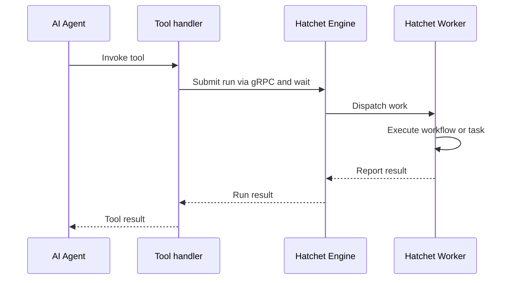

import { Callout, Steps, Tabs } from "nextra/components";
import UniversalTabs from "@/components/UniversalTabs";
import { snippets } from "@/lib/generated/snippets";
import { Snippet } from "@/components/code";

# Hatchet and MCP: Exposing Tasks and Workflows as Agent Tools

The [Model Context Protocol (MCP)](https://modelcontextprotocol.io/) is an open standard for connecting AI agents to external tools, data sources, and services. This guide shows how to expose Hatchet [workflows](/v1/directed-acyclic-graphs) and [standalone tasks](/v1/tasks) as tools that frameworks like the Claude Agent SDK and OpenAI Agents SDK can invoke. Later cookbooks in this series will show how to integrate those tools into a full agent loop.

In this guide, we define a Hatchet workflow and a standalone task, each with a description and a typed input schema, then convert each into an agent tool. When an agent invokes one of those tools, the tool handler submits a run to the Hatchet engine. A worker picks up and executes the workflow or task and reports the result to Hatchet. The tool handler returns that result to the agent.

## What this guide builds

This guide builds a temperature lookup tool backed by Hatchet. The workflow and standalone task call the [Open-Meteo API](https://open-meteo.com/) and return the current temperature for a given location. The same operation is implemented as both a workflow and a standalone task, so you can see how each becomes an agent tool.



The agent process contains the tool handler that submits the run, but it does not execute the workflow or task. Instead, a Hatchet worker executes the registered workflow or task and reports the result through Hatchet to the waiting tool handler. Since each tool call submits a run through Hatchet, the work the agent triggers gets the same observability and [core reliability guarantees](/v1/architecture-and-guarantees#core-reliability-guarantees) as any other Hatchet task or workflow.

## Setup

<Steps>

### Prepare your environment

To run this example, you need:

- a working local Hatchet environment or access to [Hatchet Cloud](https://cloud.hatchet.run)
- a Hatchet SDK example environment (see the [Quickstart](/v1/quickstart))

Install the optional dependencies for the language and agent framework you plan to use:

<UniversalTabs items={["Python", "Typescript"]}>
  <Tabs.Tab title="Python">

    Install the Hatchet SDK extra for your provider:

    ```bash
    pip install "hatchet-sdk[claude]"
    ```

    or:

    ```bash
    pip install "hatchet-sdk[openai]"
    ```

  </Tabs.Tab>
  <Tabs.Tab title="Typescript">

    Zod v4 is required for input schema generation:

    ```bash
    npm install zod@^4.0.0
    ```

    Install the agent SDK for your provider:

    ```bash
    npm install @anthropic-ai/claude-agent-sdk
    ```

    or:

    ```bash
    npm install @openai/agents
    ```

  </Tabs.Tab>
</UniversalTabs>

### Define the models

Start by defining the input and output types. The agent uses the input schema to understand what arguments the tool accepts.

<UniversalTabs items={["Python", "Typescript"]}>
  <Tabs.Tab title="Python">
    <Snippet src={snippets.python.agent.workflows.models} />
  </Tabs.Tab>
  <Tabs.Tab title="Typescript">
    <Snippet src={snippets.typescript.agent.workflow.models} />
  </Tabs.Tab>
</UniversalTabs>

In Python, Pydantic models or dataclasses define the schema. In TypeScript, Zod v4 schemas serve the same purpose and also generate the JSON Schema that agent frameworks require.

### Define a workflow

Agent tools need a description and an input validator. The description tells the agent when to use the tool. The input validator provides the schema for the tool arguments. Define the workflow with both so it can be exposed as an agent tool.

<UniversalTabs items={["Python", "Typescript"]}>
  <Tabs.Tab title="Python">
    <Snippet src={snippets.python.agent.workflows.workflow_definition} />
  </Tabs.Tab>
  <Tabs.Tab title="Typescript">
    <Snippet src={snippets.typescript.agent.workflow.workflow_definition} />
  </Tabs.Tab>
</UniversalTabs>

### Or expose a standalone task

You can expose a standalone task the same way. This is useful when the agent tool maps to a single operation rather than a multi-step workflow.

<UniversalTabs items={["Python", "Typescript"]}>
  <Tabs.Tab title="Python">
    <Snippet src={snippets.python.agent.workflows.standalone_task} />
  </Tabs.Tab>
  <Tabs.Tab title="Typescript">
    <Snippet src={snippets.typescript.agent.workflow.standalone_task} />
  </Tabs.Tab>
</UniversalTabs>

### Create agent tools

Create the tool in the process that runs your agent. The examples use helper functions around Hatchet's MCP tool conversion call so the workflow and task definitions can be imported without loading every optional provider SDK. Each helper returns a provider-specific tool definition that the agent SDK can use. The description and input validator you added above become part of that tool definition, which is why they are required.

<UniversalTabs items={["Python", "Typescript"]}>
  <Tabs.Tab title="Python">
    <Snippet src={snippets.python.agent.workflows.create_mcp_tools} />
  </Tabs.Tab>
  <Tabs.Tab title="Typescript">
    <Snippet src={snippets.typescript.agent.workflow.create_mcp_tools} />
  </Tabs.Tab>
</UniversalTabs>

<Callout type="info">
  The worker does not discover agent tools. It registers Hatchet workflows and
  tasks normally. When the tool handler submits a run, Hatchet dispatches it to
  a worker that registered the corresponding workflow or task.
</Callout>

### Register and start the worker

The worker must be running for tools to function. When the agent calls a tool, the tool handler submits a run to the Hatchet engine, and the engine dispatches it to a worker for execution.

<UniversalTabs items={["Python", "Typescript"]}>
  <Tabs.Tab title="Python">
    <Snippet src={snippets.python.agent.worker.all} />
  </Tabs.Tab>
  <Tabs.Tab title="Typescript">
    <Snippet src={snippets.typescript.agent.worker.all} />
  </Tabs.Tab>
</UniversalTabs>

### Test it

You can confirm that the workflow definitions and helper functions import successfully without requiring provider SDKs:

<UniversalTabs items={["Python", "Typescript"]}>
  <Tabs.Tab title="Python">

    ```bash
    cd sdks/python
    poetry run python -c "from examples.agent.workflows import create_temperature_workflow_tool_claude, create_temperature_task_tool_claude; print('OK')"
    ```

  </Tabs.Tab>
  <Tabs.Tab title="Typescript">

    ```bash
    cd sdks/typescript
    pnpm exec tsc --noEmit
    ```

  </Tabs.Tab>
</UniversalTabs>

To test the full round trip between the agent and the Hatchet-backed tool, start the worker in one terminal and run a provider-specific agent example in another. This requires the provider SDK and API key for the agent example you run (`ANTHROPIC_API_KEY` or `OPENAI_API_KEY`).

<UniversalTabs items={["Python", "Typescript"]}>
  <Tabs.Tab title="Python">

    Start the worker:

    ```bash
    cd sdks/python
    poetry run python -m examples.agent.worker
    ```

    In a second terminal, run the Claude or OpenAI agent example:

    ```bash
    cd sdks/python
    poetry run python -m examples.agent.agent_claude
    # or
    poetry run python -m examples.agent.agent_openai
    ```

  </Tabs.Tab>
  <Tabs.Tab title="Typescript">

    Start the worker:

    ```bash
    cd sdks/typescript
    pnpm exec ts-node -r tsconfig-paths/register -P tsconfig.json src/v1/examples/agent/worker.ts
    ```

    In a second terminal, run the Claude or OpenAI agent example:

    ```bash
    cd sdks/typescript
    pnpm exec ts-node -r tsconfig-paths/register -P tsconfig.json src/v1/examples/agent/agent-claude.ts
    # or
    pnpm exec ts-node -r tsconfig-paths/register -P tsconfig.json src/v1/examples/agent/agent-openai.ts
    ```

  </Tabs.Tab>
</UniversalTabs>

If successful, the agent will invoke the tool and print the temperature result to the terminal.

</Steps>

## Related Hatchet features

Because each agent tool call submits a run through Hatchet, you can apply the same controls you use for other tasks and workflows:

- **[Durable execution](/v1/durable-execution):** Hatchet tracks execution state durably so work can survive worker restarts and failures.
- **[Configurable retries](/v1/error-handling):** Failed tasks can retry according to your workflow or task configuration.
- **[Rate limits](/v1/rate-limits) and [concurrency control](/v1/concurrency):** Protect downstream systems from agent-driven bursts.
- **[Observability](/v1/logging):** Inspect tool-triggered runs in the Hatchet dashboard with status, timing, logs, and [OpenTelemetry traces](/v1/opentelemetry).

## Security considerations

MCP is a protocol for exposing tools to agents. It is not a security boundary. Tools can represent arbitrary code execution and should be treated with appropriate caution. Do not rely on the agent prompt alone to enforce security rules.

For production deployments:

- Validate tool inputs at the workflow level before executing business logic.
- Apply [rate limits](/v1/rate-limits) and [concurrency controls](/v1/concurrency) to prevent runaway tool invocations.
- Use [additional metadata](/v1/additional-metadata) to track which agent session triggered each run.
- Run workers with restricted permissions.
- Use network policies to limit what workers can reach.
- Use external sandbox providers when tools may execute untrusted code.

<Callout type="info">
  Hatchet does not provide native code sandboxing. If you need isolation between
  the agent and the execution environment, that is an infrastructure decision.
</Callout>
