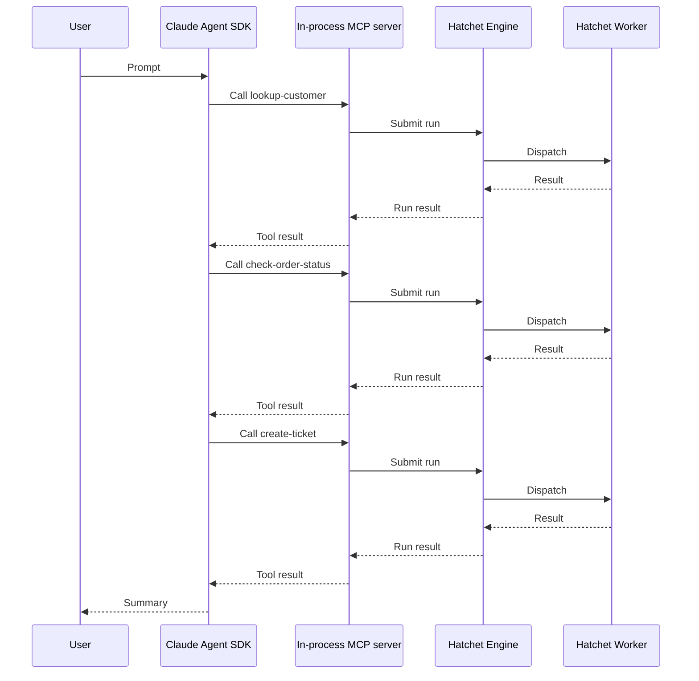

import { Callout, Steps, Tabs } from "nextra/components";
import UniversalTabs from "@/components/UniversalTabs";
import { snippets } from "@/lib/generated/snippets";
import { Snippet } from "@/components/code";

# Hatchet and MCP: Using the Claude Agent SDK in a Trusted Environment

This cookbook builds on the [Hatchet Agent Tools](/cookbooks/hatchet-and-mcp) guide, which covers exposing Hatchet tasks and workflows as MCP tools. Here, we apply the same pattern to a Claude Agent SDK process so Claude can call Hatchet-backed tools as part of an agent loop.

When Claude decides to use a tool, the in-process MCP handler submits a run to the Hatchet engine. A worker executes the task, and the result flows back to Claude.

## What this example builds

The example uses a support scenario similar to [How to Create a Support Agent Using Hatchet](/cookbooks/workflow-support-agent), but with a different architecture. That cookbook models support as a durable Hatchet workflow. This cookbook shows Claude choosing among separate Hatchet-backed tools:

- **lookup-customer**: retrieve a customer profile by ID.
- **check-order-status**: check shipping status and known issues for an order.
- **create-ticket**: open a support ticket for the customer.

<Callout type="info">
  The same MCP pattern also works for Hatchet workflows, as shown in [Hatchet
  Agent Tools](/cookbooks/hatchet-and-mcp). Use a workflow when a tool should
  trigger a multi-step process rather than a single operation. Later guides in
  this series will explore larger production agent patterns.
</Callout>

## Architecture



Claude may call independent tools in the same turn instead of waiting for each result before choosing the next tool.

<Callout type="info">
  **Trusted environment pattern.** This cookbook uses a trusted-harness
  architecture. The agent process runs in your own infrastructure with direct
  access to Hatchet credentials. The in-process MCP server is not an isolation
  boundary. If you need to run agent turns inside untrusted sandboxes with
  credentials kept outside, that is a different architecture pattern covered in
  a later guide.
</Callout>

## Setup

<Steps>

### Prepare your environment

You need:

- A working local Hatchet environment or access to [Hatchet Cloud](https://cloud.hatchet.run)
- A Hatchet SDK example environment (see the [Quickstart](/v1/quickstart))
- An `ANTHROPIC_API_KEY` environment variable set with a valid Anthropic API key

Install the Claude Agent SDK integration for your language:

<UniversalTabs items={["Python", "Typescript"]}>
  <Tabs.Tab title="Python">

    Install the Hatchet SDK extra for Claude:

    ```bash
    pip install "hatchet-sdk[claude]"
    ```

  </Tabs.Tab>
  <Tabs.Tab title="Typescript">

    Zod v4 is required for input schema generation:

    ```bash
    npm install zod@^4.0.0
    ```

    Install the Claude Agent SDK and MCP SDK dependencies:

    ```bash
    npm install @anthropic-ai/claude-agent-sdk @modelcontextprotocol/sdk
    ```

  </Tabs.Tab>
</UniversalTabs>

### Define the models

Define input and output types for each tool. Claude uses the input schema to understand what arguments a tool accepts.

<UniversalTabs items={["Python", "Typescript"]}>
  <Tabs.Tab title="Python">
    <Snippet src={snippets.python.support_agent_tools.tools.models} />
  </Tabs.Tab>
  <Tabs.Tab title="Typescript">
    <Snippet src={snippets.typescript.support_agent_tools.tools.models} />
  </Tabs.Tab>
</UniversalTabs>

### Set up the Hatchet client

Initialize the Hatchet client. It reads credentials from environment variables or a `.env` file.

<UniversalTabs items={["Python", "Typescript"]}>
  <Tabs.Tab title="Python">
    <Snippet src={snippets.python.support_agent_tools.tools.setup} />
  </Tabs.Tab>
  <Tabs.Tab title="Typescript">
    <Snippet src={snippets.typescript.support_agent_tools.tools.setup} />
  </Tabs.Tab>
</UniversalTabs>

### Add deterministic support data

The following fixture data keeps the example runnable without any third-party APIs.

<UniversalTabs items={["Python", "Typescript"]}>
  <Tabs.Tab title="Python">
    <Snippet src={snippets.python.support_agent_tools.tools.fixture_data} />
  </Tabs.Tab>
  <Tabs.Tab title="Typescript">
    <Snippet src={snippets.typescript.support_agent_tools.tools.fixture_data} />
  </Tabs.Tab>
</UniversalTabs>

### Define the Hatchet-backed tools

Each tool is a standalone Hatchet task with a description and an input validator, as covered in the [Hatchet Agent Tools](/cookbooks/hatchet-and-mcp#or-expose-a-standalone-task) guide.

#### Lookup customer

First, define a tool that retrieves customer profile data.

<UniversalTabs items={["Python", "Typescript"]}>
  <Tabs.Tab title="Python">
    <Snippet src={snippets.python.support_agent_tools.tools.lookup_customer} />
  </Tabs.Tab>
  <Tabs.Tab title="Typescript">
    <Snippet
      src={snippets.typescript.support_agent_tools.tools.lookup_customer}
    />
  </Tabs.Tab>
</UniversalTabs>

#### Check order status

Next, define another tool that returns shipping status, carrier, and any known issues for an order.

<UniversalTabs items={["Python", "Typescript"]}>
  <Tabs.Tab title="Python">
    <Snippet
      src={snippets.python.support_agent_tools.tools.check_order_status}
    />
  </Tabs.Tab>
  <Tabs.Tab title="Typescript">
    <Snippet
      src={snippets.typescript.support_agent_tools.tools.check_order_status}
    />
  </Tabs.Tab>
</UniversalTabs>

#### Create ticket

Finally, define a tool that creates a support ticket. Validate inputs before creating records, and consider attaching agent or user context with [additional metadata](/v1/additional-metadata) to improve traceability.

<UniversalTabs items={["Python", "Typescript"]}>
  <Tabs.Tab title="Python">
    <Snippet src={snippets.python.support_agent_tools.tools.create_ticket} />
  </Tabs.Tab>
  <Tabs.Tab title="Typescript">
    <Snippet
      src={snippets.typescript.support_agent_tools.tools.create_ticket}
    />
  </Tabs.Tab>
</UniversalTabs>

### Expose the tasks as Claude MCP tools

Convert each task into a Claude Agent SDK tool definition using Hatchet's MCP tool helper. The helper uses the task description and input validator to produce a tool object that the Claude Agent SDK can use directly.

<UniversalTabs items={["Python", "Typescript"]}>
  <Tabs.Tab title="Python">
    <Snippet
      src={snippets.python.support_agent_tools.tools.create_claude_tools}
    />
  </Tabs.Tab>
  <Tabs.Tab title="Typescript">
    <Snippet
      src={snippets.typescript.support_agent_tools.tools.create_claude_tools}
    />
  </Tabs.Tab>
</UniversalTabs>

<Callout type="info">
  The worker does not discover agent tools. It registers Hatchet tasks normally.
  When the tool handler submits a run, Hatchet dispatches it to a worker that
  registered the corresponding task.
</Callout>

### Register and start the worker

Register the Hatchet tasks with a worker. Tool calls submit runs to the Hatchet engine, which dispatches them to a running worker.

<UniversalTabs items={["Python", "Typescript"]}>
  <Tabs.Tab title="Python">
    <Snippet src={snippets.python.support_agent_tools.worker.all} />
  </Tabs.Tab>
  <Tabs.Tab title="Typescript">
    <Snippet src={snippets.typescript.support_agent_tools.worker.all} />
  </Tabs.Tab>
</UniversalTabs>

### Wire the Claude Agent SDK

The agent process is the trusted harness in this example. It creates the Hatchet-backed tool objects, groups them into an in-process MCP server named `support`, and passes that server to the Claude Agent SDK. Claude can then discover the support tools and call them through MCP, while the worker continues to run ordinary Hatchet tasks.

The allowed tools option pre-approves the specific tools this agent can call, using the `mcp__<server_name>__<tool_name>` naming convention. This is permission pre-approval and does not isolate tool code or protect secrets from the trusted agent process.

<UniversalTabs items={["Python", "Typescript"]}>
  <Tabs.Tab title="Python">
    <Snippet src={snippets.python.support_agent_tools.agent_claude.all} />
  </Tabs.Tab>
  <Tabs.Tab title="Typescript">
    <Snippet src={snippets.typescript.support_agent_tools.agent_claude.all} />
  </Tabs.Tab>
</UniversalTabs>

### Test it

Start the worker in one terminal and run the agent in another. The worker must be running before the agent calls any tools.

<UniversalTabs items={["Python", "Typescript"]}>
  <Tabs.Tab title="Python">

    Start the worker:

    ```bash
    cd sdks/python
    poetry run python -m examples.support_agent_tools.worker
    ```

    In a second terminal, run the agent:

    ```bash
    cd sdks/python
    poetry run python -m examples.support_agent_tools.agent_claude
    ```

  </Tabs.Tab>
  <Tabs.Tab title="Typescript">

    Start the worker:

    ```bash
    cd sdks/typescript
    pnpm exec tsx -r tsconfig-paths/register src/v1/examples/support_agent_tools/worker.ts
    ```

    In a second terminal, run the agent:

    ```bash
    cd sdks/typescript
    pnpm exec tsx -r tsconfig-paths/register src/v1/examples/support_agent_tools/agent-claude.ts
    ```

  </Tabs.Tab>
</UniversalTabs>

When successful, you should see tool calls for all three agent tools. Given the fixture data used in this example, Claude looks up customer `C-100`, checks order `ORD-9987`, creates a `high` priority ticket for the delayed delivery, and prints a final summary to the terminal.

<Callout type="info">
  Each tool call appears as a task run in the Hatchet dashboard with full
  status, timing, and input/output visibility.
</Callout>

</Steps>

## Security considerations

MCP is a protocol for exposing tools to agents. It is not a security boundary. The in-process MCP server runs at the same trust level as the agent process.

The agent process has direct access to Hatchet client credentials and runs in your own infrastructure. Do not rely on the agent prompt or allowed tools alone to enforce security rules.

<Callout type="info">
  Hatchet does not provide native code sandboxing. If you need to run each agent
  turn inside an untrusted sandbox, use a different architecture with external
  sandbox providers and credential proxying. Later guides in this series will
  explore sandboxed and custom-harness patterns.
</Callout>

## Next steps

- [Hatchet Agent Tools](/cookbooks/hatchet-and-mcp): the prerequisite guide for exposing tasks and workflows as MCP tools.
- [OpenAI Agents SDK](/cookbooks/hatchet-openai-agents-sdk-trusted-env): the same support scenario using the OpenAI Agents SDK.
- [How to Create a Support Agent Using Hatchet](/cookbooks/workflow-support-agent): a workflow-first support-agent pattern with durable waits and escalation.
- [Python SDK reference](/reference/python/client) and [TypeScript SDK reference](/reference/typescript/client): full SDK references.
