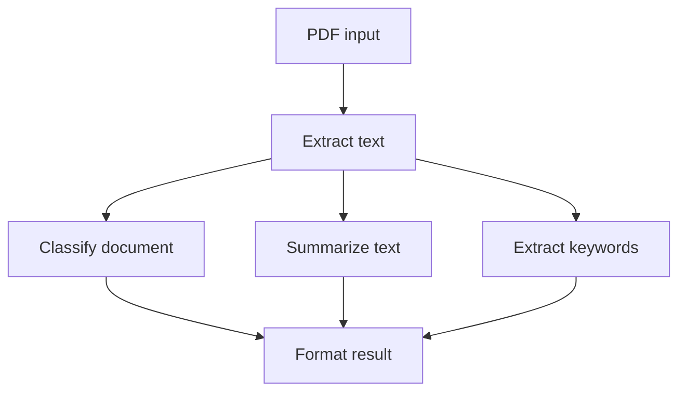

import { Steps, Tabs } from "nextra/components";
import UniversalTabs from "@/components/UniversalTabs";
import { snippets } from "@/lib/generated/snippets";
import { Snippet } from "@/components/code";

# How to Build a PDF Processing Pipeline with Hatchet DAGs

The decision framework in [Durable Tasks vs DAG Workflows](/cookbooks/durable-tasks-vs-dags) explains why document processing pipelines are a natural fit for [DAG workflows](/v1/directed-acyclic-graphs). The steps are known in advance, the dependencies between them are explicit, and independent stages can run in parallel. This cookbook builds on that framework with a concrete PDF pipeline that extracts text, classifies the document, summarizes the content, extracts keywords, and combines the results.

## What this example builds



Notice that after text extraction, the classify, summarize, and keyword extraction tasks can run concurrently because they each depend only on `extract_text` and not on each other. DAGs make concurrency explicit and simple to reason about. The final format step waits for all three tasks to finish before combining their outputs. Hatchet handles the scheduling, parallelism, and data flow between tasks automatically.

## Setup

<Steps>

### Prepare your environment

To run this example, you will need:

- a working local Hatchet environment or access to [Hatchet Cloud](https://cloud.onhatchet.run)
- a Hatchet SDK example environment (see the [Quickstart](/v1/quickstart))
- optionally, a PDF text extraction library for real PDF parsing:
  [pypdf](https://pypi.org/project/pypdf/) for Python or
  [pdf2json](https://www.npmjs.com/package/pdf2json) v4 for TypeScript.
  If the library is not installed, the example falls back to deterministic sample text so the DAG still runs.

### Define the models

Define the workflow input and the output types for each task.

<UniversalTabs items={["Python", "Typescript"]}>
  <Tabs.Tab title="Python">
    <Snippet src={snippets.python.pdf_pipeline.worker.models} />
  </Tabs.Tab>
  <Tabs.Tab title="Typescript">
    <Snippet src={snippets.typescript.pdf_pipeline.workflow.models} />
  </Tabs.Tab>
</UniversalTabs>

### Define the DAG

Declare the workflow. All tasks will be registered on this workflow with explicit parent dependencies.

<UniversalTabs items={["Python", "Typescript"]}>
  <Tabs.Tab title="Python">
    <Snippet src={snippets.python.pdf_pipeline.worker.define_the_dag} />
  </Tabs.Tab>
  <Tabs.Tab title="Typescript">
    <Snippet src={snippets.typescript.pdf_pipeline.workflow.define_the_dag} />
  </Tabs.Tab>
</UniversalTabs>

### Extract text from the PDF

The first task decodes the base64 input and extracts text using a PDF library. This is the only task that touches the PDF directly; after it finishes, the rest of the pipeline works with plain text. If you later want to swap in OCR, object storage, or a different PDF parser, this is the task you would change.

<UniversalTabs items={["Python", "Typescript"]}>
  <Tabs.Tab title="Python">
    <Snippet src={snippets.python.pdf_pipeline.worker.extract_text_task} />
  </Tabs.Tab>
  <Tabs.Tab title="Typescript">
    <Snippet
      src={snippets.typescript.pdf_pipeline.workflow.extract_text_task}
    />
  </Tabs.Tab>
</UniversalTabs>

### Classify the document

The classify task reads the extracted text from its parent and classifies the document by keyword matching.

<UniversalTabs items={["Python", "Typescript"]}>
  <Tabs.Tab title="Python">
    <Snippet src={snippets.python.pdf_pipeline.worker.classify_task} />
  </Tabs.Tab>
  <Tabs.Tab title="Typescript">
    <Snippet src={snippets.typescript.pdf_pipeline.workflow.classify_task} />
  </Tabs.Tab>
</UniversalTabs>

### Summarize the text

The summarize task also reads from `extract_text` and runs in parallel with classification.

<UniversalTabs items={["Python", "Typescript"]}>
  <Tabs.Tab title="Python">
    <Snippet src={snippets.python.pdf_pipeline.worker.summarize_task} />
  </Tabs.Tab>
  <Tabs.Tab title="Typescript">
    <Snippet src={snippets.typescript.pdf_pipeline.workflow.summarize_task} />
  </Tabs.Tab>
</UniversalTabs>

### Extract keywords

The `extract_keywords` task pulls the most frequent meaningful words from the extracted text using a small stopword list and frequency counting. It depends on text extraction, but not on classification or summarization. In fact, there is no interdependency between these tasks, so Hatchet can run all three in parallel. Concurrency is not the only benefit of this structure. Since each parallel task in a DAG is an independent unit, task-level behavior can be configured independently for aspects such as [retry policies](/v1/retry-policies), [timeouts](/v1/timeouts), and [concurrency limits](/v1/concurrency), among others. If keyword extraction is the slowest or most failure-prone step, its retry policy can be configured independently so that Hatchet retries it without re-running the classify or summarize tasks. In a sequential pipeline, you would need to build that isolation yourself. In a DAG, it comes from the structure.

<UniversalTabs items={["Python", "Typescript"]}>
  <Tabs.Tab title="Python">
    <Snippet src={snippets.python.pdf_pipeline.worker.extract_keywords_task} />
  </Tabs.Tab>
  <Tabs.Tab title="Typescript">
    <Snippet
      src={snippets.typescript.pdf_pipeline.workflow.extract_keywords_task}
    />
  </Tabs.Tab>
</UniversalTabs>

### Format the result

Hatchet runs `format_result` after `classify_document`, `summarize_text`, and `extract_keywords` have all completed. The final task receives the outputs from those parent tasks and combines them into one result.

<UniversalTabs items={["Python", "Typescript"]}>
  <Tabs.Tab title="Python">
    <Snippet src={snippets.python.pdf_pipeline.worker.format_result_task} />
  </Tabs.Tab>
  <Tabs.Tab title="Typescript">
    <Snippet
      src={snippets.typescript.pdf_pipeline.workflow.format_result_task}
    />
  </Tabs.Tab>
</UniversalTabs>

### Register and start the worker

Register the DAG workflow on a Hatchet worker and start it.

<UniversalTabs items={["Python", "Typescript"]}>
  <Tabs.Tab title="Python">
    <Snippet src={snippets.python.pdf_pipeline.worker.worker_registration} />
  </Tabs.Tab>
  <Tabs.Tab title="Typescript">
    In TypeScript, workflows are registered through the shared example worker
    rather than a per-example registration file.
  </Tabs.Tab>
</UniversalTabs>

### Run the pipeline

The trigger script creates a small sample PDF, base64-encodes it, and runs the workflow.

<UniversalTabs items={["Python", "Typescript"]}>
  <Tabs.Tab title="Python">
    <Snippet src={snippets.python.pdf_pipeline.trigger.trigger_the_pipeline} />
  </Tabs.Tab>
  <Tabs.Tab title="Typescript">
    <Snippet src={snippets.typescript.pdf_pipeline.run.trigger_the_pipeline} />
  </Tabs.Tab>
</UniversalTabs>

### Test it

This example includes an end-to-end test that generates a tiny PDF, runs the full pipeline, and asserts on the outputs. If you run it against a local Hatchet instance or Hatchet Cloud, you can inspect the workflow run in the [Hatchet dashboard](/v1/developer-experience).

<UniversalTabs items={["Python", "Typescript"]}>
  <Tabs.Tab title="Python">

    ```bash
    pytest examples/pdf_pipeline/test_pdf_pipeline.py
    ```

  </Tabs.Tab>
  <Tabs.Tab title="Typescript">

    ```bash
    pnpm run test:e2e -- --testPathPattern=pdf_pipeline
    ```

  </Tabs.Tab>
</UniversalTabs>

</Steps>

## Why this is a DAG

This pipeline is a good fit for a DAG because the processing stages are known before execution starts and the dependencies are easy to declare up front. The workflow does not need a loop, an unknown number of iterations, or a runtime decision about which tasks exist. Once `extract_text` completes, `classify_document`, `summarize_text`, and `extract_keywords` can run independently, and `format_result` waits for all three outputs before combining them. Each task points forward to later tasks, and no child step feeds back into an ancestor. If you later wanted to process a runtime-determined set of PDFs, a durable task could handle that outer decision and spawn this DAG once per document.

## Next steps

From here you could add more processing stages, such as language detection, entity extraction, or metadata enrichment. You could also replace keyword extraction or classification with an LLM call, configure retries or concurrency limits for the slowest stages, or fan out to process multiple PDFs by spawning the DAG as a child workflow from a [durable task](/v1/durable-tasks). For this cookbook, the five-task DAG is enough to show the core pattern.
