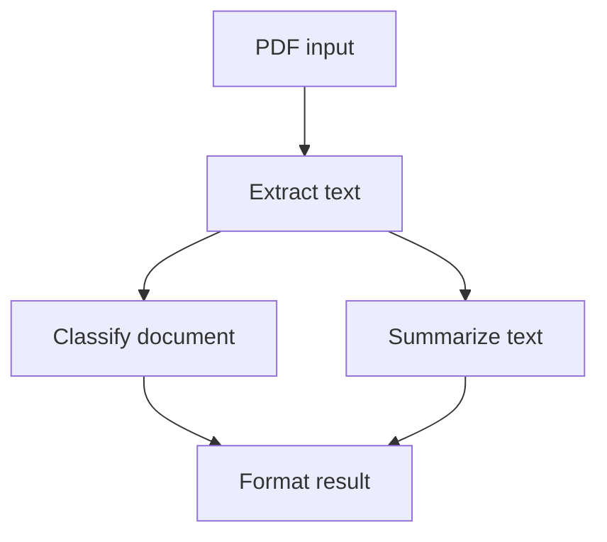

import { Steps, Tabs } from "nextra/components";
import UniversalTabs from "@/components/UniversalTabs";
import { snippets } from "@/lib/generated/snippets";
import { Snippet } from "@/components/code";

# How to Build a PDF Processing Pipeline with Hatchet DAGs

A PDF processing pipeline is a practical example of a [DAG workflow](/v1/directed-acyclic-graphs) in Hatchet. The steps are known in advance, the dependencies between them are explicit, and independent stages can run in parallel. In this cookbook we build a small DAG that extracts text from a PDF, classifies the document, summarizes the content, and combines the results.

## What this example builds



The classify and summarize tasks run in parallel after text extraction. The final format step waits for both to finish before combining their outputs. Hatchet handles the scheduling, parallelism, and data flow between tasks automatically.

## Setup

<Steps>

### Prepare your environment

To run this example, you will need:

- a working local Hatchet environment or access to [Hatchet Cloud](https://cloud.onhatchet.run)
- a Hatchet SDK example environment (see the [Quickstart](/v1/quickstart))
- a PDF text extraction library installed in your environment: [pypdf](https://pypi.org/project/pypdf/) for Python, or [pdf2json](https://www.npmjs.com/package/pdf2json) v4 for TypeScript

### Define the models

Define the workflow input and the output types for each task.

<UniversalTabs items={["Python", "Typescript"]}>
  <Tabs.Tab title="Python">
    <Snippet src={snippets.python.pdf_pipeline.worker.models} />
  </Tabs.Tab>
  <Tabs.Tab title="Typescript">
    <Snippet src={snippets.typescript.pdf_pipeline.workflow.models} />
  </Tabs.Tab>
</UniversalTabs>

### Define the DAG

Declare the workflow. All tasks will be registered on this workflow with explicit parent dependencies.

<UniversalTabs items={["Python", "Typescript"]}>
  <Tabs.Tab title="Python">
    <Snippet src={snippets.python.pdf_pipeline.worker.define_the_dag} />
  </Tabs.Tab>
  <Tabs.Tab title="Typescript">
    <Snippet src={snippets.typescript.pdf_pipeline.workflow.define_the_dag} />
  </Tabs.Tab>
</UniversalTabs>

### Extract text from the PDF

The first task decodes the base64 input and extracts text using a PDF library. This is the only task that touches the PDF directly.

<UniversalTabs items={["Python", "Typescript"]}>
  <Tabs.Tab title="Python">
    <Snippet src={snippets.python.pdf_pipeline.worker.extract_text_task} />
  </Tabs.Tab>
  <Tabs.Tab title="Typescript">
    <Snippet
      src={snippets.typescript.pdf_pipeline.workflow.extract_text_task}
    />
  </Tabs.Tab>
</UniversalTabs>

### Classify the document

This task reads the extracted text from its parent and classifies the document by keyword matching.

<UniversalTabs items={["Python", "Typescript"]}>
  <Tabs.Tab title="Python">
    <Snippet src={snippets.python.pdf_pipeline.worker.classify_task} />
  </Tabs.Tab>
  <Tabs.Tab title="Typescript">
    <Snippet src={snippets.typescript.pdf_pipeline.workflow.classify_task} />
  </Tabs.Tab>
</UniversalTabs>

### Summarize the text

This task also reads from extract_text and runs in parallel with classification.

<UniversalTabs items={["Python", "Typescript"]}>
  <Tabs.Tab title="Python">
    <Snippet src={snippets.python.pdf_pipeline.worker.summarize_task} />
  </Tabs.Tab>
  <Tabs.Tab title="Typescript">
    <Snippet src={snippets.typescript.pdf_pipeline.workflow.summarize_task} />
  </Tabs.Tab>
</UniversalTabs>

### Format the result

The final task waits for both classify and summarize to complete, then combines their outputs.

<UniversalTabs items={["Python", "Typescript"]}>
  <Tabs.Tab title="Python">
    <Snippet src={snippets.python.pdf_pipeline.worker.format_result_task} />
  </Tabs.Tab>
  <Tabs.Tab title="Typescript">
    <Snippet
      src={snippets.typescript.pdf_pipeline.workflow.format_result_task}
    />
  </Tabs.Tab>
</UniversalTabs>

### Run the pipeline

The trigger script creates a small sample PDF, base64-encodes it, and runs the workflow.

<UniversalTabs items={["Python", "Typescript"]}>
  <Tabs.Tab title="Python">
    <Snippet src={snippets.python.pdf_pipeline.trigger.trigger_the_pipeline} />
  </Tabs.Tab>
  <Tabs.Tab title="Typescript">
    <Snippet src={snippets.typescript.pdf_pipeline.run.trigger_the_pipeline} />
  </Tabs.Tab>
</UniversalTabs>

### Test it

This example includes an end-to-end test that generates a tiny PDF, runs the full pipeline, and asserts on the outputs.

<UniversalTabs items={["Python", "Typescript"]}>
  <Tabs.Tab title="Python">

    ```bash
    pytest examples/pdf_pipeline/test_pdf_pipeline.py
    ```

  </Tabs.Tab>
  <Tabs.Tab title="Typescript">

    ```bash
    pnpm run test:e2e -- --testPathPattern=pdf_pipeline
    ```

  </Tabs.Tab>
</UniversalTabs>

</Steps>

## Why this is a DAG

This pipeline is a good fit for a DAG because the steps and dependencies are known before execution starts. There are no loops, no runtime-determined branches, and no long waits for external events. The classify and summarize tasks are independent of each other and run in parallel automatically. That parallel execution is one of the main benefits of modeling a workflow as a DAG rather than writing sequential imperative code.

## Next steps

From here you could add more processing stages (language detection, entity extraction, metadata enrichment), replace the keyword classifier with an LLM call, or fan out to process multiple PDFs by spawning the DAG as a child workflow from a [durable task](/v1/durable-tasks). For this cookbook, the four-task DAG is enough to show the core pattern.
