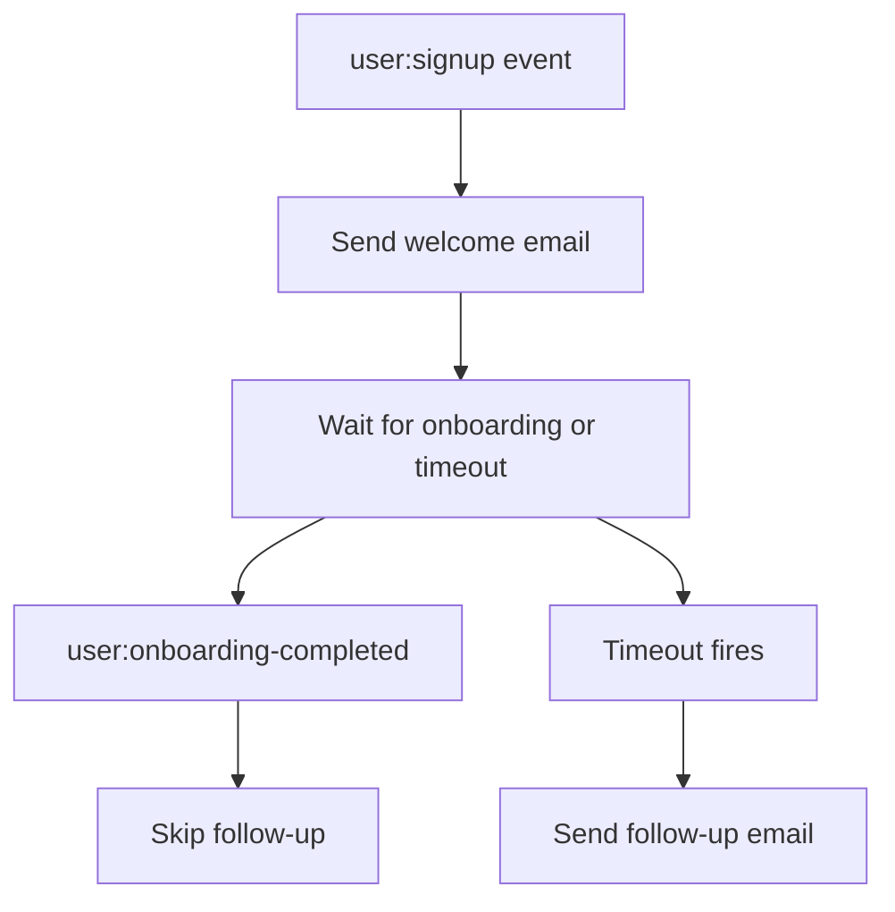

import { Steps, Tabs } from "nextra/components";
import UniversalTabs from "@/components/UniversalTabs";
import { snippets } from "@/lib/generated/snippets";
import { Snippet } from "@/components/code";

# Welcome Email

Customer onboarding guides users through required setup, improves their product understanding, and helps them gain value faster. Sending a brief welcome email after signup with a helpful link to get started is common practice.

Users are busy people who often contend with changing priorities, so sometimes they disengage before onboarding is complete. To mitigate onboarding drop-off, you may want to send a follow-up email only to users who have not reached a milestone in time. What you need is a workflow that waits for an event that may or may not arrive, with a timeout triggering the appropriate fallback behavior. Let's build a small durable workflow in Hatchet that handles exactly that pattern:



Hatchet's durable execution keeps the workflow alive across the wait. If the worker restarts or the wait lasts days, the workflow picks up where it left off. At the end of this cookbook, we show how to swap the placeholder email step to use [Loops](#sending-welcome-emails-with-loops) for production email delivery.

## Setup

<Steps>

### Prepare your environment

To run this example, you need:

- a working local Hatchet environment or access to [Hatchet Cloud](https://cloud.hatchet.run)
- a Hatchet SDK example environment (see the [Quickstart](/v1/quickstart))

No external email provider is required. The example uses `print` / `console.log` in place of real email delivery. To send real emails, see [Sending welcome emails with Loops](#sending-welcome-emails-with-loops).

### Define the models

Start by defining the input and output types. The workflow receives the new user's email and ID, and returns which emails were sent.

<UniversalTabs items={["Python", "Typescript"]}>
  <Tabs.Tab title="Python">
    <Snippet src={snippets.python.welcome_email.worker.models} />
  </Tabs.Tab>
  <Tabs.Tab title="Typescript">
    <Snippet src={snippets.typescript.welcome_email.workflow.models} />
  </Tabs.Tab>
</UniversalTabs>

### Build the durable task

The core of this example is a single [durable task](/v1/durable-execution) that runs three steps in sequence:

1. Send the welcome email immediately.
2. Wait for either a `user:onboarding-completed` event scoped to this user, or a timeout.
3. If the timeout fires, send a follow-up. If the onboarding event arrives first, skip it.

<UniversalTabs items={["Python", "Typescript"]}>
  <Tabs.Tab title="Python">
    <Snippet src={snippets.python.welcome_email.worker.welcome_email_task} />
  </Tabs.Tab>
  <Tabs.Tab title="Typescript">
    <Snippet
      src={snippets.typescript.welcome_email.workflow.welcome_email_task}
    />
  </Tabs.Tab>
</UniversalTabs>

In this example, `user:onboarding-completed` represents an activation event from your application. Your app would emit it when the user finishes the onboarding milestone. The welcome email points the user toward that step; the follow-up is only for users who do not complete it before the timeout. The timeout itself is durable, so the workflow does not need to keep a worker process sleeping while it waits, and it can resume even if the worker restarts during the wait.

The event condition uses a `scope` set to the current user's ID. When the `user:onboarding-completed` event is later pushed, it must include the same `scope` value. Scoping by user ID ensures that one user's onboarding event cannot satisfy another user's wait condition. The condition also includes a short lookback window. This lets the workflow pick up an onboarding event that arrived slightly before the wait became active. This can happen when the welcome email step and the onboarding event occur nearly at the same time.

### Register and start the worker

Register the durable task on a Hatchet worker and start it.

<UniversalTabs items={["Python", "Typescript"]}>
  <Tabs.Tab title="Python">
    <Snippet src={snippets.python.welcome_email.worker.worker_registration} />
  </Tabs.Tab>
  <Tabs.Tab title="Typescript">
    In TypeScript, workflows are registered through the shared example worker
    rather than a per-example registration file.
  </Tabs.Tab>
</UniversalTabs>

### Trigger the workflow

The durable task is configured to start from a `user:signup` event. The event payload is passed through as-is to the task input:

```json
{
  "email": "alice@example.com",
  "user_id": "user-123"
}
```

The example also includes a trigger script that starts the workflow directly, pushes a scoped onboarding event, and waits for the result.

<UniversalTabs items={["Python", "Typescript"]}>
  <Tabs.Tab title="Python">
    <Snippet src={snippets.python.welcome_email.trigger.trigger_the_workflow} />
  </Tabs.Tab>
  <Tabs.Tab title="Typescript">
    <Snippet src={snippets.typescript.welcome_email.run.trigger_the_workflow} />
  </Tabs.Tab>
</UniversalTabs>

### Test it

This example includes two end-to-end tests against a live Hatchet instance:

- an onboarding-completed test, where the scoped event arrives before the timeout and the follow-up is skipped
- a timeout test, where no onboarding event arrives and the workflow sends the follow-up

If you are running the SDK examples locally:

<UniversalTabs items={["Python", "Typescript"]}>
  <Tabs.Tab title="Python">

    ```bash
    pytest examples/welcome_email/test_welcome_email.py
    ```

  </Tabs.Tab>
  <Tabs.Tab title="Typescript">

    ```bash
    pnpm run test:e2e -- --testPathPattern=welcome_email
    ```

  </Tabs.Tab>
</UniversalTabs>

</Steps>

## Sending welcome emails with Loops

The local example uses `print` / `console.log` so it runs without external services. In production, [Loops](https://loops.so) can handle the actual email delivery as a [transactional email](https://loops.so/docs/transactional), while Hatchet continues to run the workflow around the task, including retries, concurrency, and observability.

To use Loops you need a [Loops account](https://loops.so) with a [verified sending domain](https://loops.so/docs/sending-domain), plus a [transactional email](https://loops.so/docs/transactional) created in Loops and its [`transactionalId`](https://loops.so/docs/transactional#review-your-email). Set `LOOPS_API_KEY` in your environment. Since these examples call Loops' Transactional Email API directly, no SDK installation is required. If you prefer using a client library, Loops provides [official SDKs](https://loops.so/docs/sdks#official-sdks) for a number of languages.

The snippets below replace the `print` / `console.log` calls with Loops API calls. Loops supports an `Idempotency-Key` header, which means Hatchet can safely retry the task without risking duplicate emails.

<UniversalTabs items={["Python", "Typescript"]}>
  <Tabs.Tab title="Python">

    ```python
    import json
    import os
    from urllib.error import HTTPError
    from urllib.request import Request, urlopen

    LOOPS_API_KEY = os.environ["LOOPS_API_KEY"]
    WELCOME_TEMPLATE_ID = "your-welcome-transactional-id"
    FOLLOWUP_TEMPLATE_ID = "your-followup-transactional-id"

    def send_loops_email(
        template_id: str,
        email: str,
        idempotency_key: str | None = None,
    ) -> None:
        body = {
            "transactionalId": template_id,
            "email": email,
        }

        headers = {
            "Authorization": f"Bearer {LOOPS_API_KEY}",
            "Content-Type": "application/json",
            "User-Agent": "hatchet-cookbook/1.0",
        }
        if idempotency_key:
            headers["Idempotency-Key"] = idempotency_key

        req = Request(
            "https://app.loops.so/api/v1/transactional",
            data=json.dumps(body).encode(),
            headers=headers,
            method="POST",
        )
        try:
            with urlopen(req) as resp:
                result = json.loads(resp.read())
                if not result.get("success"):
                    raise RuntimeError(f"Loops API error: {result}")
        except HTTPError as e:
            if e.code == 409:
                return  # already sent with this idempotency key
            raise
    ```

    Then inside the durable task, replace the `print` calls:

    ```python
    # Step 1: Send the welcome email
    send_loops_email(
        WELCOME_TEMPLATE_ID,
        input.email,
        idempotency_key=f"welcome:{WELCOME_TEMPLATE_ID}:{input.user_id}",
    )

    # ... wait for onboarding or timeout ...

    # Step 3b: Timeout -> send follow-up email
    send_loops_email(
        FOLLOWUP_TEMPLATE_ID,
        input.email,
        idempotency_key=f"followup:{FOLLOWUP_TEMPLATE_ID}:{input.user_id}",
    )
    ```

  </Tabs.Tab>
  <Tabs.Tab title="Typescript">

    ```typescript
    const LOOPS_API_KEY = process.env.LOOPS_API_KEY!;
    const WELCOME_TEMPLATE_ID = "your-welcome-transactional-id";
    const FOLLOWUP_TEMPLATE_ID = "your-followup-transactional-id";

    async function sendLoopsEmail(
      templateId: string,
      email: string,
      idempotencyKey?: string,
    ): Promise<void> {
      const body = { transactionalId: templateId, email };

      const headers: Record<string, string> = {
        Authorization: `Bearer ${LOOPS_API_KEY}`,
        "Content-Type": "application/json",
      };
      if (idempotencyKey) headers["Idempotency-Key"] = idempotencyKey;

      const resp = await fetch("https://app.loops.so/api/v1/transactional", {
        method: "POST",
        headers,
        body: JSON.stringify(body),
      });

      if (resp.status === 409) return; // already sent with this idempotency key

      const result = await resp.json();
      if (!result.success) {
        throw new Error(`Loops API error: ${JSON.stringify(result)}`);
      }
    }
    ```

    Then inside the durable task, replace the `console.log` calls:

    ```typescript
    // Step 1: Send the welcome email
    await sendLoopsEmail(
      WELCOME_TEMPLATE_ID,
      input.email,
      `welcome:${WELCOME_TEMPLATE_ID}:${input.userId}`,
    );

    // ... wait for onboarding or timeout ...

    // Step 3b: Timeout -> send follow-up email
    await sendLoopsEmail(
      FOLLOWUP_TEMPLATE_ID,
      input.email,
      `followup:${FOLLOWUP_TEMPLATE_ID}:${input.userId}`,
    );
    ```

  </Tabs.Tab>
</UniversalTabs>

Each idempotency key combines the email purpose, such as `welcome` or `followup`, with the template ID and user ID. This lets Hatchet retry the task after a transient failure without Loops sending the same email twice. Loops returns `409 Conflict` when a key is reused within 24 hours, and the helpers above treat that as already sent. If a user can legitimately receive the same email type more than once within 24 hours, include a workflow run ID or signup event ID in the key to keep each send distinct.

## Next steps

From here you could extend the timeout to suit your actual onboarding flow, add more follow-up stages, use [Loops](https://loops.so) or another provider for real email delivery, add [data variables](https://loops.so/docs/transactional#add-data-variables) to personalize transactional emails, or combine this pattern with other Hatchet features such as [rate limits](/v1/rate-limits) to throttle email sends across your worker fleet.
