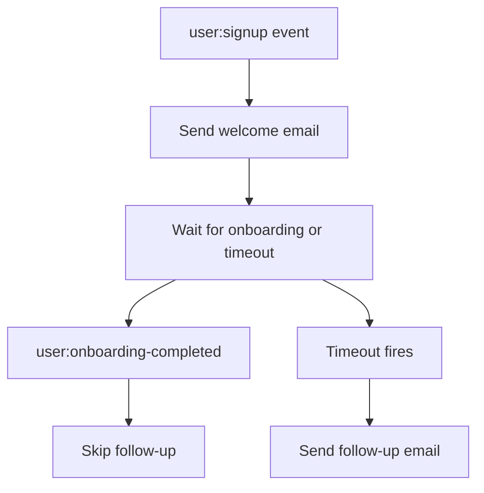

import { Steps, Tabs } from "nextra/components";
import UniversalTabs from "@/components/UniversalTabs";
import { snippets } from "@/lib/generated/snippets";
import { Snippet } from "@/components/code";

# Welcome Email

When a new user signs up, most applications send a welcome email right away. What happens next is trickier: you want to send a follow-up nudge if the user hasn't completed onboarding after some time, but skip it if they have. That means your workflow needs to wait for an event that may or may not arrive, with a timeout as the fallback.

This cookbook builds a small durable workflow in Hatchet that handles exactly that pattern:



Hatchet's durable execution keeps the workflow alive across the wait. If the worker restarts or the wait lasts hours, the workflow picks up where it left off.

## Setup

<Steps>

### Prepare your environment

To run this example you need:

- a working local Hatchet environment or access to [Hatchet Cloud](https://cloud.onhatchet.run)
- a Hatchet SDK example environment (see the [Quickstart](/v1/quickstart))

No external email provider is required. The example uses `print` / `console.log` in place of real email delivery.

### Define the models

Start by defining the input and output types. The workflow receives the new user's email and ID, and returns which emails were sent.

<UniversalTabs items={["Python", "Typescript"]}>
  <Tabs.Tab title="Python">
    <Snippet src={snippets.python.welcome_email.worker.models} />
  </Tabs.Tab>
  <Tabs.Tab title="Typescript">
    <Snippet src={snippets.typescript.welcome_email.workflow.models} />
  </Tabs.Tab>
</UniversalTabs>

### Build the durable task

The core of this example is a single [durable task](/v1/durable-execution) that runs three steps in sequence:

1. Send the welcome email immediately.
2. Wait for either a `user:onboarding-completed` event scoped to this user, or a timeout.
3. If the timeout fires, send a follow-up. If the onboarding event arrives first, skip it.

<UniversalTabs items={["Python", "Typescript"]}>
  <Tabs.Tab title="Python">
    <Snippet src={snippets.python.welcome_email.worker.welcome_email_task} />
  </Tabs.Tab>
  <Tabs.Tab title="Typescript">
    <Snippet
      src={snippets.typescript.welcome_email.workflow.welcome_email_task}
    />
  </Tabs.Tab>
</UniversalTabs>

The event condition uses a **scope** set to the current user's ID. When the `user:onboarding-completed` event is pushed later, it must be pushed with the same scope value. This ensures that one user's onboarding event does not accidentally satisfy another user's wait.

### Register and start the worker

Register the durable task on a Hatchet worker and start it.

<Snippet src={snippets.python.welcome_email.worker.worker_registration} />

In TypeScript, workflows are registered through the shared example worker rather than a per-example registration file.

### Trigger the workflow

The durable task is configured with `on_events=["user:signup"]` (Python) / `onEvents: ['user:signup']` (TypeScript), so pushing a `user:signup` event starts the workflow. The event payload is passed through as-is to the task input, so both languages receive the same field names:

```json
{
  "email": "alice@example.com",
  "user_id": "user-123"
}
```

Once the workflow is running and waiting, you can resolve it by pushing the onboarding event **with a matching scope**:

<UniversalTabs items={["Python", "Typescript"]}>
  <Tabs.Tab title="Python">
    ```python
    hatchet.event.push(
        "user:onboarding-completed",
        {"status": "done"},
        scope="user-123",
    )
    ```
  </Tabs.Tab>
  <Tabs.Tab title="Typescript">
    ```typescript
    await hatchet.events.push(
      'user:onboarding-completed',
      { status: 'done' },
      { scope: 'user-123' }
    );
    ```
  </Tabs.Tab>
</UniversalTabs>

The scope value (`"user-123"`) must match the user ID that the workflow received in its signup input. The event payload itself is not used for correlation — only the scope matters.

</Steps>

## The two paths

**Timeout wins:** If no `user:onboarding-completed` event arrives before the timeout, the workflow sends the follow-up email. The result indicates that the follow-up was sent.

**Onboarding event wins:** If the scoped event arrives before the timeout, the workflow skips the follow-up. The result indicates that only the welcome email was sent.

## Next steps

To use this in production, replace the `print` / `console.log` calls with your email provider's SDK. You may also want to extend the timeout to something like 24 hours and add retry or idempotency logic around the send step. Those concerns are provider-specific and intentionally outside this minimal example.
