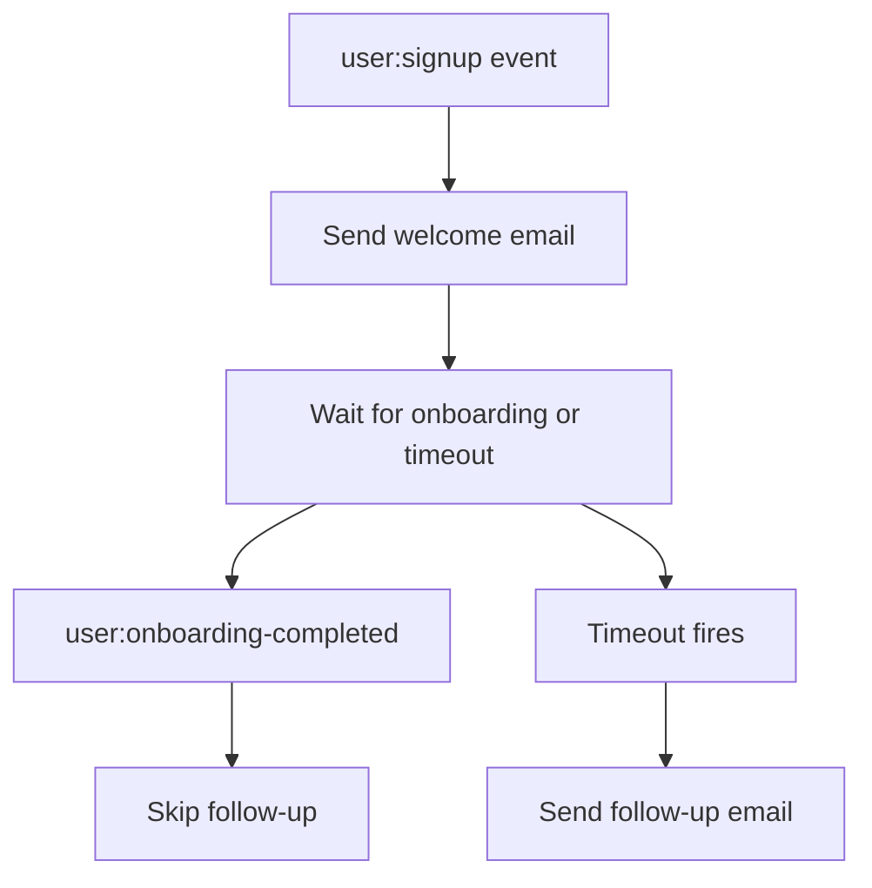

import { Steps, Tabs } from "nextra/components";
import UniversalTabs from "@/components/UniversalTabs";
import { snippets } from "@/lib/generated/snippets";
import { Snippet } from "@/components/code";

# Welcome Email

Customer onboarding guides users through required setup, improves their product understanding, and helps them gain value faster. Sending a brief welcome email after signup with a helpful link to get started is common practice.

Users are busy people who often contend with changing priorities, so sometimes they disengage before onboarding is complete. To mitigate onboarding drop-off, you may want to send a follow-up email only to users who have not reached a milestone in time. What you need is a workflow that waits for an event that may or may not arrive, with a timeout triggering the appropriate fallback behavior. Let's build a small durable workflow in Hatchet that handles exactly that pattern:



Hatchet's durable execution keeps the workflow alive across the wait. If the worker restarts or the wait lasts days, the workflow picks up where it left off.

## Setup

<Steps>

### Prepare your environment

To run this example you need:

- a working local Hatchet environment or access to [Hatchet Cloud](https://cloud.onhatchet.run)
- a Hatchet SDK example environment (see the [Quickstart](/v1/quickstart))

No external email provider is required. The example uses `print` / `console.log` in place of real email delivery.

### Define the models

Start by defining the input and output types. The workflow receives the new user's email and ID, and returns which emails were sent.

<UniversalTabs items={["Python", "Typescript"]}>
  <Tabs.Tab title="Python">
    <Snippet src={snippets.python.welcome_email.worker.models} />
  </Tabs.Tab>
  <Tabs.Tab title="Typescript">
    <Snippet src={snippets.typescript.welcome_email.workflow.models} />
  </Tabs.Tab>
</UniversalTabs>

### Build the durable task

The core of this example is a single [durable task](/v1/durable-execution) that runs three steps in sequence:

1. Send the welcome email immediately.
2. Wait for either a `user:onboarding-completed` event scoped to this user, or a timeout.
3. If the timeout fires, send a follow-up. If the onboarding event arrives first, skip it.

<UniversalTabs items={["Python", "Typescript"]}>
  <Tabs.Tab title="Python">
    <Snippet src={snippets.python.welcome_email.worker.welcome_email_task} />
  </Tabs.Tab>
  <Tabs.Tab title="Typescript">
    <Snippet
      src={snippets.typescript.welcome_email.workflow.welcome_email_task}
    />
  </Tabs.Tab>
</UniversalTabs>

In this example, `user:onboarding-completed` represents an activation event from your application. Your app would emit it when the user finishes the onboarding milestone. The welcome email points the user toward that step; the follow-up is only for users who do not complete it before the timeout. The timeout itself is durable, so the workflow does not need to keep a worker process sleeping while it waits, and it can resume even if the worker restarts during the wait.

The event condition uses a `scope` set to the current user's ID. When the `user:onboarding-completed` event is later pushed, it must include the same `scope` value. Scoping by user ID ensures that one user's onboarding event cannot satisfy another user's wait condition. The condition also includes a short lookback window. This lets the workflow pick up an onboarding event that arrived slightly before the wait became active. This can happen when the welcome email step and the onboarding event occur nearly at the same time.

### Register and start the worker

Register the durable task on a Hatchet worker and start it.

<UniversalTabs items={["Python", "Typescript"]}>
  <Tabs.Tab title="Python">
    <Snippet src={snippets.python.welcome_email.worker.worker_registration} />
  </Tabs.Tab>
  <Tabs.Tab title="Typescript">
    In TypeScript, workflows are registered through the shared example worker
    rather than a per-example registration file.
  </Tabs.Tab>
</UniversalTabs>

### Trigger the workflow

The durable task is configured to start from a `user:signup` event. The event payload is passed through as-is to the task input:

```json
{
  "email": "alice@example.com",
  "user_id": "user-123"
}
```

The example also includes a trigger script that starts the workflow directly, pushes a scoped onboarding event, and waits for the result.

<UniversalTabs items={["Python", "Typescript"]}>
  <Tabs.Tab title="Python">
    <Snippet src={snippets.python.welcome_email.trigger.trigger_the_workflow} />
  </Tabs.Tab>
  <Tabs.Tab title="Typescript">
    <Snippet src={snippets.typescript.welcome_email.run.trigger_the_workflow} />
  </Tabs.Tab>
</UniversalTabs>

### Test it

This example includes two end-to-end tests against a live Hatchet instance:

- an onboarding-completed test, where the scoped event arrives before the timeout and the follow-up is skipped
- a timeout test, where no onboarding event arrives and the workflow sends the follow-up

If you are running the SDK examples locally:

<UniversalTabs items={["Python", "Typescript"]}>
  <Tabs.Tab title="Python">

    ```bash
    pytest examples/welcome_email/test_welcome_email.py
    ```

  </Tabs.Tab>
  <Tabs.Tab title="Typescript">

    ```bash
    pnpm run test:e2e -- --testPathPattern=welcome_email
    ```

  </Tabs.Tab>
</UniversalTabs>

</Steps>

## Next steps

To send real emails from this example, replace the `print` / `console.log` calls with a call to your email provider. You may also want to extend the timeout to better suit your workflow. Provider-specific delivery concerns are intentionally outside this minimal example.
