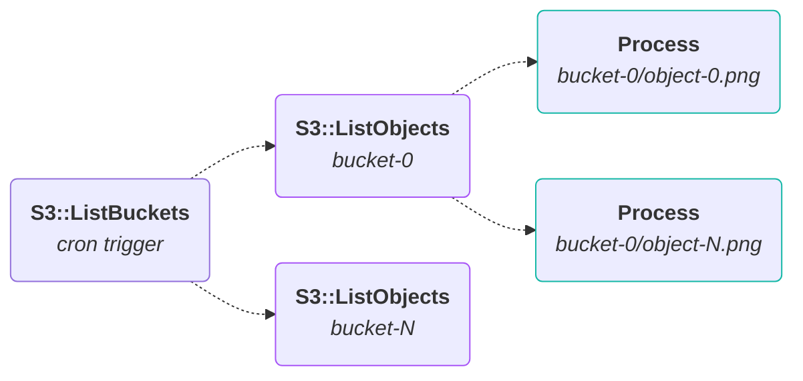
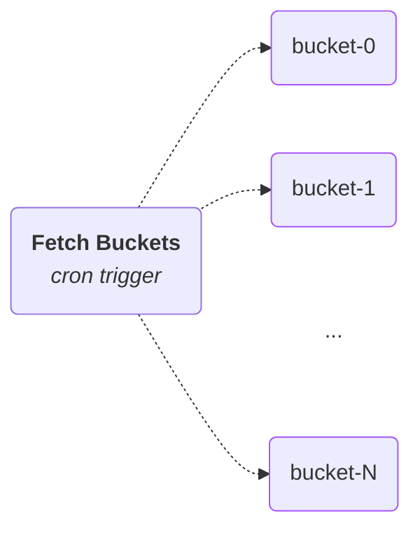
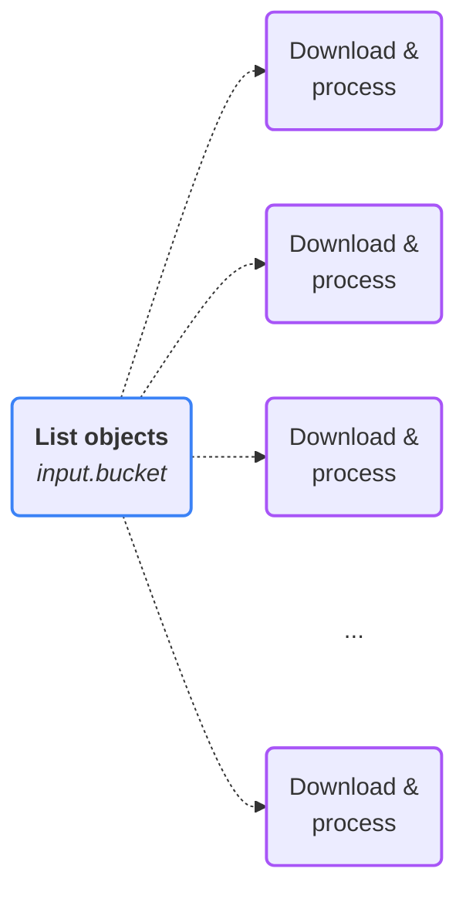

import { Callout, Steps, Tabs } from "nextra/components";
import UniversalTabs from "@/components/UniversalTabs";
import { snippets } from "@/lib/generated/snippets";
import { Snippet } from "@/components/code";
import AmazonS3ImagePipelineDiagram from "@/components/AmazonS3ImagePipelineDiagram";

# Processing Amazon S3 Objects at Scale with Hatchet

## Introduction

Amazon S3 is a reliable-and-boring distributed object store with strong [read-after-write consistency](https://docs.aws.amazon.com/AmazonS3/latest/userguide/Welcome.html#ConsistencyModel), making it an ideal backend for processing massive datasets at scale. However, coordinating workloads that actually leverage S3's scale (without accruing a comically large cloud bill) is non-trivial.

This guide walks through building an _embarrassingly parallel_ Hatchet pipeline for ingesting and processing hundreds of thousands of images stored across multiple regionally bound S3 buckets. This approach will be making extensive use of Hatchet's [concurrency control](/v1/concurrency) features, paired with aggressive fan-outs via [dynamic child spawning](/v1/child-spawning#fan-out-spawning-many-children-in-parallel), to parallelize the heck out of a data processing workflow while ensuring fair allocation of resources and idempotent processing of objects.

<figure style={{ margin: "2rem auto", maxWidth: "400px", textAlign: "center" }}>
  
  <figcaption
    style={{
      marginTop: "0.75rem",
      fontSize: "0.875rem",
      fontStyle: "italic",
      opacity: 0.7,
    }}
  >
    Without concurrency control, nothing stops multiple workers all grabbing,
    and processing, the same object.
  </figcaption>
</figure>

### Scenario

For the purposes of this guide, we'll constrain the system as follows:

- Each bucket corresponds to a separate class of objects.
- Bucket sizes are unevenly distributed.
- Objects are ephemeral. Once successfully processed, an object should be deleted.
- Data can be added or removed at any point, with a sizable chunk being front-loaded at startup.

## Setup

### AWS Credentials

This pipeline requires [AWS access keys](https://docs.aws.amazon.com/sdkref/latest/guide/feature-static-credentials.html) configured with the following IAM permissions:

| Action                | Resource                                | Reason                                   |
| --------------------- | --------------------------------------- | ---------------------------------------- |
| `s3:ListAllMyBuckets` | `*`                                     | Paginate across buckets in the account.  |
| `s3:ListBucket`       | `arn:aws:s3:::<your-bucket-prefix>-*`   | Paginate object keys within each bucket. |
| `s3:GetObject`        | `arn:aws:s3:::<your-bucket-prefix>-*/*` | Download each object for processing.     |
| `s3:DeleteObject`     | `arn:aws:s3:::<your-bucket-prefix>-*/*` | Remove the object after processing.      |

_Note: `<your-bucket-prefix>` should be scoped at runtime to the specific bucket prefix you are targeting._

These can be set via environment variables, which should be automatically picked up by the SDK client:

<UniversalTabs items={["Python", "Typescript"]}>
  <Tabs.Tab title="Typescript">
    <Snippet src={snippets.typescript.aws.s3.worker.client_setup} />
  </Tabs.Tab>
  <Tabs.Tab title="Python">
    <Snippet src={snippets.python.aws.s3.worker.client_setup} />
  </Tabs.Tab>
</UniversalTabs>

## Workflows

To ensure maximum parallelism, we treat the processing of each object within each bucket as an independent unit of work. Concretely, the execution sequence is:

1. Fetch buckets from S3.
2. Fetch objects within each bucket.
3. Process each object.
4. Delete each object.

We implement this as a _double fan-out_: one fan-out across buckets to spawn per-bucket polling tasks, and a second fan-out within each polling task to spawn one processing task per object. This lets us distribute both the listing and processing work across a horizontally scaled fleet of workers without any single worker becoming a bottleneck.



### Define the Models

Start by defining the data models for our workflow inputs.

<UniversalTabs items={["Python", "Typescript"]}>
  <Tabs.Tab title="Typescript">
    <Snippet src={snippets.typescript.aws.s3.worker.models} />
  </Tabs.Tab>
  <Tabs.Tab title="Python">
    <Snippet src={snippets.python.aws.s3.worker.models} />
  </Tabs.Tab>
</UniversalTabs>

Notice that we only have models defined for our input data, as the task naturally concludes upon object deletion.

### Fetch Buckets

We start by fetching all relevant buckets from S3. For simplicity, this pipeline forgoes [S3 Event Notifications](https://docs.aws.amazon.com/AmazonS3/latest/userguide/EventNotifications.html) in favor of periodic scanning via a [cron trigger](/v1/cron-runs).

As the root of the pipeline, this task paginates across all buckets in our region, fanning out a child workflow per bucket. Since we're just iterating across mini-batches/pages of buckets, there's no meaningful work here to parallelize.

However, our strategy should still guard against _overlapping executions_ of the same cron job. If S3 throttles us mid-scan and a run takes longer than the cron interval, the next tick should be rejected until the in-flight run finishes, rather than piling on more concurrent listing calls and making the throttling worse.



<UniversalTabs items={["Python", "Typescript"]}>
  <Tabs.Tab title="Typescript">
    <Snippet src={snippets.typescript.aws.s3.worker.fetch_s3_buckets} />
  </Tabs.Tab>
  <Tabs.Tab title="Python">
    <Snippet src={snippets.python.aws.s3.worker.fetch_s3_buckets} />
  </Tabs.Tab>
</UniversalTabs>

Here, we set the concurrency key to the CEL expression `'singleton'`, a string literal that evaluates to the same value for every run. Combined with `max_runs=1` and `CANCEL_NEWEST`, this rule funnels all runs through **a single slot on a single worker**: while one is in-flight, any new run triggered by the cron is immediately canceled.

The task body itself is responsible for gathering all relevant buckets from our region and spawning a new `fetch_objects` task from the `fetch_s3_objects` workflow for each:

<UniversalTabs items={["Python", "Typescript"]}>
  <Tabs.Tab title="Typescript">
    <Snippet src={snippets.typescript.aws.s3.worker.fetch_s3_buckets_task} />
  </Tabs.Tab>
  <Tabs.Tab title="Python">
    <Snippet src={snippets.python.aws.s3.worker.fetch_s3_buckets_task} />
  </Tabs.Tab>
</UniversalTabs>

We use the bucket name as its child key for each spawn to ensure deduplication of downstream `fetch_objects` runs.

### Fetch Objects

Next, we define a workflow responsible for polling a given S3 bucket for objects, before fanning out and assigning each object a processing task.



Similarly to [Fetch Buckets](#fetch-buckets), this workflow needs to ensure each bucket has at most one poller in-flight at a time, preventing overlaps via the `CANCEL_NEWEST` strategy and constraining to a single run. Here, however, we group by bucket name using the CEL expression `input.bucket` to enforce per-bucket concurrency.

Additionally, we define a global concurrency expression that limits how many bucket pollers can spin up simultaneously. Tasks exceeding this rule are enqueued using the `GROUP_ROUND_ROBIN` strategy and will execute when concurrent slots free up.

<UniversalTabs items={["Python", "Typescript"]}>
  <Tabs.Tab title="Typescript">
    <Snippet src={snippets.typescript.aws.s3.worker.fetch_s3_objects} />
  </Tabs.Tab>
  <Tabs.Tab title="Python">
    <Snippet src={snippets.python.aws.s3.worker.fetch_s3_objects} />
  </Tabs.Tab>
</UniversalTabs>

These two `ConcurrencyExpression` entries compose to ensure a **single poller per bucket** paired with a **workflow-level limitation** on total in-flight pollers.

The task itself paginates through the bucket's objects and spawns a processing run per object:

<UniversalTabs items={["Python", "Typescript"]}>
  <Tabs.Tab title="Typescript">
    <Snippet src={snippets.typescript.aws.s3.worker.fetch_s3_objects_task} />
  </Tabs.Tab>
  <Tabs.Tab title="Python">
    <Snippet src={snippets.python.aws.s3.worker.fetch_s3_objects_task} />
  </Tabs.Tab>
</UniversalTabs>

The child key here combines the bucket name and object key `({bucket}/{key})`, guaranteeing that re-triggering the parent won't spawn duplicate processing runs for the same object. S3 object keys are only unique within a specific bucket, so the bucket prefix is mandatory here.

### Process Objects

Lastly, we define the processing workflow, which represents the bulk of the pipeline's actual computational work. Recall from the previous sections that:

1. The distribution of objects per bucket is not uniform.
2. Processed objects are immediately deleted.

Rather than capping concurrency globally, we scope the limit _per bucket_ using `S3_WORKER_MAX_RUNS_PER_BUCKET`. A global cap would allow the largest buckets to monopolize all processing slots. A per-bucket cap keeps throughput fair across the system regardless of individual bucket size. When a bucket hits its limit, additional runs are enqueued and dispatched round-robin via `GROUP_ROUND_ROBIN` as slots open.

<AmazonS3ImagePipelineDiagram />

The diagram above shows this steady state: work interleaves across buckets, the worker pool runs at partial capacity, and a backlog drains in round-robin order. Even when `bucket-1` has the most pending objects, it doesn't monopolize the workers.

There is no child-side deduplication on this workflow (no concurrency expression keyed on `{bucket}/{object-key}`). Because `process-object` runs are only ever spawned by [`fetch_objects`](#fetch-objects) (which already handles deduplication via child key at spawn time) a secondary concurrency expression would be redundant.

<UniversalTabs items={["Python", "Typescript"]}>
  <Tabs.Tab title="Typescript">
    <Snippet src={snippets.typescript.aws.s3.worker.process_s3_objects} />
  </Tabs.Tab>
  <Tabs.Tab title="Python">
    <Snippet src={snippets.python.aws.s3.worker.process_s3_objects} />
  </Tabs.Tab>
</UniversalTabs>

The final step is to download the object, process it, and safely delete it from the source bucket:

<UniversalTabs items={["Python", "Typescript"]}>
  <Tabs.Tab title="Typescript">
    <Snippet
      src={
        snippets.typescript.aws.s3.worker.download_and_process_s3_objects_task
      }
    />
  </Tabs.Tab>
  <Tabs.Tab title="Python">
    <Snippet
      src={snippets.python.aws.s3.worker.download_and_process_s3_objects_task}
    />
  </Tabs.Tab>
</UniversalTabs>

This architecture provides an idempotent, effectively-exactly-once processing pipeline via two core mechanisms:

1. **Idempotent runs:** Each `download_and_process` task fetches, processes, then deletes the target object. If the object does not exist, the `NoSuchKey` / `NoSuchBucket` (404) branch catches it and returns a no-op. S3's strong read-after-write consistency ensures that a "not found" response is a reliable completion signal.
2. **Spawn-time deduplication:** Concurrent duplicate runs for the exact same `(bucket, object)` are actively prevented by the parent's `child_key` constraint, meaning the 404 no-op path operates purely as a safety net rather than the norm.

## Register and start the worker

You can start the worker, which will begin polling all S3 buckets prefixed with `S3_WORKER_BUCKET_PREFIX` as follows:

<UniversalTabs items={["Python", "Typescript"]}>
  <Tabs.Tab title="Python">

From `sdks/python/`:

```bash
S3_WORKER_BUCKET_PREFIX="bucket-" \
S3_WORKER_MAX_CONCURRENT_BUCKET_POLLERS=10 \
S3_WORKER_MAX_RUNS_PER_BUCKET=20 \
S3_WORKER_SLOTS=40 \
poetry run python -m examples.aws.s3.worker
```

  </Tabs.Tab>
  <Tabs.Tab title="Typescript">

From `sdks/typescript/`:

```bash
S3_WORKER_BUCKET_PREFIX="bucket-" \
S3_WORKER_MAX_CONCURRENT_BUCKET_POLLERS=10 \
S3_WORKER_MAX_RUNS_PER_BUCKET=20 \
S3_WORKER_SLOTS=40 \
npx ts-node src/v1/examples/aws/s3/worker.ts
```

  </Tabs.Tab>
</UniversalTabs>

<Callout type="info">
  **Running Worker Locally**

Start `localstack/localstack:4.14` using the provided `docker-compose.yaml`:

```bash
docker compose -f examples/aws/s3/docker-compose.yml up -d --wait
```

Then set the following environment variables before running:

```bash
AWS_ENDPOINT_URL=http://localhost:4566
AWS_ACCESS_KEY_ID=test
AWS_SECRET_ACCESS_KEY=test
AWS_REGION=us-east-1
```

</Callout>

## Testing

<UniversalTabs items={["Python", "Typescript"]}>
  <Tabs.Tab title="Python">

Run the Python worker test suite to exercise the end-to-end workflow, with startup and teardown managed by `pytest` fixtures. This will:

- Spin up a LocalStack instance via `docker compose`.
- Seed it with S3 data.
- Start the worker, which will initiate polling.
- Validate that every seeded object is processed and deleted.

```bash
pytest examples/aws/s3/test_worker.py
```

  </Tabs.Tab>
  <Tabs.Tab title="Typescript">

There is no automated test suite for the TypeScript worker. Use the steps above to run it manually against LocalStack.

  </Tabs.Tab>
</UniversalTabs>
