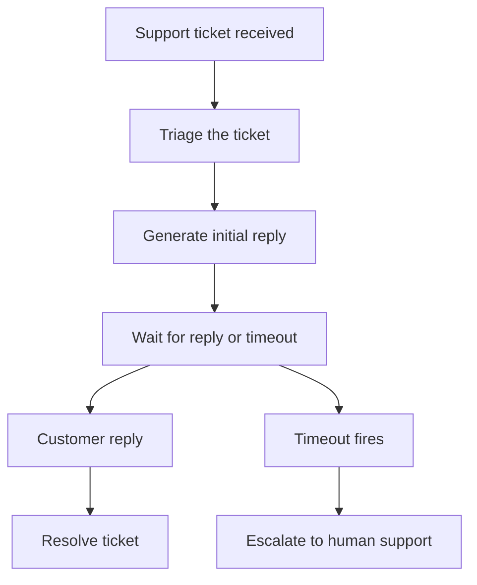

import { Steps } from "nextra/components";
import { snippets } from "@/lib/generated/snippets";
import { Snippet } from "@/components/code";

# How to Create a Support Agent Using Hatchet

Many real-world workflows become difficult to manage once they involve multiple steps, long waits, human replies, and escalation rules. Support is one example, but the same pattern also shows up in onboarding, approvals, incident response, and other operational flows. In this cookbook, we will build a simple support agent that triages a ticket, generates an initial reply, and then waits for either a customer response or a timeout. If the customer replies, the workflow resolves. If no reply arrives in time, the workflow escalates the ticket to a human support agent.

## What this example builds

This example implements the following durable support workflow:



Hatchet’s durable execution model helps keep the whole interaction in one workflow rather than scattering it across separate queue jobs and ad hoc timers.

## Setup

<Steps>

### Prepare your environment

To run this example, you will need:

- a working local Hatchet environment or access to Hatchet Cloud
- the Python SDK example environment
- optionally, an `ANTHROPIC_API_KEY`

Without `ANTHROPIC_API_KEY`, the example still runs using a fixed fallback reply.

### Define the models

Start with a few small Pydantic models for the workflow input and outputs.

<Snippet src={snippets.python.support_agent.worker.models} />

The models keep the inputs and outputs for each task explicit, which makes the workflow easier to inspect and test.

### Add the child tasks

The durable workflow delegates its work to a few small child tasks.

First, add a task to classify the incoming ticket:

<Snippet src={snippets.python.support_agent.worker.triage_task} />

Next, add a task to generate the initial support reply. This task calls Claude when `ANTHROPIC_API_KEY` is present and falls back to a fixed response when it is not.

<Snippet src={snippets.python.support_agent.worker.generate_reply_task} />

Finally, add a task to represent escalation to the support team:

<Snippet src={snippets.python.support_agent.worker.escalate_task} />

Keeping triage, reply generation, and escalation as separate tasks keeps the workflow itself small and makes each piece easier to reason about.

### Build the durable workflow

Now tie everything together in a durable Hatchet workflow.

<Snippet src={snippets.python.support_agent.worker.support_agent_workflow} />

As you can see, the workflow runs triage first, generates an initial reply, and then waits for one of two things to happen: either a customer reply event arrives for that ticket, or the timeout fires. From there, the workflow either resolves the ticket or escalates it.

The detail that matters most here is `consider_events_since` on the reply event condition. A customer reply could arrive while the workflow is still finishing triage or generating the first response. By using `consider_events_since`, the workflow can still pick up that reply once the wait becomes active instead of missing it because the event arrived slightly early.

### Register and start the worker

To run this workflow, register the workflow and its child tasks on a Hatchet worker, then start it.

<Snippet src={snippets.python.support_agent.worker.worker_registration} />

With the worker running, you can trigger the workflow and observe either the resolved or escalated outcome.

### Trigger the workflow

The example also includes a small trigger script that starts the workflow, pushes a scoped reply event, and waits for the result.

<Snippet src={snippets.python.support_agent.trigger.trigger_the_workflow} />

Because the workflow uses `consider_events_since`, the trigger can push the reply event immediately after starting the support agent.

### Test it

This example includes two end-to-end tests against a live Hatchet instance:

- a resolved path, where the customer reply event arrives before the timeout
- a timeout path, where no reply arrives and the workflow escalates

If you are running the Python SDK examples locally, you can run the support agent tests with:

```bash
pytest examples/support_agent/test_support_agent.py
```

Together, these tests validate both branches of the workflow and confirm that early reply events are handled safely without coordination sleeps.

</Steps>

## Why Hatchet fits this workflow

The interesting part of this example is not the LLM call. It is the combination of waiting, branching, and keeping the full interaction in one place. A support flow like this usually needs to preserve state across several steps, wait for human input, and react differently depending on whether a reply arrives before a deadline.

Hatchet supports that model well because the workflow can own the whole interaction directly. Instead of stitching together separate jobs, external timers, and custom retry logic, you can express the event wait and timeout branch as part of the workflow itself. That also makes the result easier to inspect and easier to test.

## Next steps

A natural next step would be to connect this workflow to a real ticketing system and carry the conversation beyond a single reply. You could also make escalation depend on the content of the customer response instead of only on timeout. For this cookbook, though, the smaller version is enough to show the core pattern: start work immediately, wait safely for a reply, and escalate when the deadline passes.
