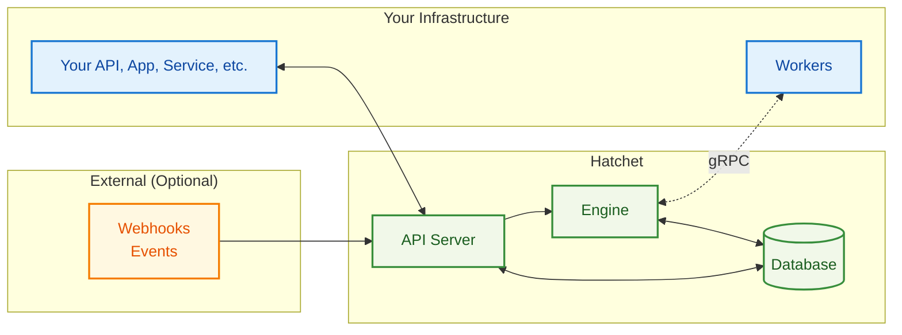

import { Callout } from "nextra/components";

# Architecture & Guarantees

This page explains how Hatchet is put together, what the main components do, and what reliability guarantees you should design your workers around.

## Architecture overview

Hatchet has three main moving pieces:

- **API server**: the HTTP surface area for triggering workflows, querying state, and powering the UI
- **Engine**: schedules and dispatches work, enforces dependencies/policies, and records state transitions durably
- **Workers**: your processes that run the actual task code

State is stored durably (PostgreSQL is the source of truth). In many deployments that’s enough—no separate broker required—while self-hosted high-throughput setups can add additional components (for example, RabbitMQ) based on your needs.

Hatchet Cloud and self-hosted Hatchet share the same architecture; the difference is who runs and operates the Hatchet services.

## Core components

### API server

The API server is the front door to Hatchet. It’s what your application and the Hatchet UI talk to in order to:

- trigger workflows with input data
- query workflow/task state (and, where supported, subscribe to updates)
- manage resources like schedules and settings
- ingest webhooks/events (optional)

### Engine

The engine is responsible for turning “a workflow should run” into “these tasks are ready and should be executed.” In practice, it:

- evaluates workflow dependencies
- enforces policies like concurrency limits, rate limits, and priorities
- schedules ready tasks and dispatches them to connected workers
- records state transitions durably and applies retry/timeout behavior
- runs scheduled/cron workflows

Workers connect to the engine over bidirectional gRPC, which allows low-latency dispatch and frequent status updates.

### Workers

Workers are your processes. They connect to the engine, receive tasks, run your code, and report progress/results back to Hatchet.

Workers are intentionally flexible: you can run them locally, in containers, or on VMs, and you can scale workers independently from the Hatchet services. You can also run different “types” of workers (and even different languages) depending on what your system needs.

### Storage (and optional messaging)

PostgreSQL is the durable store for workflow definitions and execution state (queued/running/completed, inputs/outputs, retries, etc.). In self-hosted deployments, you can start with PostgreSQL-only and add components like RabbitMQ if you need higher throughput.

## Guarantees & tradeoffs

Hatchet aims to sit in the middle: more structure than a simple queue, but simpler to operate than a full distributed workflow system.

### Good fit for

- **Workflow orchestration** with dependencies, retries, and timeouts
- **Durable background jobs** where “don’t lose work” matters
- **Moderate to high throughput** systems (and a path to higher scale with tuning/sharding). If you’re pushing the limits, [contact us](https://hatchet.run/contact).
- **Multi-language / polyglot workers**
- **Teams already on PostgreSQL** who want operational simplicity
- **Cloud or air-gapped environments** ([Hatchet Cloud](https://cloud.onhatchet.run) or [self-hosting](/self-hosting))

### Not a good fit for

- **Extremely high throughput** without sharding/custom tuning (for example, sustaining 10,000+ tasks/sec)
- **Sub-millisecond dispatch latency** requirements
- **In-memory-only queuing** where durability is unnecessary
- **Serverless-only runtimes** (e.g. AWS Lambda / Cloud Functions) as your primary worker model

## Core reliability guarantees

### At-least-once task execution

Hatchet is **at least once**: tasks are not silently dropped, and failures retry according to your configuration. This also means **a task can run more than once**, so your task code should be **idempotent** (or otherwise safe to retry).

### Durable state transitions

Workflow state is persisted in PostgreSQL, and state transitions are performed transactionally. This helps keep dependency resolution consistent and makes the system resilient to restarts and transient failures.

### Execution policies are explicit

By default, task assignment is FIFO, and you can change execution behavior using:

- [Concurrency policies](/concepts/concurrency)
- [Rate limits](/concepts/rate-limits)
- [Priorities](/concepts/priority)

### Stateless services; resilient workers

The engine and API server are designed to restart without losing state, which also enables horizontal scaling by running multiple instances. Workers reconnect after network interruptions and can run close to your services (or close to Hatchet) depending on your latency goals.

## Performance expectations

Real-world performance depends heavily on topology (worker ↔ engine network latency), database sizing, and workload shape.

- **Dispatch latency**: often sub-50ms with PostgreSQL-backed storage; in optimized, “hot worker” setups it can be closer to ~25ms P95.
- **Throughput**: varies by setup. PostgreSQL-only deployments often handle hundreds of tasks/sec per engine instance; higher throughput typically requires additional tuning and/or components like RabbitMQ. With tuning and sharding, Hatchet can scale into the high tens of thousands of tasks/sec—[contact us](https://hatchet.run/contact) if you want to design for that.
- **Common bottlenecks**: DB connection limits, large payloads (e.g. > 1MB), complex dependency graphs, and cross-region latency.

<Callout type="warning">

**Not seeing expected performance?**

If you're not seeing the performance you expect, please [reach out to us](https://hatchet.run/office-hours) or [join our community](https://hatchet.run/discord) to explore tuning options.

</Callout>

## Next Steps

- **[Quick Start](/essentials/quickstart)**: set up your first Hatchet worker
- **[Self-Hosting](/self-hosting)**: deploy Hatchet on your own infrastructure
