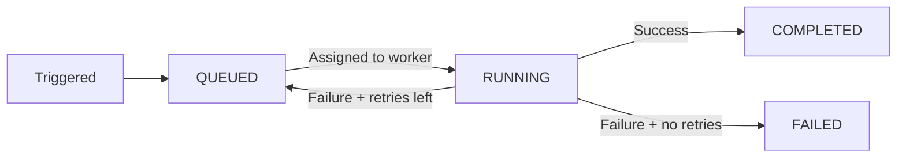

import { snippets } from "@/lib/generated/snippets";
import { Snippet } from "@/components/code";
import { Callout, Card, Cards, Steps, Tabs } from "nextra/components";
import UniversalTabs from "@/components/UniversalTabs";

# Declaring Your First Task

Everything you run in Hatchet is a **task** — a named function that you can trigger, retry, schedule, and observe. Tasks can be configured to handle the problems that come up in real systems.

## Defining a Task

At minimum, a task needs a name and a function. The returned object is a **runnable** — you'll use it directly to [trigger](/essentials/running-your-task) the task.

<UniversalTabs items={["Python", "Typescript", "Go", "Ruby"]}>
  <Tabs.Tab title="Python">

<Snippet src={snippets.python.quickstart.workflows.first_task.simple_task} />
</Tabs.Tab>
<Tabs.Tab title="Typescript">
<Snippet src={snippets.typescript.simple.workflow.declaring_a_task} />
</Tabs.Tab>
<Tabs.Tab title="Go">
<Snippet src={snippets.go.simple.main.declaring_a_task} />
</Tabs.Tab>
<Tabs.Tab title="Ruby">
<Snippet src={snippets.ruby.quickstart.workflows.first_task.simple_task} />
</Tabs.Tab>
</UniversalTabs>

## Task lifecycle

When you trigger a task, it moves through three phases: queued, running, and a terminal state.

A task can also be **CANCELLED** at any point — either explicitly or by a [timeout](/concepts/timeouts) expiring.

## Configuring a task

Tasks can be configured to handle common problems in distributed systems. For example, you might want to automatically retry a task when an external API returns a transient error, or limit how many instances of a task run at the same time to avoid overwhelming a downstream service.

| Concept | What it does |
| --- | --- |
| [Retries](/concepts/retry-policies) | Retry the task on failure, with optional backoff. |
| [Timeouts](/concepts/timeouts) | Limit how long a task may wait to be scheduled or to run. |
| [Concurrency](/concepts/concurrency) | Limit how many runs of this task execute at once. |
| [Rate limits](/concepts/rate-limits) | Throttle task execution over a time window. |
| [Priority](/concepts/priority) | Influence scheduling order relative to other queued tasks. |
| [Worker affinity](/concepts/worker-affinity) | Prefer or require specific workers for this task. |

See the [Concepts](/concepts) page for a complete overview of all possible configurations.

## Next steps

Now that you have a task defined, [create a worker](/essentials/workers) to execute it.

Want to dive deeper? The [Tasks concepts page](/concepts/tasks) covers triggering methods, input/output, the context object, and how tasks execute on workers.
