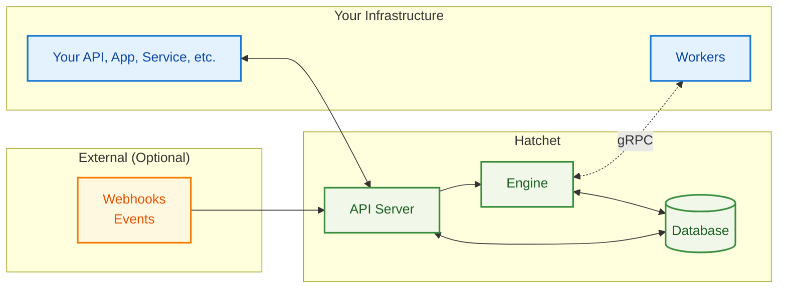

# Architecture

## Overview

Hatchet's architecture is designed around simplicity and reliability. At its core, Hatchet consists of three main components: the **Engine**, the **API Server**, and **Workers**. State is managed durably and efficiently, eliminating the need for additional message brokers or distributed systems.

Whether you use [Hatchet Cloud](https://cloud.onhatchet.run) or self-host, the architecture remains consistent, allowing seamless migration between deployment models as your needs evolve.

## Core Components

### Engine

The **Hatchet Engine** orchestrates the entire workflow execution process. It determines when and where tasks should run based on complex dependencies, concurrency limits, and worker availability. Key responsibilities include:

- **Task Scheduling**: Intelligent routing based on worker capacity and constraints
- **Queue Management**: Sophisticated priority, rate limiting, and fairness algorithms
- **Flow Control**: Enforces concurrency limits, rate limits, and routing rules
- **Retry Logic**: Automatic handling of failures, timeouts, and backpressure
- **Cron Processing**: Manages scheduled workflow executions

Communication with workers are handled through bidirectional gRPC connections that enable real-time task dispatch and status updates with minimal latency and network overhead. The Hatchet engine continuously tracks task execution state and automatically handles retries, timeouts, and failure scenarios without manual intervention.

The Engine is designed to be horizontally scalable—multiple engine instances can run simultaneously, coordinating through the persistent storage layer to handle increasing workloads seamlessly.

### API Server

The **API Server** serves as the primary interface for viewing Hatchet resources. It exposes REST endpoints that the Hatchet UI and your applications use to:

- **Trigger Workflows**: Start new workflow executions with input data
- **Query or Subscribe to Status**: Check workflow and task execution status
- **Manage Resources**: Configure workflows, schedules, and settings
- **Webhook Ingestion**: Receive and process external events

Security is handled through multi-tenant authentication with API keys and JWT tokens, or webhook signature verification where applicable, to ensure only authentic requests are processed. The API Server also powers Hatchet's web dashboard through REST endpoints, giving you real-time visibility into your workflows.

### Workers

**Workers** are your application processes that execute the actual business logic. They establish secure, bidirectional gRPC connections to the Engine and run your functions when tasks are dispatched. Workers continuously report status updates, including task progress, logs, and results, giving you real-time visibility into execution.

When tasks need to be cancelled, workers handle this gracefully with proper cleanup procedures. One of Hatchet's key design goals is deployment flexibility: workers can run anywhere, from containers to VMs or even your local development machine. This flexibility means you can start development locally, deploy to staging in containers, and run production workloads on dedicated infrastructure without changing your worker code.

You can run either homogeneous or heterogeneous workers. Homogeneous workers are a single type of worker that is used for all tasks. Heterogeneous workers are a mix of different types of workers that are used for different tasks.

Heterogeneous workers can also be polyglot, meaning they can run multiple languages. For example, you can run a Python worker, a Go worker, and a TypeScript worker which can all be invoked from the same service application.

### Persistent Storage & Inter-Service Communication

The platform maintains durable state for all aspects of workflow execution, including task queue state for queued, running, and completed tasks. Workflow definitions with their dependencies, configuration, and metadata are stored persistently, ensuring your orchestration logic survives system restarts.

In [self-hosted deployments](../self-hosting), this can be a single PostgreSQL database, or for high-throughput workloads you can use RabbitMQ for inter-service communication. In [Hatchet Cloud](https://hatchet.run), this is managed for you with enterprise-grade reliability and performance, handling backups, scaling, and maintenance automatically.

## Design Philosophy

Hatchet prioritizes simplicity over complexity:

- **PostgreSQL foundation** - Built on PostgreSQL with optional RabbitMQ for high-throughput workloads
- **Stateless services** - Engine and API scale horizontally
- **Worker flexibility** - Deploy anywhere, any language (Python/TypeScript/Go), independent scaling

## Next Steps

**[Guarantees & Tradeoffs](./guarantees-and-tradeoffs.mdx)** - Learn about Hatchet's guarantees, limitations, and performance characteristics.

**[Quick Start](./setup.mdx)** - Set up your first Hatchet worker.

**[Self Hosting](../self-hosting)** - Deploy the Hatchet platform on your own infrastructure.
