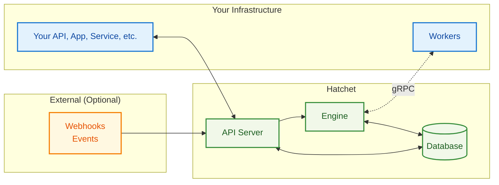

import { Callout } from "nextra/components";

# Architecture & Guarantees

## Architecture Overview

Hatchet's architecture is designed around simplicity and reliability. At its core, Hatchet consists of three main components: the **Engine**, the **API Server**, and **Workers**. State is managed durably and efficiently, eliminating the need for additional message brokers or distributed systems.

Whether you use [Hatchet Cloud](https://cloud.onhatchet.run) or self-host, the architecture remains consistent, allowing seamless migration between deployment models as your needs evolve.

## Core Components

### Engine

The **Hatchet Engine** orchestrates the entire workflow execution process. It determines when and where tasks should run based on complex dependencies, concurrency limits, and worker availability. Key responsibilities include:

- **Task Scheduling**: Intelligent routing based on worker capacity and constraints
- **Queue Management**: Sophisticated priority, rate limiting, and fairness algorithms
- **Flow Control**: Enforces concurrency limits, rate limits, and routing rules
- **Retry Logic**: Automatic handling of failures, timeouts, and backpressure
- **Cron Processing**: Manages scheduled workflow executions

Communication with workers are handled through bidirectional gRPC connections that enable real-time task dispatch and status updates with minimal latency and network overhead. The Hatchet engine continuously tracks task execution state and automatically handles retries, timeouts, and failure scenarios without manual intervention.

The Engine is designed to be horizontally scalable—multiple engine instances can run simultaneously, coordinating through the persistent storage layer to handle increasing workloads seamlessly.

### API Server

The **API Server** serves as the primary interface for viewing Hatchet resources. It exposes REST endpoints that the Hatchet UI and your applications use to:

- **Trigger Workflows**: Start new workflow executions with input data
- **Query or Subscribe to Status**: Check workflow and task execution status
- **Manage Resources**: Configure workflows, schedules, and settings
- **Webhook Ingestion**: Receive and process external events

Security is handled through multi-tenant authentication with API keys and JWT tokens, or webhook signature verification where applicable, to ensure only authentic requests are processed. The API Server also powers Hatchet's web dashboard through REST endpoints, giving you real-time visibility into your workflows.

### Workers

**Workers** are your application processes that execute the actual business logic. They establish secure, bidirectional gRPC connections to the Engine and run your functions when tasks are dispatched. Workers continuously report status updates, including task progress, logs, and results, giving you real-time visibility into execution.

When tasks need to be cancelled, workers handle this gracefully with proper cleanup procedures. One of Hatchet's key design goals is deployment flexibility: workers can run anywhere, from containers to VMs or even your local development machine. This flexibility means you can start development locally, deploy to staging in containers, and run production workloads on dedicated infrastructure without changing your worker code.

You can run either homogeneous or heterogeneous workers. Homogeneous workers are a single type of worker that is used for all tasks. Heterogeneous workers are a mix of different types of workers that are used for different tasks.

Heterogeneous workers can also be polyglot, meaning they can run multiple languages. For example, you can run a Python worker, a Go worker, and a TypeScript worker which can all be invoked from the same service application.

### Persistent Storage & Inter-Service Communication

The platform maintains durable state for all aspects of workflow execution, including task queue state for queued, running, and completed tasks. Workflow definitions with their dependencies, configuration, and metadata are stored persistently, ensuring your orchestration logic survives system restarts.

In [self-hosted deployments](/self-hosting), this can be a single PostgreSQL database, or for high-throughput workloads you can use RabbitMQ for inter-service communication. In [Hatchet Cloud](https://hatchet.run), this is managed for you with enterprise-grade reliability and performance, handling backups, scaling, and maintenance automatically.

## Design Philosophy

Hatchet prioritizes simplicity over complexity:

- **PostgreSQL foundation** - Built on PostgreSQL with optional RabbitMQ for high-throughput workloads
- **Stateless services** - Engine and API scale horizontally
- **Worker flexibility** - Deploy anywhere, any language (Python/TypeScript/Go), independent scaling

---

## Guarantees & Tradeoffs

Hatchet is designed as a modern task orchestration platform that bridges the gap between simple job queues and complex workflow engines. Understanding where it excels—and where it doesn't—will help you determine if it's the right fit for your needs.

### Good Fit

<table>
  <tbody>
    <tr>
      <td>✅</td>
      <td>
        <strong>Real-time Requests</strong> - Sub-25ms task dispatch for hot
        workers with thousands of concurrent tasks
      </td>
    </tr>
    <tr>
      <td>✅</td>
      <td>
        <strong>Workflow Orchestration</strong> with dependencies and error
        handling
      </td>
    </tr>
    <tr>
      <td>✅</td>
      <td>
        <strong>Reliable Task Processing</strong> where durability matters
      </td>
    </tr>
    <tr>
      <td>✅</td>
      <td>
        <strong>Moderate to High Throughput</strong> - Hundreds to tens of
        thousands of tasks/second; with tuning and sharding, Hatchet can scale
        into the <strong>high tens of thousands</strong>. [Contact us](https://hatchet.run/contact) to discuss your scale requirements.
      </td>
    </tr>
    <tr>
      <td>✅</td>
      <td>
        <strong>Multi-Language Workers</strong> or polyglot teams
      </td>
    </tr>
    <tr>
      <td>✅</td>
      <td>
        <strong>Operational Simplicity</strong> if your team is already using
        PostgreSQL
      </td>
    </tr>
    <tr>
      <td>✅</td>
      <td>
        <strong>Cloud or Air-Gapped Environments</strong> for flexible
        deployment options (
        <a href="https://cloud.onhatchet.run">Hatchet Cloud</a> and{" "}
        <a href="/self-hosting">self-hosting</a>)
      </td>
    </tr>
  </tbody>
</table>

### Not a Good Fit

<table>
  <tbody>
    <tr>
      <td>❌</td>
      <td>
        <strong>Extremely High Throughput</strong> (consistently 10,000+
        tasks/second without sharding or custom tuning)
      </td>
    </tr>
    <tr>
      <td>❌</td>
      <td>
        <strong>Sub-Millisecond Latency</strong> requirements
      </td>
    </tr>
    <tr>
      <td>❌</td>
      <td>
        <strong>Memory-Only Queuing</strong> where persistence or durability
        isn't needed
      </td>
    </tr>
    <tr>
      <td>❌</td>
      <td>
        <strong>Serverless Environments</strong> on cloud providers like AWS
        Lambda, Google Cloud Functions, or Azure Functions
      </td>
    </tr>
  </tbody>
</table>

## Core Reliability Guarantees

Hatchet is designed with the following core reliability guarantees:

**Every task will execute at least once.** Hatchet ensures that no task gets lost, even during system failures, network outages, or deployments. Failed tasks automatically retry according to your configuration, and all tasks persist through restarts and network issues.

**Consistent state management.** All workflow state changes happen within PostgreSQL transactions, ensuring that your workflow dependencies resolve consistently and no tasks are lost during failures or deployments.

**Predictable execution order.** The default task assignment strategy is First In First Out (FIFO) which can be modified with [concurrency policies](/concepts/concurrency), [rate limits](/concepts/rate-limits), and [priorities](/concepts/priority).

**Operational resilience.** The engine and API servers are stateless, allowing them to restart without losing state and enabling horizontal scaling by simply adding more instances. Workers automatically reconnect after network issues and can be deployed anywhere—containers, VMs, or local development environments.

## Performance Expectations

Understanding Hatchet's performance characteristics helps you plan your implementation and set realistic expectations.

**Typical time-to-start latency** for task dispatch is sub 50ms with PostgreSQL storage, though this can be optimized to ~25ms P95 for hot workers in optimized setups. Network latency between your workers and the Hatchet engine will directly impact dispatch times, so consider deployment topology when latency matters.

**Throughput capacity** varies significantly based on your setup. A single engine instance with PostgreSQL-only storage typically handles hundreds of tasks per second. When you need higher throughput, adding RabbitMQ as a message queue can substantially increase capacity. **With tuning and sharding, Hatchet can scale into the high tens of thousands of tasks per second**—[contact us](https://hatchet.run/contact) to discuss your requirements and architecture.

**Concurrent processing** scales well — Hatchet supports thousands of concurrent workers, with worker-level concurrency controlled through slot configuration. The depth of your queues is limited by your database storage capacity rather than memory constraints.

**Performance optimization** comes through several strategies: RabbitMQ for high-throughput workloads, read replicas for analytics queries, connection pooling with tools like PgBouncer, and shorter retention periods for execution history. Conversely, performance can be limited by database connection limits, large task payloads (over 1MB), complex dependency graphs, and cross-region network latency.

<Callout type="warning">

**Not seeing expected performance?**

If you're not seeing the performance you expect, please [reach out to us](https://hatchet.run/office-hours) or [join our community](https://hatchet.run/discord) to explore tuning options.

</Callout>

## Next Steps

**[Quick Start](/guide/hatchet-cloud-quickstart/advanced)** - Set up your first Hatchet worker.

**[Self-Hosting](/self-hosting)** - Deploy the Hatchet platform on your own infrastructure.
