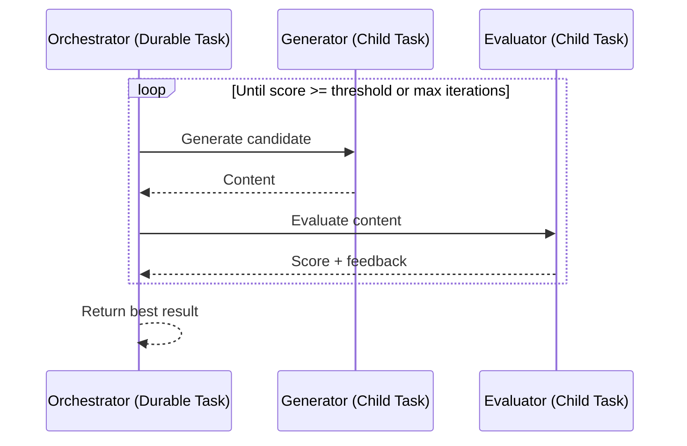

import { Callout, Cards, Steps, Tabs } from "nextra/components";
import { snippets } from "@/lib/generated/snippets";
import { Snippet } from "@/components/code";
import UniversalTabs from "@/components/UniversalTabs";

# Evaluator-Optimizer

The evaluator-optimizer pattern uses two LLM calls per iteration: one to **generate** a candidate output and one to **evaluate** it against a rubric. If the evaluator scores the output below a threshold, it provides feedback and the generator tries again. The loop continues until the evaluator is satisfied or a max iteration count is reached.

This pattern trades compute cost for output quality. It's useful whenever a first draft can be systematically improved — content writing, code generation, data extraction, translation — and you have clear evaluation criteria.

## When to use

| Scenario                                        | Fit                                                    |
| ----------------------------------------------- | ------------------------------------------------------ |
| Content writing (social posts, emails, ad copy) | Good — measurable quality criteria, cheap to iterate   |
| Code generation with test suites                | Good — evaluator runs tests, feeds back failures       |
| Data extraction from documents                  | Good — evaluator checks schema conformance             |
| Subjective creative tasks with no rubric        | Poor — evaluator can't converge without clear criteria |
| Latency-sensitive requests (< 2s)               | Poor — multiple LLM round-trips add latency            |

## How it maps to Hatchet

The orchestrator is a **durable task** that runs the loop. Each generator and evaluator call is a **child task** spawned with `.run()`. Durable execution checkpoints after each child completes, so if the worker crashes mid-loop the agent resumes from the last completed iteration rather than restarting.

## Step-by-step walkthrough

<Steps>

### Step 1: Define the generator and evaluator tasks

Create separate tasks for generation and evaluation. The generator takes a topic and optional feedback; the evaluator scores a draft.

<UniversalTabs items={["Python", "Typescript", "Go", "Ruby"]}>
  <Tabs.Tab title="Python">
    <Snippet
      src={
        snippets.python.guides.evaluator_optimizer.worker.step_01_define_tasks
      }
    />
  </Tabs.Tab>
  <Tabs.Tab title="Typescript">
    <Snippet
      src={
        snippets.typescript.guides.evaluator_optimizer.workflow
          .step_01_define_tasks
      }
    />
  </Tabs.Tab>
  <Tabs.Tab title="Go">
    <Snippet
      src={snippets.go.guides.evaluator_optimizer.main.step_01_define_tasks}
    />
  </Tabs.Tab>
  <Tabs.Tab title="Ruby">
    <Snippet
      src={snippets.ruby.guides.evaluator_optimizer.worker.step_01_define_tasks}
    />
  </Tabs.Tab>
</UniversalTabs>

### Step 2: Optimization loop

The orchestrator is a durable task that loops: generate → evaluate → check score. Each `.run()` / `.aio_run()` call creates a child run that is checkpointed. If the worker dies mid-loop, the orchestrator resumes from the last completed iteration.

<UniversalTabs items={["Python", "Typescript", "Go", "Ruby"]} variant="hidden">
  <Tabs.Tab title="Python">
    <Snippet
      src={
        snippets.python.guides.evaluator_optimizer.worker
          .step_02_optimization_loop
      }
    />
  </Tabs.Tab>
  <Tabs.Tab title="Typescript">
    <Snippet
      src={
        snippets.typescript.guides.evaluator_optimizer.workflow
          .step_02_optimization_loop
      }
    />
  </Tabs.Tab>
  <Tabs.Tab title="Go">
    <Snippet
      src={
        snippets.go.guides.evaluator_optimizer.main.step_02_optimization_loop
      }
    />
  </Tabs.Tab>
  <Tabs.Tab title="Ruby">
    <Snippet
      src={
        snippets.ruby.guides.evaluator_optimizer.worker
          .step_02_optimization_loop
      }
    />
  </Tabs.Tab>
</UniversalTabs>

### Step 3: Run the worker

Register all tasks and start the worker.

<UniversalTabs items={["Python", "Typescript", "Go", "Ruby"]} variant="hidden">
  <Tabs.Tab title="Python">
    <Snippet
      src={snippets.python.guides.evaluator_optimizer.worker.step_03_run_worker}
    />
  </Tabs.Tab>
  <Tabs.Tab title="Typescript">
    <Snippet
      src={
        snippets.typescript.guides.evaluator_optimizer.worker.step_03_run_worker
      }
    />
  </Tabs.Tab>
  <Tabs.Tab title="Go">
    <Snippet
      src={snippets.go.guides.evaluator_optimizer.main.step_03_run_worker}
    />
  </Tabs.Tab>
  <Tabs.Tab title="Ruby">
    <Snippet
      src={snippets.ruby.guides.evaluator_optimizer.worker.step_03_run_worker}
    />
  </Tabs.Tab>
</UniversalTabs>

</Steps>

<Callout type="warning">
  Always set a **max iteration count** and **execution timeout**. Without
  bounds, the loop can run indefinitely. See [Timeouts](/concepts/timeouts).
</Callout>

## Common use cases

| Use case            | Generator                | Evaluator                                             |
| ------------------- | ------------------------ | ----------------------------------------------------- |
| **Content writing** | Draft post/email/copy    | Score clarity, tone, length; provide edit suggestions |
| **Code generation** | Write function or query  | Run tests or linter; feed back errors                 |
| **Data extraction** | Extract fields from text | Validate against schema; flag missing fields          |
| **Translation**     | Translate text           | Back-translate and compare; score fidelity            |

## Related patterns

<Cards>
  <Cards.Card title="Reasoning Loop" href="/guides/ai-agents/reasoning-loop">
    General agent loop with tool calls. Evaluator-optimizer is a specialized
    form where the "tool" is an evaluator LLM.
  </Cards.Card>
  <Cards.Card title="LLM Pipelines" href="/guides/llm-pipelines">
    Fixed-stage LLM chains with validation gates. Use when stages don't need
    iterative feedback loops.
  </Cards.Card>
  <Cards.Card
    title="Cycles"
    href="/concepts/durable-workflows/durable-task-execution/child-spawning"
  >
    The underlying Hatchet primitive: a task that re-spawns itself until a
    condition is met.
  </Cards.Card>
  <Cards.Card title="Human-in-the-Loop" href="/guides/human-in-the-loop">
    Replace automated evaluation with human review for subjective quality
    criteria.
  </Cards.Card>
</Cards>
