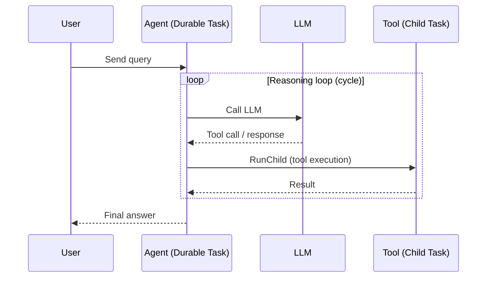

import { Callout, Cards } from "nextra/components";

# What is an AI Agent?

An **AI agent** is a program that uses an LLM to decide what to do next at runtime. Instead of following a fixed pipeline, the agent reasons about its goal, picks a tool or action, observes the result, and loops until the goal is met. This makes agents powerful — and hard to run reliably.

Agents fail in production when the process hosting them dies mid-loop, when they burn through worker slots while waiting for human approval, or when a long-running reasoning chain exhausts a timeout. Hatchet solves these problems by making every agent a **durable task**.

## How agents map to Hatchet

| Agent concept       | Hatchet primitive                                                                                             |
| ------------------- | ------------------------------------------------------------------------------------------------------------- |
| Agent               | [Durable task](/concepts/durable-workflows/durable-task-execution)                                            |
| Reasoning loop      | [Cycle](/concepts/durable-workflows/durable-task-execution/child-spawning) — task re-spawns itself until done |
| Tool calls          | [Child tasks](/concepts/durable-workflows/directed-acyclic-graphs/child-spawning) or external API calls       |
| Human approval gate | [WaitForEvent](/concepts/durable-workflows/durable-task-execution/durable-events) — slot freed while waiting  |
| Parallel tool calls | [Fanout](/concepts/durable-workflows/directed-acyclic-graphs/child-spawning) — spawn children concurrently    |
| Routing by LLM      | `if`/`else` in code + `RunChild` to different workflows                                                       |

## Why Hatchet for agents

**Survives crashes.** Each iteration of the reasoning loop is a child run. Completed iterations are checkpointed; if the worker dies, the agent resumes from the last checkpoint rather than restarting from scratch.

**Frees slots during waits.** When an agent calls `WaitForEvent` (for human approval) or `SleepFor` (for a scheduled retry), the worker slot is [evicted](/concepts/durable-workflows/durable-task-execution/task-eviction) and freed. No resources are held while the agent is idle — even if the wait lasts hours or days.

**Streams tokens in real time.** Call `putStream` inside the task to emit LLM tokens as they're generated. Clients subscribe with `subscribe_to_stream` and receive chunks immediately.

**Controls concurrency.** Set `CANCEL_IN_PROGRESS` on a session key so new user messages cancel stale agent runs. This prevents zombie agents from piling up in chat applications.

**Full observability.** Every child run appears in the Hatchet dashboard. You can trace the full reasoning chain: which tools were called, what the LLM returned, where the loop terminated.

## Agent patterns

<Cards>
  <Cards.Card title="Reasoning Loop" href="/guides/ai-agents/reasoning-loop">
    The core agent pattern. Reason → act → observe → repeat until done. Every
    agent starts here.
  </Cards.Card>
  <Cards.Card
    title="Evaluator-Optimizer"
    href="/guides/ai-agents/evaluator-optimizer"
  >
    Generate content, evaluate quality, feed back improvements. Loop until a
    score threshold is met.
  </Cards.Card>
  <Cards.Card title="Routing" href="/guides/ai-agents/routing">
    Classify incoming requests with an LLM or rule, then route to a specialist
    workflow.
  </Cards.Card>
  <Cards.Card title="Multi-Agent" href="/guides/ai-agents/multi-agent">
    An orchestrator delegates to specialist agents. Each specialist is its own
    workflow with its own prompt and tools.
  </Cards.Card>
  <Cards.Card title="Parallelization" href="/guides/ai-agents/parallelization">
    Fan out independent tool calls or sub-tasks in parallel. Aggregate results
    before the agent continues.
  </Cards.Card>
</Cards>

### Related guides

These top-level guides cover patterns commonly combined with agents:

<Cards>
  <Cards.Card title="Human-in-the-Loop" href="/guides/human-in-the-loop">
    Pause the agent for human approval. The slot is freed; the agent resumes
    when the event arrives.
  </Cards.Card>
  <Cards.Card title="LLM Pipelines" href="/guides/llm-pipelines">
    Fixed-sequence LLM stages with validation gates. Use when the pipeline shape
    is known upfront.
  </Cards.Card>
  <Cards.Card title="Streaming" href="/guides/streaming">
    Stream LLM tokens to frontends in real time via put_stream.
  </Cards.Card>
</Cards>

## Next steps

- [Reasoning Loop](/guides/ai-agents/reasoning-loop) — Start with the core agent loop
- [Durable Execution](/concepts/durable-workflows/durable-task-execution) — How checkpointing, replay, and eviction work
- [Concurrency Control](/concepts/concurrency) — Configure CANCEL_IN_PROGRESS for chat agents
