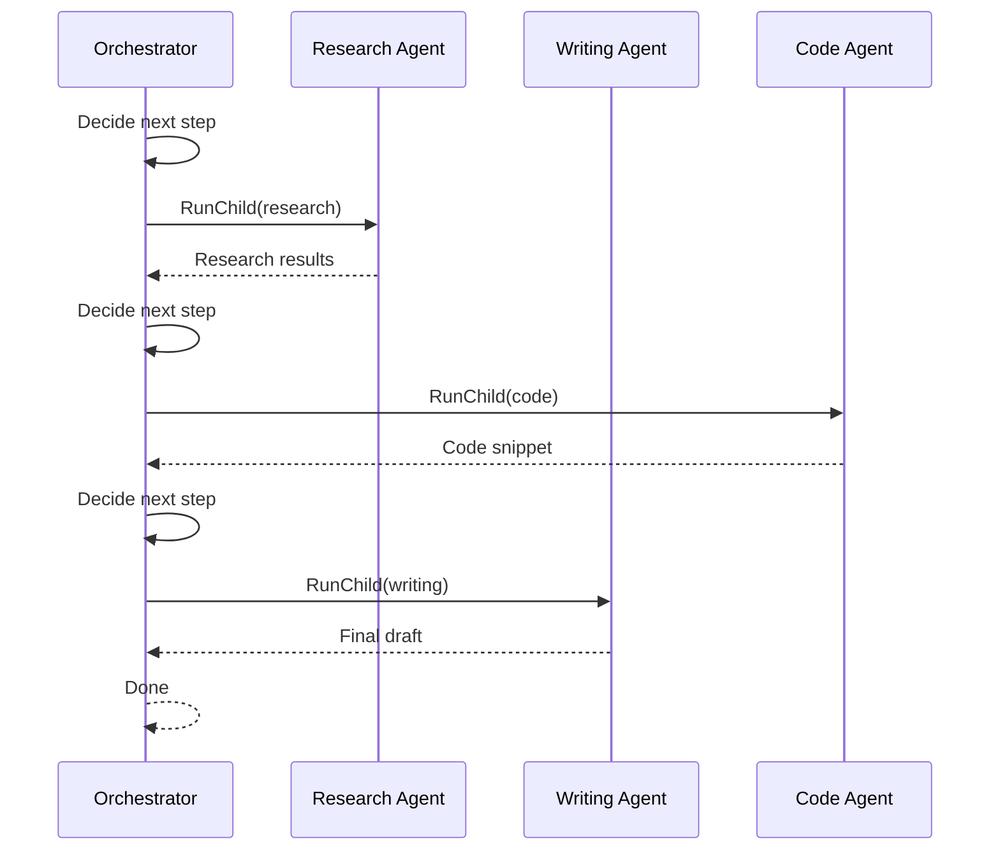

import { Callout, Cards, Steps, Tabs } from "nextra/components";
import { snippets } from "@/lib/generated/snippets";
import { Snippet } from "@/components/code";
import UniversalTabs from "@/components/UniversalTabs";

# Multi-Agent

Multi-agent orchestration uses a coordinating agent that delegates work to specialist agents. Unlike [routing](/guides/ai-agents/routing) (which classifies once and calls one handler), the orchestrator runs a **reasoning loop** — it may call multiple specialists across multiple iterations, passing results between them, until the overall goal is met.

Each specialist is a separate Hatchet workflow with its own prompt, tools, timeout, and retry settings. The orchestrator's LLM decides which specialist to call next based on the accumulated context.

## When to use

| Scenario                                                              | Fit                                                 |
| --------------------------------------------------------------------- | --------------------------------------------------- |
| Complex tasks needing different expertise (research + code + writing) | Good — each specialist focuses on one domain        |
| Customer service with support, sales, and billing specialists         | Good — orchestrator picks the right expert per turn |
| Tasks where output from one specialist feeds the next                 | Good — orchestrator passes context between calls    |
| Simple tasks a single agent can handle end-to-end                     | Skip — orchestration overhead isn't worth it        |
| Specialists always run in a fixed sequence                            | Use [LLM Pipelines](/guides/llm-pipelines) instead  |

## How it maps to Hatchet

The orchestrator is a **durable task** running a reasoning loop ([cycle](/concepts/durable-workflows/durable-task-execution/child-spawning)). Each specialist is a standalone workflow spawned via `.run()` / `.aio_run()`. The orchestrator's LLM returns structured tool calls — each tool name maps to a specialist workflow.

Because each specialist call is a child run, the orchestrator's slot is freed while specialists execute. If the orchestrator dies mid-loop, it resumes from the last checkpoint without re-running completed specialist calls.

## Step-by-step walkthrough

<Steps>

### Step 1: Define the specialist agents

Each specialist is a standalone task with its own prompt and timeout. They run independently and can be reused across different orchestrators.

<UniversalTabs items={["Python", "Typescript", "Go", "Ruby"]}>
  <Tabs.Tab title="Python">
    <Snippet
      src={snippets.python.guides.multi_agent.worker.step_01_specialist_agents}
    />
  </Tabs.Tab>
  <Tabs.Tab title="Typescript">
    <Snippet
      src={
        snippets.typescript.guides.multi_agent.workflow
          .step_01_specialist_agents
      }
    />
  </Tabs.Tab>
  <Tabs.Tab title="Go">
    <Snippet
      src={snippets.go.guides.multi_agent.main.step_01_specialist_agents}
    />
  </Tabs.Tab>
  <Tabs.Tab title="Ruby">
    <Snippet
      src={snippets.ruby.guides.multi_agent.worker.step_01_specialist_agents}
    />
  </Tabs.Tab>
</UniversalTabs>

### Step 2: Orchestrator loop

The orchestrator runs a reasoning loop: call LLM → parse tool choice → spawn specialist → observe result → repeat. Context accumulates across iterations so later specialist calls have full history.

<UniversalTabs items={["Python", "Typescript", "Go", "Ruby"]} variant="hidden">
  <Tabs.Tab title="Python">
    <Snippet
      src={snippets.python.guides.multi_agent.worker.step_02_orchestrator_loop}
    />
  </Tabs.Tab>
  <Tabs.Tab title="Typescript">
    <Snippet
      src={
        snippets.typescript.guides.multi_agent.workflow
          .step_02_orchestrator_loop
      }
    />
  </Tabs.Tab>
  <Tabs.Tab title="Go">
    <Snippet
      src={snippets.go.guides.multi_agent.main.step_02_orchestrator_loop}
    />
  </Tabs.Tab>
  <Tabs.Tab title="Ruby">
    <Snippet
      src={snippets.ruby.guides.multi_agent.worker.step_02_orchestrator_loop}
    />
  </Tabs.Tab>
</UniversalTabs>

### Step 3: Run the worker

Register all specialists and the orchestrator, then start the worker.

<UniversalTabs items={["Python", "Typescript", "Go", "Ruby"]} variant="hidden">
  <Tabs.Tab title="Python">
    <Snippet
      src={snippets.python.guides.multi_agent.worker.step_03_run_worker}
    />
  </Tabs.Tab>
  <Tabs.Tab title="Typescript">
    <Snippet
      src={snippets.typescript.guides.multi_agent.worker.step_03_run_worker}
    />
  </Tabs.Tab>
  <Tabs.Tab title="Go">
    <Snippet src={snippets.go.guides.multi_agent.main.step_03_run_worker} />
  </Tabs.Tab>
  <Tabs.Tab title="Ruby">
    <Snippet src={snippets.ruby.guides.multi_agent.worker.step_03_run_worker} />
  </Tabs.Tab>
</UniversalTabs>

</Steps>

<Callout type="warning">
  Always set a **max iteration count** and **execution timeout** on the
  orchestrator. Without bounds, the loop can call specialists indefinitely.
</Callout>

## Multi-agent vs. routing

|                      | Multi-agent                                        | Routing                       |
| -------------------- | -------------------------------------------------- | ----------------------------- |
| **Specialist calls** | Multiple, across loop iterations                   | One per request               |
| **Orchestration**    | Reasoning loop — LLM decides next step dynamically | Classify once, route once     |
| **Use when**         | Task needs multiple types of expertise             | Task fits a single specialist |

## Related patterns

<Cards>
  <Cards.Card title="Reasoning Loop" href="/guides/ai-agents/reasoning-loop">
    Multi-agent is a reasoning loop where "tools" are specialist workflows
    instead of API calls.
  </Cards.Card>
  <Cards.Card title="Routing" href="/guides/ai-agents/routing">
    Classify once and route to one handler. Multi-agent loops and may call many.
  </Cards.Card>
  <Cards.Card title="Parallelization" href="/guides/ai-agents/parallelization">
    When multiple specialists can work independently, spawn them in parallel
    within a single iteration.
  </Cards.Card>
  <Cards.Card
    title="Child Spawning"
    href="/concepts/durable-workflows/directed-acyclic-graphs/child-spawning"
  >
    The Hatchet primitive used to spawn specialist workflows from the
    orchestrator.
  </Cards.Card>
</Cards>
