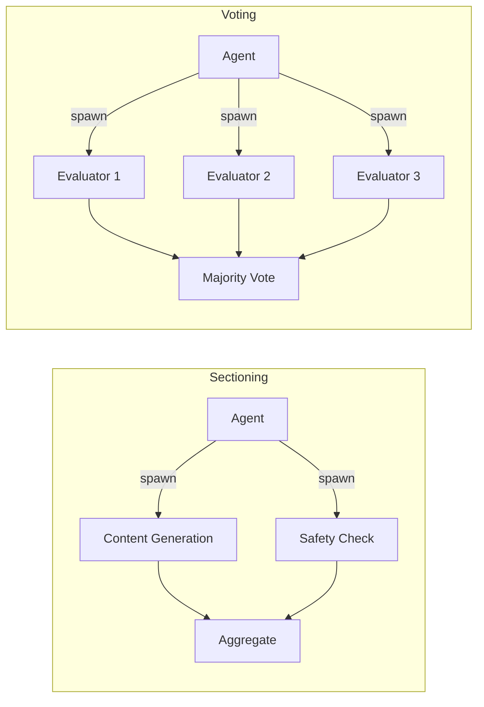

import { Callout, Cards, Steps, Tabs } from "nextra/components";
import { snippets } from "@/lib/generated/snippets";
import { Snippet } from "@/components/code";
import UniversalTabs from "@/components/UniversalTabs";

# Parallelization

Parallelization spawns multiple independent tasks at the same time and aggregates results before continuing. Inside an agent loop, this typically means running several tool calls concurrently when they don't depend on each other. At a system level, it can mean running the same input through multiple evaluators and picking the best (or majority) result.

Hatchet distributes child runs across all running workers where the task is registered. The parent's slot is [freed while children execute](/concepts/durable-workflows/durable-task-execution/task-eviction), so you don't hold resources during parallel work.

There are two common variants:

- **Sectioning**: different tasks handle different concerns in parallel (e.g., content generation + safety check).
- **Voting**: the same task runs N times and results are aggregated by majority vote or best score.

## When to use

| Scenario                                              | Fit                                                                              |
| ----------------------------------------------------- | -------------------------------------------------------------------------------- |
| Agent calls 3 independent APIs (weather, news, stock) | Good: no dependencies between calls, latency drops to max of the three           |
| Content generation + safety guardrail in parallel     | Good: sectioning, both run at once, block if unsafe                              |
| Multiple evaluators vote on content quality           | Good: voting, aggregate for more reliable decisions                              |
| Processing a batch of items (100+ documents)          | Good: see [Batch Processing](/guides/batch-processing) for large-scale fanout    |
| Steps depend on each other (output of A feeds B)      | Skip: run sequentially                                                           |
| Provider rate limits are tight                        | Careful: parallel calls may hit limits; use [Rate Limits](/concepts/rate-limits) |

## How it maps to Hatchet

The parent task spawns children via [child spawning](/concepts/durable-workflows/directed-acyclic-graphs/child-spawning). Each child runs on any available worker. The parent's slot is [evicted](/concepts/durable-workflows/durable-task-execution/task-eviction) while children execute, so you're not holding resources during the parallel work. When all children complete, the parent resumes and aggregates.

## Step-by-step walkthrough

<Steps>

### Define the parallel tasks

Create separate tasks for each concern. These run independently and can be composed in different patterns.

<UniversalTabs items={["Python", "Typescript", "Go", "Ruby"]}>
  <Tabs.Tab title="Python">
    <Snippet
      src={snippets.python.guides.parallelization.worker.step_01_parallel_tasks}
    />
  </Tabs.Tab>
  <Tabs.Tab title="Typescript">
    <Snippet
      src={
        snippets.typescript.guides.parallelization.workflow
          .step_01_parallel_tasks
      }
    />
  </Tabs.Tab>
  <Tabs.Tab title="Go">
    <Snippet
      src={snippets.go.guides.parallelization.main.step_01_parallel_tasks}
    />
  </Tabs.Tab>
  <Tabs.Tab title="Ruby">
    <Snippet
      src={snippets.ruby.guides.parallelization.worker.step_01_parallel_tasks}
    />
  </Tabs.Tab>
</UniversalTabs>

### Sectioning (parallel concerns)

Sectioning runs different concerns in parallel. The example generates content and checks safety at the same time. If the safety check fails, the content is blocked even though generation succeeded.

<UniversalTabs items={["Python", "Typescript", "Go", "Ruby"]} variant="hidden">
  <Tabs.Tab title="Python">
    <Snippet
      src={snippets.python.guides.parallelization.worker.step_02_sectioning}
    />
  </Tabs.Tab>
  <Tabs.Tab title="Typescript">
    <Snippet
      src={
        snippets.typescript.guides.parallelization.workflow.step_02_sectioning
      }
    />
  </Tabs.Tab>
  <Tabs.Tab title="Go">
    <Snippet src={snippets.go.guides.parallelization.main.step_02_sectioning} />
  </Tabs.Tab>
  <Tabs.Tab title="Ruby">
    <Snippet
      src={snippets.ruby.guides.parallelization.worker.step_02_sectioning}
    />
  </Tabs.Tab>
</UniversalTabs>

### Voting (parallel consensus)

Voting runs the same evaluation N times and aggregates by majority or average score. This produces more reliable decisions than a single evaluation.

<UniversalTabs items={["Python", "Typescript", "Go", "Ruby"]} variant="hidden">
  <Tabs.Tab title="Python">
    <Snippet
      src={snippets.python.guides.parallelization.worker.step_03_voting}
    />
  </Tabs.Tab>
  <Tabs.Tab title="Typescript">
    <Snippet
      src={snippets.typescript.guides.parallelization.workflow.step_03_voting}
    />
  </Tabs.Tab>
  <Tabs.Tab title="Go">
    <Snippet src={snippets.go.guides.parallelization.main.step_03_voting} />
  </Tabs.Tab>
  <Tabs.Tab title="Ruby">
    <Snippet src={snippets.ruby.guides.parallelization.worker.step_03_voting} />
  </Tabs.Tab>
</UniversalTabs>

### Run the worker

Register all tasks and start the worker.

<UniversalTabs items={["Python", "Typescript", "Go", "Ruby"]} variant="hidden">
  <Tabs.Tab title="Python">
    <Snippet
      src={snippets.python.guides.parallelization.worker.step_04_run_worker}
    />
  </Tabs.Tab>
  <Tabs.Tab title="Typescript">
    <Snippet
      src={snippets.typescript.guides.parallelization.worker.step_04_run_worker}
    />
  </Tabs.Tab>
  <Tabs.Tab title="Go">
    <Snippet src={snippets.go.guides.parallelization.main.step_04_run_worker} />
  </Tabs.Tab>
  <Tabs.Tab title="Ruby">
    <Snippet
      src={snippets.ruby.guides.parallelization.worker.step_04_run_worker}
    />
  </Tabs.Tab>
</UniversalTabs>

</Steps>

<Callout type="info">
  For large-scale parallelism (hundreds or thousands of items), see the [Batch
  Processing](/guides/batch-processing) guide, which covers fan-out with
  concurrency control.
</Callout>

## Related Patterns

<Cards>
  <Cards.Card title="Batch Processing" href="/guides/batch-processing">
    Large-scale fan-out with concurrency limits and progress tracking.
  </Cards.Card>
  <Cards.Card title="Reasoning Loop" href="/guides/ai-agents/reasoning-loop">
    Parallelization applies within one iteration of an agent loop when multiple
    tools are independent.
  </Cards.Card>
  <Cards.Card
    title="Evaluator-Optimizer"
    href="/guides/ai-agents/reasoning-loop#variant-evaluator-optimizer"
  >
    Combine voting (parallel evaluators) with optimization (feedback loop) for
    higher-quality iteration.
  </Cards.Card>
  <Cards.Card
    title="Fanout"
    href="/concepts/durable-workflows/directed-acyclic-graphs/child-spawning"
  >
    The Hatchet concept: spawn children in parallel, parent waits for all.
  </Cards.Card>
</Cards>

## Next Steps

- [Child Spawning](/concepts/durable-workflows/directed-acyclic-graphs/child-spawning): spawn parallel children from a parent task
- [Task Eviction](/concepts/durable-workflows/durable-task-execution/task-eviction): free the parent's slot while children execute
- [Rate Limits](/concepts/rate-limits): throttle parallel calls to external APIs
- [Concurrency Control](/concepts/concurrency): limit how many children run simultaneously
