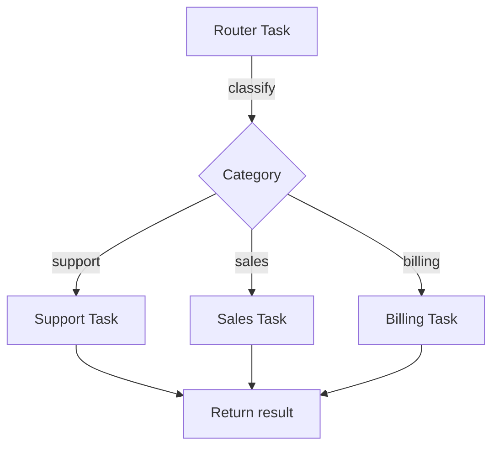

import { Callout, Cards, Steps, Tabs } from "nextra/components";
import { snippets } from "@/lib/generated/snippets";
import { Snippet } from "@/components/code";
import UniversalTabs from "@/components/UniversalTabs";

# Routing

Routing classifies an incoming request and directs it to a specialist [durable task](/concepts/durable-workflows/durable-task-execution). A single entry point handles all requests; the routing logic (an LLM call, a rule-based check, or a keyword match) determines which downstream task runs. Only one branch executes per request.

This pattern improves response quality because each specialist task has its own prompt, tools, and context optimized for that category. It also simplifies the caller: trigger one task and let the router decide where to send it.

## When to use

| Scenario                                               | Fit                                                                                                             |
| ------------------------------------------------------ | --------------------------------------------------------------------------------------------------------------- |
| Customer service (support vs. sales vs. billing)       | Good: distinct domains with different prompts and tools                                                         |
| Document processing (invoice vs. receipt vs. contract) | Good: each type needs different extraction logic                                                                |
| Request triage (simple auto-reply vs. complex agent)   | Good: avoid expensive agent loops for easy questions                                                            |
| All requests follow the same path                      | Skip: no benefit from routing                                                                                   |
| Routing rules are simple and known at definition time  | Use [Parent Conditions](/concepts/durable-workflows/directed-acyclic-graphs/parent-conditions) in a DAG instead |

## How it maps to Hatchet

The router is a **[durable task](/concepts/durable-workflows/durable-task-execution)**. It spawns a classifier [child task](/concepts/durable-workflows/durable-task-execution/child-spawning) (or does classification inline), then spawns the matching specialist as a [child run](/concepts/durable-workflows/durable-task-execution/child-spawning). Since each specialist is a separate durable task, they can have their own [timeouts](/concepts/timeouts), [retries](/concepts/retry-policies), [rate limits](/concepts/rate-limits), and [concurrency](/concepts/concurrency) settings.

Routing decisions are checkpointed. If the worker dies after classification but before the specialist finishes, the router resumes and does not re-classify.

## Step-by-step walkthrough

<Steps>

### Define the classifier task

A separate task classifies the incoming message. This lets you observe the classification result and retry independently if the LLM fails.

<UniversalTabs items={["Python", "Typescript", "Go", "Ruby"]}>
  <Tabs.Tab title="Python">
    <Snippet
      src={snippets.python.guides.routing.worker.step_01_classify_task}
    />
  </Tabs.Tab>
  <Tabs.Tab title="Typescript">
    <Snippet
      src={snippets.typescript.guides.routing.workflow.step_01_classify_task}
    />
  </Tabs.Tab>
  <Tabs.Tab title="Go">
    <Snippet src={snippets.go.guides.routing.main.step_01_classify_task} />
  </Tabs.Tab>
  <Tabs.Tab title="Ruby">
    <Snippet src={snippets.ruby.guides.routing.worker.step_01_classify_task} />
  </Tabs.Tab>
</UniversalTabs>

### Define the specialist tasks

Each specialist is a standalone durable task with its own prompt and tools. They run independently with their own timeout and retry settings.

<UniversalTabs items={["Python", "Typescript", "Go", "Ruby"]} variant="hidden">
  <Tabs.Tab title="Python">
    <Snippet
      src={snippets.python.guides.routing.worker.step_02_specialist_tasks}
    />
  </Tabs.Tab>
  <Tabs.Tab title="Typescript">
    <Snippet
      src={snippets.typescript.guides.routing.workflow.step_02_specialist_tasks}
    />
  </Tabs.Tab>
  <Tabs.Tab title="Go">
    <Snippet src={snippets.go.guides.routing.main.step_02_specialist_tasks} />
  </Tabs.Tab>
  <Tabs.Tab title="Ruby">
    <Snippet
      src={snippets.ruby.guides.routing.worker.step_02_specialist_tasks}
    />
  </Tabs.Tab>
</UniversalTabs>

### Route with a durable task

The router classifies the message, then spawns the matching specialist. The classification result is checkpointed, so if the worker dies after classifying, it resumes and spawns the specialist without re-classifying.

<UniversalTabs items={["Python", "Typescript", "Go", "Ruby"]} variant="hidden">
  <Tabs.Tab title="Python">
    <Snippet src={snippets.python.guides.routing.worker.step_03_router_task} />
  </Tabs.Tab>
  <Tabs.Tab title="Typescript">
    <Snippet
      src={snippets.typescript.guides.routing.workflow.step_03_router_task}
    />
  </Tabs.Tab>
  <Tabs.Tab title="Go">
    <Snippet src={snippets.go.guides.routing.main.step_03_router_task} />
  </Tabs.Tab>
  <Tabs.Tab title="Ruby">
    <Snippet src={snippets.ruby.guides.routing.worker.step_03_router_task} />
  </Tabs.Tab>
</UniversalTabs>

### Run the worker

Register all tasks and start the worker.

<UniversalTabs items={["Python", "Typescript", "Go", "Ruby"]} variant="hidden">
  <Tabs.Tab title="Python">
    <Snippet src={snippets.python.guides.routing.worker.step_04_run_worker} />
  </Tabs.Tab>
  <Tabs.Tab title="Typescript">
    <Snippet
      src={snippets.typescript.guides.routing.worker.step_04_run_worker}
    />
  </Tabs.Tab>
  <Tabs.Tab title="Go">
    <Snippet src={snippets.go.guides.routing.main.step_04_run_worker} />
  </Tabs.Tab>
  <Tabs.Tab title="Ruby">
    <Snippet src={snippets.ruby.guides.routing.worker.step_04_run_worker} />
  </Tabs.Tab>
</UniversalTabs>

</Steps>

<Callout type="info">
  For simple routing based on input fields (not LLM classification), you can
  skip the classify task and route directly in the durable task body based on
  `input.type` or similar fields.
</Callout>

## Routing vs. DAG branching

|                       | Routing (durable task)                         | DAG Parent Conditions                                 |
| --------------------- | ---------------------------------------------- | ----------------------------------------------------- |
| **Branch decided by** | Runtime code (`if`/`else`, LLM call)           | Declared conditions on parent task output             |
| **Use when**          | Category is unknown until an LLM classifies it | Branch criteria are known at workflow definition time |
| **Observability**     | Router + specialist appear as separate runs    | All branches visible in the DAG graph                 |

## Related Patterns

<Cards>
  <Cards.Card title="Multi-Agent" href="/guides/ai-agents/multi-agent">
    Like routing but with a loop: the orchestrator may call multiple specialists
    across iterations.
  </Cards.Card>
  <Cards.Card
    title="Parent Conditions"
    href="/concepts/durable-workflows/directed-acyclic-graphs/parent-conditions"
  >
    DAG-level branching for when routing rules are fixed at definition time.
  </Cards.Card>
  <Cards.Card title="Reasoning Loop" href="/guides/ai-agents/reasoning-loop">
    An agent loop can use routing internally to pick tools per iteration.
  </Cards.Card>
  <Cards.Card title="LLM Pipelines" href="/guides/llm-pipelines">
    Fixed-sequence pipelines; route to different pipelines based on input type.
  </Cards.Card>
</Cards>

## Next Steps

- [Durable Task Execution](/concepts/durable-workflows/durable-task-execution): understand how the router and specialists checkpoint
- [Child Spawning](/concepts/durable-workflows/durable-task-execution/child-spawning): spawn specialist tasks from the router
- [Timeouts](/concepts/timeouts): set execution timeouts on the router and each specialist
- [Retry Policies](/concepts/retry-policies): configure retries for classification and specialist tasks
