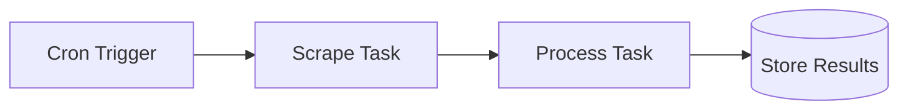

import { Callout, Cards, Steps, Tabs } from "nextra/components";
import { snippets } from "@/lib/generated/snippets";
import { Snippet } from "@/components/code";
import UniversalTabs from "@/components/UniversalTabs";
import ScraperIntegrationTabs from "@/components/ScraperIntegrationTabs";

# Web Scraping

Web scraping workflows fetch content from external websites, process it, and store the results. Scraping is inherently unreliable — pages change layout, rate limits kick in, requests time out — so scrape tasks need retries, timeouts, and concurrency control. Hatchet provides all three, plus cron scheduling to refresh scraped data on a recurring cadence.

A typical web scraping pipeline has three parts:

1. **Scrape** — Fetch the page content (HTML, rendered JS, or structured API response)
2. **Process** — Extract, transform, or summarize the content (optionally with an LLM)
3. **Schedule** — Run the pipeline periodically via a cron workflow

## Recommended scraping tools

Hatchet orchestrates the workflow; the actual scraping is done by a library you call from inside the task. Choose based on your needs:

| Tool                                                                             | Best for                                               | How to use with Hatchet                                  |
| -------------------------------------------------------------------------------- | ------------------------------------------------------ | -------------------------------------------------------- |
| [Firecrawl](https://firecrawl.dev)                                               | LLM-ready markdown from any URL, built-in JS rendering | Call the Firecrawl API from your scrape task             |
| [Browserbase](https://browserbase.com)                                           | Cloud-hosted headless browsers with stealth features   | Connect Playwright to Browserbase from your task         |
| [Playwright](https://playwright.dev) / [Puppeteer](https://pptr.dev)             | Full browser automation, JS-heavy sites                | Run headless browser inside the task                     |
| [OpenAI Responses API](https://platform.openai.com/docs/guides/tools-web-search) | Web search + content extraction via `web_search` tool  | Call OpenAI from your process task to search & summarize |
| [httpx](https://www.python-httpx.org) / [axios](https://axios-http.com)          | Simple HTTP fetches, APIs, static HTML                 | Direct HTTP call inside the task                         |

## Step-by-step walkthrough

By the end of this guide you will have a scrape task with retries, a processing step, and a cron workflow that refreshes your scraped data every 6 hours.

<Steps>

### Step 1: Define the scrape task

Create a task that fetches a URL and returns the content. Set a timeout (pages can hang) and retries (transient failures are common). The examples below use a mock — swap it for Firecrawl, Playwright, or any HTTP client.

<UniversalTabs items={["Python", "Typescript", "Go", "Ruby"]}>
  <Tabs.Tab title="Python">
    <Snippet
      src={
        snippets.python.guides.web_scraping.worker.step_01_define_scrape_task
      }
    />
  </Tabs.Tab>
  <Tabs.Tab title="Typescript">
    <Snippet
      src={
        snippets.typescript.guides.web_scraping.workflow
          .step_01_define_scrape_task
      }
    />
  </Tabs.Tab>
  <Tabs.Tab title="Go">
    <Snippet
      src={snippets.go.guides.web_scraping.main.step_01_define_scrape_task}
    />
  </Tabs.Tab>
  <Tabs.Tab title="Ruby">
    <Snippet
      src={snippets.ruby.guides.web_scraping.worker.step_01_define_scrape_task}
    />
  </Tabs.Tab>
</UniversalTabs>

### Step 2: Process the scraped content

A separate task extracts or transforms the raw scraped content. This could be simple parsing, or an LLM call to summarize or extract structured data. Keeping it separate lets you retry processing independently from scraping.

<UniversalTabs items={["Python", "Typescript", "Go", "Ruby"]} variant="hidden">
  <Tabs.Tab title="Python">
    <Snippet
      src={snippets.python.guides.web_scraping.worker.step_02_process_content}
    />
  </Tabs.Tab>
  <Tabs.Tab title="Typescript">
    <Snippet
      src={
        snippets.typescript.guides.web_scraping.workflow.step_02_process_content
      }
    />
  </Tabs.Tab>
  <Tabs.Tab title="Go">
    <Snippet
      src={snippets.go.guides.web_scraping.main.step_02_process_content}
    />
  </Tabs.Tab>
  <Tabs.Tab title="Ruby">
    <Snippet
      src={snippets.ruby.guides.web_scraping.worker.step_02_process_content}
    />
  </Tabs.Tab>
</UniversalTabs>

### Step 3: Schedule recurring scrapes

Wrap the pipeline in a cron workflow to refresh data on a schedule. The example below runs every 6 hours and scrapes a list of URLs. Each scrape + process pair runs as child tasks, so failures on one URL don't block the others.

<UniversalTabs items={["Python", "Typescript", "Go", "Ruby"]} variant="hidden">
  <Tabs.Tab title="Python">
    <Snippet
      src={snippets.python.guides.web_scraping.worker.step_03_cron_workflow}
    />
  </Tabs.Tab>
  <Tabs.Tab title="Typescript">
    <Snippet
      src={
        snippets.typescript.guides.web_scraping.workflow.step_03_cron_workflow
      }
    />
  </Tabs.Tab>
  <Tabs.Tab title="Go">
    <Snippet src={snippets.go.guides.web_scraping.main.step_03_cron_workflow} />
  </Tabs.Tab>
  <Tabs.Tab title="Ruby">
    <Snippet
      src={snippets.ruby.guides.web_scraping.worker.step_03_cron_workflow}
    />
  </Tabs.Tab>
</UniversalTabs>

### Step 4: Run the worker

Register all tasks and start the worker. The cron schedule activates when the worker connects.

<UniversalTabs items={["Python", "Typescript", "Go", "Ruby"]} variant="hidden">
  <Tabs.Tab title="Python">
    <Snippet
      src={snippets.python.guides.web_scraping.worker.step_04_run_worker}
    />
  </Tabs.Tab>
  <Tabs.Tab title="Typescript">
    <Snippet
      src={snippets.typescript.guides.web_scraping.worker.step_04_run_worker}
    />
  </Tabs.Tab>
  <Tabs.Tab title="Go">
    <Snippet src={snippets.go.guides.web_scraping.main.step_04_run_worker} />
  </Tabs.Tab>
  <Tabs.Tab title="Ruby">
    <Snippet
      src={snippets.ruby.guides.web_scraping.worker.step_04_run_worker}
    />
  </Tabs.Tab>
</UniversalTabs>

</Steps>

<Callout type="warning">
  Always set **timeouts** and **retries** on scrape tasks. Pages can hang
  indefinitely, and transient network failures are common. See
  [Timeouts](/concepts/timeouts) and [Retry Policies](/concepts/retry-policies).
</Callout>

## Scraping tool integrations

Hatchet orchestrates the workflow — the actual scraping is done by a library you call inside your task. Pick a provider and language below to see install and usage snippets you can drop into the `scrape_url` task above.

<ScraperIntegrationTabs />

## Common patterns

| Pattern                 | Description                                                                                    |
| ----------------------- | ---------------------------------------------------------------------------------------------- |
| **Price monitoring**    | Scrape competitor pricing pages on a schedule; alert on changes                                |
| **Content aggregation** | Scrape multiple news sources; use LLM to deduplicate and summarize                             |
| **SEO monitoring**      | Scrape your own pages to verify meta tags, headings, and content                               |
| **Lead enrichment**     | Scrape company websites to enrich CRM records with latest info                                 |
| **Documentation sync**  | Scrape external docs; chunk and embed for RAG (see [RAG & Indexing](/guides/rag-and-indexing)) |
| **Compliance checking** | Scrape regulatory pages; alert when content changes                                            |

## Related patterns

<Cards>
  <Cards.Card title="Scheduled Jobs / Cron" href="/guides/scheduled-jobs">
    Cron expressions and one-time scheduled runs for periodic scraping.
  </Cards.Card>
  <Cards.Card title="Batch Processing" href="/guides/batch-processing">
    Fan out scrapes across many URLs in parallel with concurrency control.
  </Cards.Card>
  <Cards.Card title="RAG & Data Indexing" href="/guides/rag-and-indexing">
    Chunk and embed scraped content for retrieval-augmented generation.
  </Cards.Card>
  <Cards.Card title="Document Processing" href="/guides/document-processing">
    Extract structured data from scraped documents with OCR and LLM pipelines.
  </Cards.Card>
</Cards>

## Next steps

- [Cron Triggers](/concepts/cron-runs): cron expression syntax and configuration
- [Retry Policies](/concepts/retry-policies): handle transient scraping failures
- [Rate Limits](/concepts/rate-limits): throttle requests to avoid being blocked
- [Concurrency Control](/concepts/concurrency): limit parallel scrapes per domain
