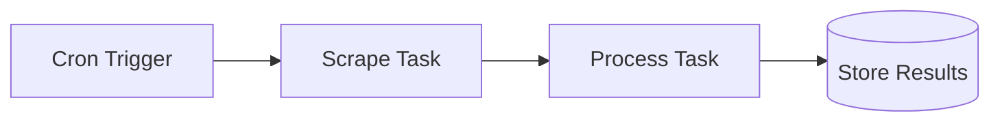

import { Callout, Cards, Steps, Tabs } from "nextra/components";
import { snippets } from "@/lib/generated/snippets";
import { Snippet } from "@/components/code";
import UniversalTabs from "@/components/UniversalTabs";
import ScraperIntegrationTabs from "@/components/ScraperIntegrationTabs.mdx";

# Web Scraping

Web scraping workflows fetch content from external websites, process it, and store the results. Scraping is inherently unreliable: pages change layout, rate limits kick in, requests time out. Scrape tasks need retries, timeouts, and concurrency control. Hatchet provides all three, plus cron scheduling to refresh scraped data on a recurring cadence.

A typical web scraping pipeline has three parts:

1. **Scrape**: fetch the page content (HTML, rendered JS, or structured API response)
2. **Process**: extract, transform, or summarize the content (optionally with an LLM)
3. **Schedule**: run the pipeline periodically via a cron workflow

## Step-by-step walkthrough

You'll build a scrape task with retries, a processing step, a cron workflow that refreshes your scraped data every 6 hours, and a rate-limited variant to avoid getting blocked.

<Steps>

### Define the scrape task

Create a task that fetches a URL and returns the content. Set a timeout (pages can hang) and retries (transient failures are common). The examples below use a mock. Swap it for Firecrawl, Playwright, or any HTTP client.

<UniversalTabs items={["Python", "Typescript", "Go", "Ruby"]}>
  <Tabs.Tab title="Python">
    <Snippet
      src={
        snippets.python.guides.web_scraping.worker.step_01_define_scrape_task
      }
    />
  </Tabs.Tab>
  <Tabs.Tab title="Typescript">
    <Snippet
      src={
        snippets.typescript.guides.web_scraping.workflow
          .step_01_define_scrape_task
      }
    />
  </Tabs.Tab>
  <Tabs.Tab title="Go">
    <Snippet
      src={snippets.go.guides.web_scraping.main.step_01_define_scrape_task}
    />
  </Tabs.Tab>
  <Tabs.Tab title="Ruby">
    <Snippet
      src={snippets.ruby.guides.web_scraping.worker.step_01_define_scrape_task}
    />
  </Tabs.Tab>
</UniversalTabs>

The examples above use a mock scraper. To use a real scraping provider, swap the mock with one of these. Pick a provider, then your language:

<ScraperIntegrationTabs />

### Process the scraped content

A separate task extracts or transforms the raw scraped content. This could be simple parsing, or an LLM call to summarize or extract structured data. Keeping it separate lets you retry processing independently from scraping.

<UniversalTabs items={["Python", "Typescript", "Go", "Ruby"]} variant="hidden">
  <Tabs.Tab title="Python">
    <Snippet
      src={snippets.python.guides.web_scraping.worker.step_02_process_content}
    />
  </Tabs.Tab>
  <Tabs.Tab title="Typescript">
    <Snippet
      src={
        snippets.typescript.guides.web_scraping.workflow.step_02_process_content
      }
    />
  </Tabs.Tab>
  <Tabs.Tab title="Go">
    <Snippet
      src={snippets.go.guides.web_scraping.main.step_02_process_content}
    />
  </Tabs.Tab>
  <Tabs.Tab title="Ruby">
    <Snippet
      src={snippets.ruby.guides.web_scraping.worker.step_02_process_content}
    />
  </Tabs.Tab>
</UniversalTabs>

### Schedule recurring scrapes

Wrap the pipeline in a cron workflow to refresh data on a schedule. The example below runs every 6 hours and scrapes a list of URLs. Each scrape + process pair runs as child tasks, so failures on one URL don't block the others.

<UniversalTabs items={["Python", "Typescript", "Go", "Ruby"]} variant="hidden">
  <Tabs.Tab title="Python">
    <Snippet
      src={snippets.python.guides.web_scraping.worker.step_03_cron_workflow}
    />
  </Tabs.Tab>
  <Tabs.Tab title="Typescript">
    <Snippet
      src={
        snippets.typescript.guides.web_scraping.workflow.step_03_cron_workflow
      }
    />
  </Tabs.Tab>
  <Tabs.Tab title="Go">
    <Snippet src={snippets.go.guides.web_scraping.main.step_03_cron_workflow} />
  </Tabs.Tab>
  <Tabs.Tab title="Ruby">
    <Snippet
      src={snippets.ruby.guides.web_scraping.worker.step_03_cron_workflow}
    />
  </Tabs.Tab>
</UniversalTabs>

### Add rate limiting

Target sites will block you if you send too many requests. Create a separate rate-limited scrape task that caps requests to a fixed number per minute across all workers. Hatchet holds back task executions that would exceed the limit, so you stay within budget without adding sleep logic in your code. See [Rate Limits](/v1/flow-control/rate-limits) for details.

<UniversalTabs items={["Python", "Typescript", "Go", "Ruby"]} variant="hidden">
  <Tabs.Tab title="Python">
    <Snippet
      src={
        snippets.python.guides.web_scraping.worker.step_04_rate_limited_scrape
      }
    />
  </Tabs.Tab>
  <Tabs.Tab title="Typescript">
    <Snippet
      src={
        snippets.typescript.guides.web_scraping.workflow
          .step_04_rate_limited_scrape
      }
    />
  </Tabs.Tab>
  <Tabs.Tab title="Go">
    <Snippet
      src={snippets.go.guides.web_scraping.main.step_04_rate_limited_scrape}
    />
  </Tabs.Tab>
  <Tabs.Tab title="Ruby">
    <Snippet
      src={snippets.ruby.guides.web_scraping.worker.step_04_rate_limited_scrape}
    />
  </Tabs.Tab>
</UniversalTabs>

### Run the worker

Register all tasks (including the rate-limited variant) and upsert the rate limit before starting the worker. The cron schedule activates when the worker connects.

<UniversalTabs items={["Python", "Typescript", "Go", "Ruby"]} variant="hidden">
  <Tabs.Tab title="Python">
    <Snippet
      src={snippets.python.guides.web_scraping.worker.step_05_run_worker}
    />
  </Tabs.Tab>
  <Tabs.Tab title="Typescript">
    <Snippet
      src={snippets.typescript.guides.web_scraping.worker.step_05_run_worker}
    />
  </Tabs.Tab>
  <Tabs.Tab title="Go">
    <Snippet src={snippets.go.guides.web_scraping.main.step_05_run_worker} />
  </Tabs.Tab>
  <Tabs.Tab title="Ruby">
    <Snippet
      src={snippets.ruby.guides.web_scraping.worker.step_05_run_worker}
    />
  </Tabs.Tab>
</UniversalTabs>

</Steps>

<Callout type="warning">
  Always set **timeouts** and **retries** on scrape tasks. Pages can hang
  indefinitely, and transient network failures are common. See
  [Timeouts](/v1/error-handling/timeouts) and [Retry Policies](/v1/error-handling/retry-policies).
</Callout>

## Common Patterns

| Pattern                 | Description                                                                                    |
| ----------------------- | ---------------------------------------------------------------------------------------------- |
| **Price monitoring**    | Scrape competitor pricing pages on a schedule; alert on changes                                |
| **Content aggregation** | Scrape multiple news sources; use LLM to deduplicate and summarize                             |
| **SEO monitoring**      | Scrape your own pages to verify meta tags, headings, and content                               |
| **Lead enrichment**     | Scrape company websites to enrich CRM records with latest info                                 |
| **Documentation sync**  | Scrape external docs; chunk and embed for RAG (see [RAG & Indexing](/guides/rag-and-indexing)) |
| **Compliance checking** | Scrape regulatory pages; alert when content changes                                            |

## Related Patterns

<Cards>
  <Cards.Card title="Scheduled Jobs / Cron" href="/guides/scheduled-jobs">
    Cron expressions and one-time scheduled runs for periodic scraping.
  </Cards.Card>
  <Cards.Card title="Batch Processing" href="/guides/batch-processing">
    Fan out scrapes across many URLs in parallel with concurrency control.
  </Cards.Card>
  <Cards.Card title="RAG & Data Indexing" href="/guides/rag-and-indexing">
    Chunk and embed scraped content for retrieval-augmented generation.
  </Cards.Card>
  <Cards.Card title="Document Processing" href="/guides/document-processing">
    Extract structured data from scraped documents with OCR and LLM pipelines.
  </Cards.Card>
</Cards>

## Next Steps

- [Cron Triggers](/v1/runnables/cron-runs): cron expression syntax and configuration
- [Retry Policies](/v1/error-handling/retry-policies): handle transient scraping failures
- [Rate Limits](/v1/flow-control/rate-limits): throttle requests to avoid being blocked
- [Concurrency Control](/v1/flow-control/concurrency): limit parallel scrapes per domain
