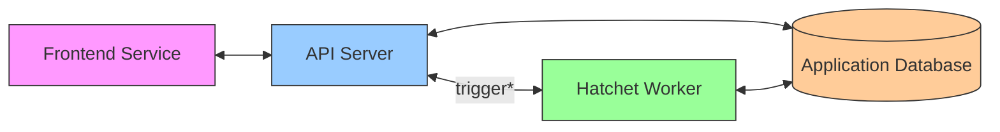

import { useData } from "nextra/data";
import { BiLogoGithub } from "react-icons/bi";
import { Button } from "@/components/ui/button";
import { Callout } from "nextra/components";

export const getStaticProps = ({ params }) => {
  return fetch(`https://api.github.com/repos/hatchet-dev/hatchet`)
    .then((res) => res.json())
    .then((repo) => ({
      props: {
        // We add an `ssg` field to the page props,
        // which will be provided to the Nextra `useData` hook.
        ssg: {
          stars: repo.stargazers_count,
        },
      },
      // The page will be considered as stale and regenerated every 60 seconds.
      revalidate: 60,
    }));
};

export const Stars = () => {
  const { stars } = useData();

return (
<a href="https://github.com/hatchet-dev/hatchet" target="_blank">
<Button variant="outline">
<BiLogoGithub className="mr-2 w-6 h-6" />
<strong className="ml-2">{stars.toLocaleString()}</strong>
</Button>
</a>
);
};

# What is Hatchet?

Hatchet is an "Async Compute" platform backed by an [open-source, low latency task queue](https://github.com/hatchet-dev/hatchet).

Instead of processing background tasks and functions in your application handlers, which can lead to complex code, hard-to-debug errors, and resource contention, you can distribute work between a set of [workers](./foundations_workers.mdx). Workers are long-running processes which listen for assigned work, so you can easily run long, low priority, or compute-intensive jobs.

  <Stars />

## Simple to Start

Hatchet offers Python, Typescript, and Go SDKs, so you can start running functions in minutes. You can run a worker in a few lines of code and fits seamlessly into your existing codebase.

Workers can run simple [step functions](./foundations_steps.mdx), or more complex [workflows with multiple steps](./foundations_workflows.mdx).

Hatchet runs in a separate process from your API, so you can easily scale it independently.

_\* trigger is a simplification. scheduling work is actually done through a push based engine._

## Features to Scale

- **Low Latency**: Hatchet is built on top of a low-latency queue, which means it can handle real-time interactions and mission-critical tasks. This is particularly useful if you're building a real-time application, or if you're running tasks which need to be completed quickly. It can scale to millions of queued tasks and can handle hundreds of tasks per second. We are continuously working to improve our throughput and latency.
- **High Throughput**: Hatchet is designed to scale horizontally, so you can add more workers to handle more tasks. Unlike other task queues, Hatchet can handle thousands of concurrent task assignments per second.
- **Fault Tolerance**: Hatchet is designed to be fault-tolerant, so you can continue processing tasks even if some workers fail.
- **Simple Queue**: Hatchet uses a simple queue model, so you have direct control over things like [concurrency](./queue_concurrency/index.mdx), [retries](./errors_retry-policies.mdx), and [rate limits](./rate_limits.mdx).

## Getting Started

We want to help you get up and running as quickly as possible! If you haven't already head over to [hatchet.run](https://hatchet.run) to sign up for a Hatchet Cloud account.

We have a great [Quickstart Guide](./quickstart_cloud.mdx) to help you get started with Hatchet.

## Support

If you need help getting started, please join our community [Discord server](https://discord.gg/hatchet) or don't hesitate to reach out to [support@hatchet.run](mailto:support@hatchet.run).

<Callout type="info">
  Planning on self-hosting? We provide a fully open-source version of Hatchet
  that you can run on your own infrastructure and offer enterprise support.
  [Reach out to us for more information](mailto:support@hatchet.run)
</Callout>
