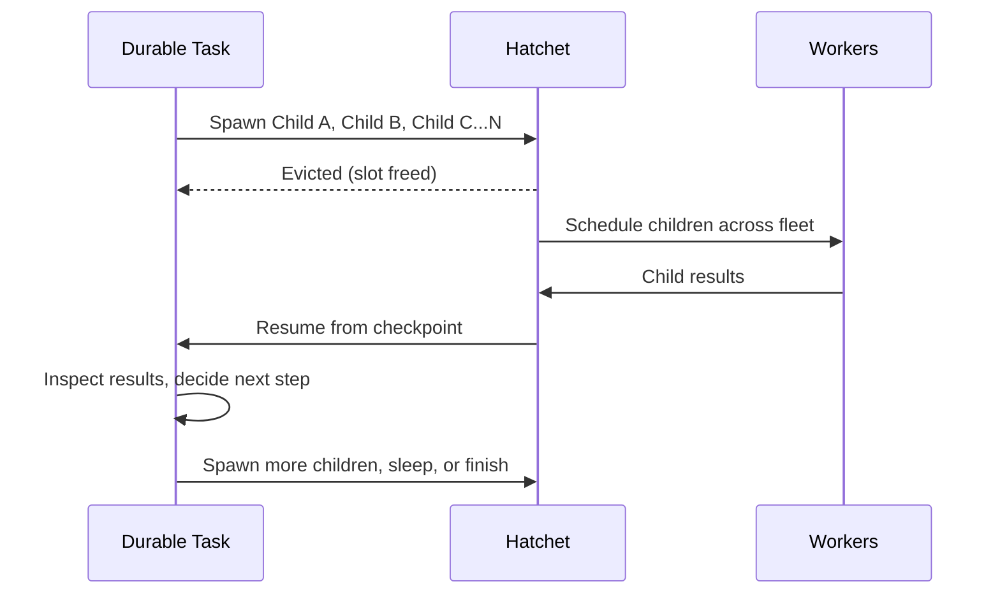

import { snippets } from "@/lib/generated/snippets";
import { Snippet } from "@/components/code";

import { Callout, Steps } from "nextra/components";
import DurableWorkflowDiagram from "@/components/DurableWorkflowDiagramWrapper";

# Durable Tasks

Use durable tasks when **you don't know the shape of work ahead of time**. For example, an AI agent that picks its next action based on a model response, a fan-out where N is determined by the input data, or a pipeline that branches and spawns sub-workflows based on intermediate results. In all of these cases, the "graph" of work doesn't exist when the task starts; it emerges at runtime as the task makes decisions and [spawns children](/v1/child-spawning).

A durable task is a single long-running function that acts as an **orchestrator**: it spawns child tasks, waits for their results, makes decisions, and spawns more. Hatchet checkpoints its progress so it can recover from crashes, survive long waits, and resume on any worker without re-executing completed work.

<Callout type="info">
  If you know the full graph of work upfront (every task and dependency is fixed
  before execution begins), use a [DAG](/v1/patterns/directed-acyclic-graphs)
  instead. You can always [mix both patterns](/v1/patterns/mixing-patterns) in
  the same application.
</Callout>

## When to Use Durable Tasks

| Scenario                          | Why Durable?                                                                                                                                                                            |
| --------------------------------- | --------------------------------------------------------------------------------------------------------------------------------------------------------------------------------------- |
| **Dynamic fan-out** (N unknown)   | Spawn children based on runtime data; wait for results without holding a slot. See [Batch Processing](/guides/batch-processing) and [Document Processing](/guides/document-processing). |
| **Agentic workflows**             | An agent decides what to do next, spawns subtasks, loops, or stops at runtime. See [AI Agents](/guides/ai-agents/reasoning-loop).                                                       |
| **Long waits** (hours/days)       | Worker slots are freed during waits; no wasted compute.                                                                                                                                 |
| **Human-in-the-loop**             | Wait for approval events without holding resources. See [Human-in-the-Loop](/guides/human-in-the-loop).                                                                                 |
| **Multi-step with inline pauses** | `SleepFor` and `WaitForEvent` let you express complex procedural flows.                                                                                                                 |
| **Crash-resilient pipelines**     | Automatically resume from checkpoints after failures.                                                                                                                                   |

## How It Works

A durable task builds the workflow at runtime through **child spawning**. The task function runs, inspects data, and decides what to do next by spawning child tasks. The parent is [evicted](/v1/task-eviction) while children execute, freeing its worker slot. When children complete, the parent resumes from its checkpoint and continues.

This is fundamentally different from a DAG, where every task and dependency is declared before execution begins. With durable tasks, the number of children, which branches to take, and whether to loop or stop are all determined by your code at runtime.

<DurableWorkflowDiagram />

<Steps>

### Checkpoints

Each call to `SleepFor`, `WaitForEvent`, `WaitFor`, `Memo`, or `RunChild` creates a checkpoint in the durable event log. These checkpoints record the task's progress.

### Worker slot is freed during waits

When a durable task enters a wait (sleep, event, or child result), Hatchet [evicts](/v1/task-eviction) it from the worker. The slot is immediately available for other tasks.

### Task resumes from checkpoint

When the wait completes, Hatchet re-queues the task on any available worker. It replays the event log up to the last checkpoint and resumes execution from there. Completed operations are not re-executed.

</Steps>

## The Durable Context

Declare a task as durable (using `durable_task` instead of `task`) and it receives a `DurableContext` instead of a normal `Context`. The `DurableContext` extends `Context` with methods for checkpointing and waiting:

| Method                        | Purpose                                                                                                                                                                        |
| ----------------------------- | ------------------------------------------------------------------------------------------------------------------------------------------------------------------------------ |
| **`SleepFor(duration)`**      | Pause for a fixed duration. Respects the original sleep time on restart; if interrupted after 23 of 24 hours, only sleeps 1 more hour.                                         |
| **`WaitForEvent(key, expr)`** | Wait for an external event by key, with optional [CEL filter](https://github.com/google/cel-spec) expression on the payload.                                                   |
| **`WaitFor(conditions)`**     | General-purpose wait accepting any combination of sleep conditions, event conditions, or or-groups. `SleepFor` and `WaitForEvent` are convenience wrappers around this method. |
| **[`Memo(function)`](/v1/memo)** | Cache expensive operations so they aren't re-executed on task replay. See [Memoization](/v1/memo).                                                                             |
| **`RunChild(task, input)`**   | Spawn a child task and wait for its result. The parent is evicted during the wait.                                                                                             |

## Example Task

<Snippet src={snippets.python.durable.worker.create_a_durable_workflow} />

Now add tasks to the workflow. The first is a regular task; the second is a durable task that sleeps and waits for an event:

<Snippet src={snippets.python.durable.worker.add_durable_task} />

<Callout type="info">
  The `durable_task` decorator gives the function a `DurableContext` instead of
  a regular `Context`. Durable tasks run on the same worker as regular tasks,
  but they consume slots from a separate pool. This prevents deadlocks where a
  durable task waiting for children could starve those children of slots. See
  [Slot types](/v1/workers#slot-types) for details.
</Callout>

If this task is interrupted at any time, it will continue from where it left off. If the task calls `ctx.aio_sleep_for` for 24 hours and is interrupted after 23 hours, it will only sleep for 1 more hour on restart.

### Or Groups

Durable tasks can combine multiple wait conditions using [or groups](/v1/conditions#or-groups). For example, you could wait for either an event or a sleep (whichever comes first):

<Snippet
  src={snippets.python.durable.worker.add_durable_tasks_that_wait_for_or_groups}
/>

## Spawning Child Tasks

Child spawning is the primary way durable tasks build workflows at runtime. A durable task can spawn any runnable (regular tasks, other durable tasks, or entire DAG workflows), wait for results, and decide what to do next.

| Child type       | Example                                                                           |
| ---------------- | --------------------------------------------------------------------------------- |
| **Regular task** | Spawn a stateless task for a quick computation or API call.                       |
| **Durable task** | Spawn another durable task that has its own checkpoints, sleeps, and event waits. |
| **DAG workflow** | Spawn an entire multi-task workflow and wait for its final output.                |

The parent is evicted while children execute, so it consumes no resources. The number and type of children can be determined dynamically based on input, intermediate results, or model outputs.

See [Child Spawning](/v1/child-spawning) for patterns and full examples.

## Determinism Requirements

Because durable tasks can be interrupted and resumed, your task code must be **deterministic**. When Hatchet replays a task after an interruption, it re-executes your code from the beginning while skipping operations that were already checkpointed. If the code path taken during replay differs from the original execution, Hatchet raises a `NonDeterminismError`.

### What Causes Non-Determinism

Non-determinism occurs when the same task code produces different checkpoint operations on replay:

| Anti-Pattern | Problem | Solution |
| --- | --- | --- |
| **Random values in wait conditions** | Sleep durations that change on replay (e.g., using `random()` or `Math.random()`) | Use deterministic values or memoize random calls |
| **Time-based logic** | Branching based on current time changes between original run and replay | Use `ctx.invocationCount` (TS) / `ctx.attempt_number` (Python) or memoize the timestamp |
| **Different child spawn inputs** | Generating new IDs (UUIDs, etc.) on each replay | Derive inputs from workflow input or memoize the ID |
| **External state that changes** | Fetching data from a database or API that may have changed | Memoize the fetch or pass data through workflow input |

### Handling NonDeterminismError

When Hatchet detects a mismatch between the current execution and the recorded checkpoint, it raises `NonDeterminismError` with information about where the mismatch occurred:

- `taskExternalId` (TypeScript) / `task_external_id` (Python): The ID of the affected task run
- `invocationCount` (TypeScript) / `invocation_count` (Python): Which invocation of the task detected the error
- `nodeId` (TypeScript) / `node_id` (Python): The checkpoint position where the mismatch was detected

You can catch this error to implement custom recovery logic, but typically the right fix is to make your code deterministic.

For SDK-specific documentation, see:
- **TypeScript**: [`NonDeterminismError`](/reference/typescript/Context#nondeterminismerror)
- **Python**: [`NonDeterminismError`](/reference/python/context#durable-context)

### Best Practices

1. **Keep durable operations deterministic**: The arguments to `sleepFor`/`aio_sleep_for`, `waitFor`/`aio_wait_for`, `spawnChild`/`aio_run`, and similar methods should produce the same values on replay
2. **Use `memo()` for non-deterministic operations**: Wrap calls to random number generators, UUIDs, timestamps, or external services in `ctx.memo()` so the result is cached and reused on replay
3. **Derive values from workflow input**: When possible, include all necessary data in the workflow input rather than fetching it during execution
4. **Avoid conditional checkpoints**: Don't wrap durable operations in conditions that might evaluate differently on replay

## Replaying from a Checkpoint

You can programmatically reset a durable task to replay from a specific checkpoint. This creates a new execution branch in the durable event log, re-executing from the specified node while preserving the original execution history.

| Use case                        | How                                                                |
| ------------------------------- | ------------------------------------------------------------------ |
| **Replay from the beginning**   | Set `node_id=1` to restart the entire task ("replay as new")       |
| **Replay from a checkpoint**    | Set `node_id` to the specific checkpoint you want to resume from   |
| **Debugging**                   | Re-run a task from a point where something went wrong              |

The Python SDK provides [`reset_durable_task`](/reference/python/feature-clients/runs#reset_durable_task) and [`aio_reset_durable_task`](/reference/python/feature-clients/runs#aio_reset_durable_task) methods on the runs client.

<Callout type="warning">
  When you reset a durable task, a new branch is created in the event log. The
  original execution history is preserved. Completed operations before the
  specified `node_id` are skipped during replay.
</Callout>

<Callout type="info">
  For an in-depth look at how durable execution works internally, see [this blog
  post](https://hatchet.run/blog/durable-execution).
</Callout>
