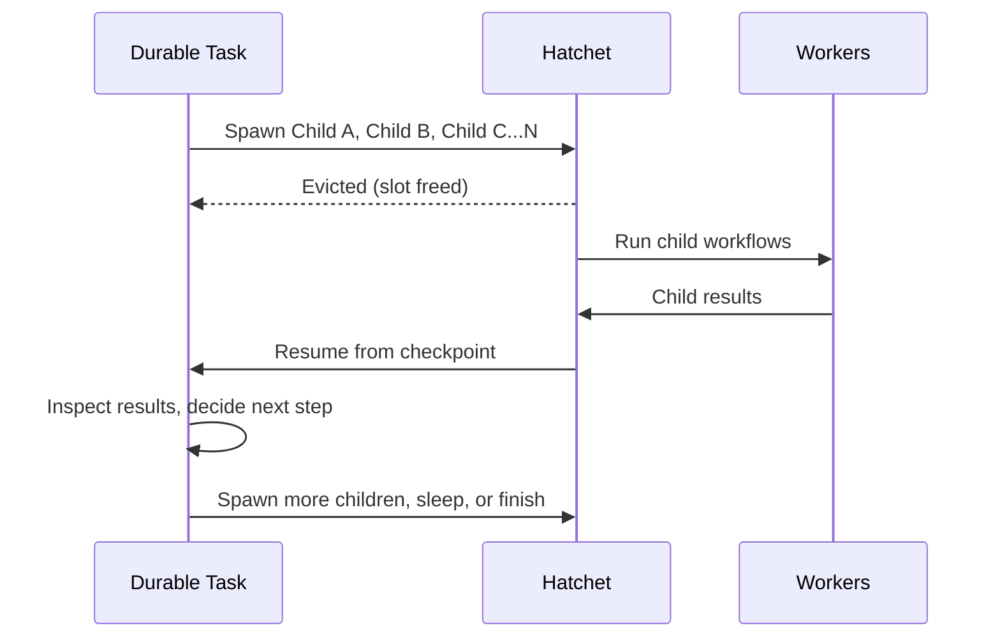

import { snippets } from "@/lib/generated/snippets";
import { Snippet } from "@/components/code";

import { Callout, Steps } from "nextra/components";
import DurableWorkflowDiagram from "@/components/DurableWorkflowDiagramWrapper";

# Durable Tasks

Durable tasks are the fundamental building block of durable execution in Hatchet. A durable task is a task that is comprised durable execution primitives that conforms to the [core assumptions of durable execution](/v1/durable-execution#core-assumptions). In Hatchet, durable tasks perform two durable operations: they **wait** (for time to pass or events to be received), and they **spawn child tasks**. Every time one of those happens, Hatchet writes a checkpoint to the durable event log. On retries, Hatchet can replay from that checkpoint instead of re-running completed application logic, which gives your tasks something closer to exactly-once semantics than you'd get with many other task queue implementations.

Use durable tasks when the shape of work is not known upfront, when parts of the task are hard to make idempotent, or when execution might be interrupted and resumed later. Common examples are agentic loops (often with human-in-the-loop steps), dynamic workflows that choose child workflows at runtime, and long waits that should not hold worker slots. They can also be very simple: sleep, then continue; or wait for an event, then exit.

<Callout type="warning">
  Durable tasks must only either call methods on the durable context or spawn
  children, and they must be deterministic given the event history. For example,
  you should _not_ directly access your database or an external API, or generate
  random numbers and use them for control flow inside of a durable task. Have
  your durable task spawn children to do this sort of work instead.
</Callout>

## Determinism in durable tasks

One important thing to keep in mind when writing durable tasks: the code between checkpoints must be deterministic. When a task is evicted and resumed, Hatchet replays the durable event log to rebuild state — it doesn't re-execute completed operations, but it does re-run the code path that led to each checkpoint.

This means a few things in practice:

- **Base decisions on checkpoint outputs**, not on external state that might change between runs (wall-clock time, database reads, random values). If a branch is taken on the first run, it must be taken again on replay.
- **Don't read outside state mid-function** in ways that assume a particular value that may differ between runs.
- **Push side effects into child tasks**. If you need to call external APIs, databases, or other services, do it in child tasks and wait on their results.

If you're ever unsure whether something is safe, ask yourself: "If this task was interrupted and replayed from the last checkpoint, would this code produce the same result?" If yes, you're fine.

## When to use durable tasks

| Scenario                           | Why durable?                                                                     |
| ---------------------------------- | -------------------------------------------------------------------------------- |
| **Agentic loops**                  | Spawn children, collect results, and continue in a loop without losing progress. |
| **Hard-to-idempotent steps**       | Replay from checkpoints instead of re-running already completed logic.           |
| **Runtime-selected workflows**     | Choose which child tasks/workflows to run based on intermediate results.         |
| **Long waits / human-in-the-loop** | Wait for timeouts or approvals without holding worker resources.                 |
| **Recovering from interruptions**  | Resume from checkpoints after worker restarts or crashes.                        |

## How it works

Each time a durable task finishes waiting for something (either a sleep, an event, or a child run to complete), Hatchet checkpoints progress. While the task is waiting, Hatchet can [evict](/v1/task-eviction) it and free the worker slot. When the wait is over, Hatchet re-queues the task, replays the durable event log, and resumes the durable task from the latest checkpoint, as if it had never been evicted.

This differs from a DAG, where every task and dependency is declared before execution starts. With durable tasks, your code can decide at runtime how many children to spawn, which branch to take, and whether to continue or stop.

## The durable context

When you declare a task as durable, it receives a durable context instead of a regular context. The durable context includes everything in the normal context, plus the durable execution toolkit you'll use to construct your durable task. These methods allow you to [wait for sleeps to complete](/v1/sleep), [wait for events to be received](/v1/events), [wait for children to complete](/v1/child-spawning), or use [or groups](/v1/conditions#or-groups) to combine them using boolean "or" logic.
