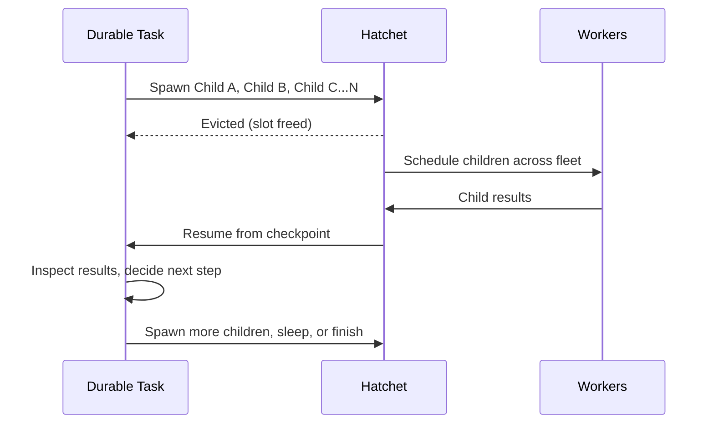

import { snippets } from "@/lib/generated/snippets";
import { Snippet } from "@/components/code";

import { Callout, Steps } from "nextra/components";
import DurableWorkflowDiagram from "@/components/DurableWorkflowDiagramWrapper";

# Durable Tasks

Use durable tasks when **you don't know the shape of work ahead of time**. For example, an AI agent that picks its next action based on a model response, a fan-out where N is determined by the input data, or a pipeline that branches and spawns sub-workflows based on intermediate results. In all of these cases, the "graph" of work doesn't exist when the task starts; it emerges at runtime as the task makes decisions and [spawns children](/v1/durable-workflows/child-spawning).

A durable task is a single long-running function that acts as an **orchestrator**: it spawns child tasks, waits for their results, makes decisions, and spawns more. Hatchet checkpoints its progress so it can recover from crashes, survive long waits, and resume on any worker without re-executing completed work.

<Callout type="info">
  If you know the full graph of work upfront (every task and dependency is fixed
  before execution begins), use a
  [DAG](/v1/durable-workflows/directed-acyclic-graphs) instead. You can always
  [mix both patterns](/v1/durable-workflows/mixing-patterns) in the same
  application.
</Callout>

## When to Use Durable Tasks

| Scenario                          | Why Durable?                                                                                                                                                                            |
| --------------------------------- | --------------------------------------------------------------------------------------------------------------------------------------------------------------------------------------- |
| **Dynamic fan-out** (N unknown)   | Spawn children based on runtime data; wait for results without holding a slot. See [Batch Processing](/guides/batch-processing) and [Document Processing](/guides/document-processing). |
| **Agentic workflows**             | An agent decides what to do next, spawns subtasks, loops, or stops at runtime. See [AI Agents](/guides/ai-agents/reasoning-loop).                                                       |
| **Long waits** (hours/days)       | Worker slots are freed during waits; no wasted compute.                                                                                                                                 |
| **Human-in-the-loop**             | Wait for approval events without holding resources. See [Human-in-the-Loop](/guides/human-in-the-loop).                                                                                 |
| **Multi-step with inline pauses** | `SleepFor` and `WaitForEvent` let you express complex procedural flows.                                                                                                                 |
| **Crash-resilient pipelines**     | Automatically resume from checkpoints after failures.                                                                                                                                   |

## How It Works

A durable task builds the workflow at runtime through **child spawning**. The task function runs, inspects data, and decides what to do next by spawning child tasks. The parent is [evicted](/v1/durable-workflows/task-eviction) while children execute, freeing its worker slot. When children complete, the parent resumes from its checkpoint and continues.

This is fundamentally different from a DAG, where every task and dependency is declared before execution begins. With durable tasks, the number of children, which branches to take, and whether to loop or stop are all determined by your code at runtime.

<DurableWorkflowDiagram />

<Steps>

### Checkpoints

Each call to `SleepFor`, `WaitForEvent`, `WaitFor`, `Memo`, or `RunChild` creates a checkpoint in the durable event log. These checkpoints record the task's progress.

### Worker slot is freed during waits

When a durable task enters a wait (sleep, event, or child result), Hatchet [evicts](/v1/durable-workflows/task-eviction) it from the worker. The slot is immediately available for other tasks.

### Task resumes from checkpoint

When the wait completes, Hatchet re-queues the task on any available worker. It replays the event log up to the last checkpoint and resumes execution from there. Completed operations are not re-executed.

</Steps>

## The Durable Context

Declare a task as durable (using `durable_task` instead of `task`) and it receives a `DurableContext` instead of a normal `Context`. The `DurableContext` extends `Context` with methods for checkpointing and waiting:

| Method                        | Purpose                                                                                                                                                                        |
| ----------------------------- | ------------------------------------------------------------------------------------------------------------------------------------------------------------------------------ |
| **`SleepFor(duration)`**      | Pause for a fixed duration. Respects the original sleep time on restart; if interrupted after 23 of 24 hours, only sleeps 1 more hour.                                         |
| **`WaitForEvent(key, expr)`** | Wait for an external event by key, with optional [CEL filter](https://github.com/google/cel-spec) expression on the payload.                                                   |
| **`WaitFor(conditions)`**     | General-purpose wait accepting any combination of sleep conditions, event conditions, or or-groups. `SleepFor` and `WaitForEvent` are convenience wrappers around this method. |
| **`Memo(function)`**          | Run functions whose outputs are memoized based on the input arguments.                                                                                                         |
| **`RunChild(task, input)`**   | Spawn a child task and wait for its result. The parent is evicted during the wait.                                                                                             |

## Example Task

<Snippet src={snippets.python.durable.worker.create_a_durable_workflow} />

Now add tasks to the workflow. The first is a regular task; the second is a durable task that sleeps and waits for an event:

<Snippet src={snippets.python.durable.worker.add_durable_task} />

<Callout type="info">
  The `durable_task` decorator gives the function a `DurableContext` instead of
  a regular `Context`. This is the only difference in declaration; the task
  registers and runs on the same worker as regular tasks.
</Callout>

If this task is interrupted at any time, it will continue from where it left off. If the task calls `ctx.aio_sleep_for` for 24 hours and is interrupted after 23 hours, it will only sleep for 1 more hour on restart.

### Or Groups

Durable tasks can combine multiple wait conditions using [or groups](/v1/durable-workflows/conditions#or-groups). For example, you could wait for either an event or a sleep (whichever comes first):

<Snippet
  src={snippets.python.durable.worker.add_durable_tasks_that_wait_for_or_groups}
/>

## Spawning Child Tasks

Child spawning is the primary way durable tasks build workflows at runtime. A durable task can spawn any runnable (regular tasks, other durable tasks, or entire DAG workflows), wait for results, and decide what to do next.

| Child type       | Example                                                                           |
| ---------------- | --------------------------------------------------------------------------------- |
| **Regular task** | Spawn a stateless task for a quick computation or API call.                       |
| **Durable task** | Spawn another durable task that has its own checkpoints, sleeps, and event waits. |
| **DAG workflow** | Spawn an entire multi-task workflow and wait for its final output.                |

The parent is evicted while children execute, so it consumes no resources. The number and type of children can be determined dynamically based on input, intermediate results, or model outputs.

See [Child Spawning](/v1/durable-workflows/child-spawning) for patterns and full examples.

<Callout type="info">
  For an in-depth look at how durable execution works internally, see [this blog
  post](https://hatchet.run/blog/durable-execution).
</Callout>
