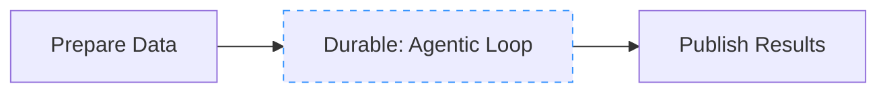
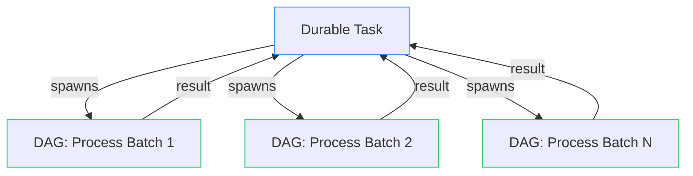
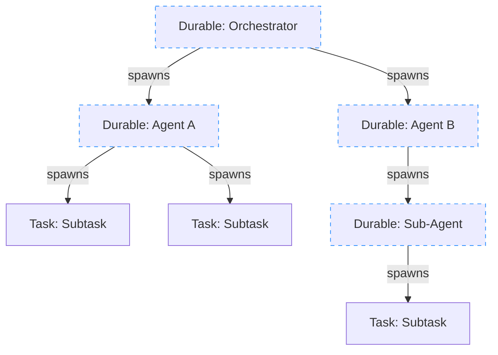

import { Callout } from "nextra/components";

# Patterns & Best Practices

## Choosing a Pattern

Use a **DAG** for any portion of work whose shape you know upfront, and use a **durable task** to orchestrate the parts whose shape is dynamic. You can mix them freely within the same application and even within the same workflow.

| Scenario                                       | Pattern                                      |
| ---------------------------------------------- | -------------------------------------------- |
| Fixed pipeline, every step is known            | DAG                                          |
| Fixed pipeline, but one step needs a long wait | DAG with a durable task node                 |
| Dynamic orchestration of known pipelines       | Durable task spawning DAGs                   |
| Fully dynamic, shape decided at runtime        | Durable task spawning tasks/durable tasks    |
| Agent that reasons and acts in a loop          | Durable task spawning children per iteration |

[DAGs](/v1/durable-workflows/directed-acyclic-graphs) are inherently deterministic, since their shape is predefined and intermediate results are cached. If your workflow can be represented as a DAG, prefer that. Reach for a durable task only when you need capabilities a static graph can't express.

<Callout type="info">
  You don't have to choose one pattern for your entire application. Different
  workflows can use different patterns, and a single workflow can mix them.
  Start with the simplest pattern that fits and add complexity only when needed.
</Callout>

## Mixing Patterns

### A durable task inside a DAG

A DAG workflow can include a durable task as one of its nodes. The durable task checkpoints and waits like any other, while the rest of the DAG proceeds according to its declared dependencies.

This is useful when most of your pipeline is a fixed graph but one step needs dynamic behavior, for example a pipeline where one stage runs an agentic loop that decides what to do at runtime.

The durable task (`Agentic Loop`) can spawn children, sleep, wait for events, or loop until a condition is met. When it completes, the downstream `Publish Results` task runs automatically.

### Spawning a DAG from a durable task

A durable task can spawn an entire DAG workflow as a child, wait for its result, and then continue. This lets you use procedural control flow to decide _which_ pipeline to run and _how many times_ to run it, while the pipeline itself is a well-defined graph.

The durable task decides at runtime how many batches to process, spawns a DAG workflow for each one, and collects the results. The DAG workflows run in parallel across your worker fleet while the durable task's slot is freed.

### Durable tasks spawning durable tasks

A durable task can spawn other durable tasks as children, each with their own checkpoints and event waits. This creates a tree of durable work that's entirely driven by runtime logic.

This pattern is ideal for agent-based systems where each level of the tree decides what to do next. Each durable task in the tree can sleep, wait for events, or spawn more children, and none of them hold a worker slot while waiting.

## Determinism in Durable Tasks

Durable tasks must be **deterministic** between checkpoints. The task should always perform the same sequence of operations in between retries. This is what allows Hatchet to replay the task from the last checkpoint. If a task is not deterministic, it may produce different results on each retry, which can lead to unexpected behavior.

### Rules for determinism

1. **Only call methods available on the `DurableContext`**: a common way to introduce non-determinism is to call methods that produce side effects. If you need to fetch data from a database, call an API, or otherwise interact with external systems, spawn those operations as a **child task** using `RunChild`. Durable tasks are [evicted](/v1/durable-workflows/task-eviction) at every wait point and replayed from checkpoint on resume. Any side effect not behind a checkpoint will re-execute.

2. **When updating durable tasks, always guarantee backwards compatibility**: if you change the order of checkpoint operations in a durable task, you may break determinism. For example, if you call `SleepFor` followed by `WaitFor`, and then change the order of those calls, Hatchet will not be able to replay the task correctly. The task may have already been checkpointed at the first call to `SleepFor`, and changing the order makes that checkpoint meaningless.
