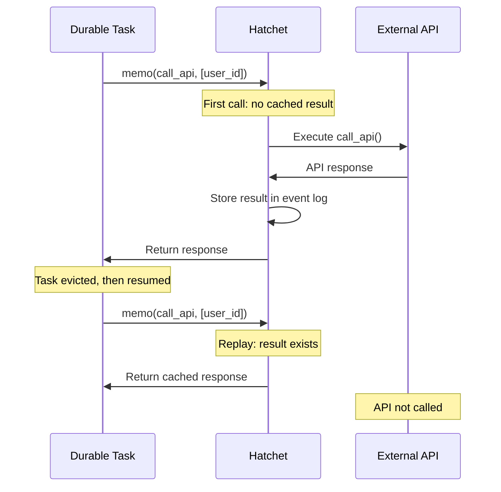

import { Callout, Tabs } from "nextra/components";
import UniversalTabs from "@/components/UniversalTabs";

# Memoization

Memoization caches the results of expensive operations within a durable task. When a task replays after eviction, memoized operations return their cached results instead of re-executing.

<Callout type="info">
  Memoization is only available in durable tasks. Regular tasks run to
  completion without replay, so memoization has no effect.
</Callout>

## When to Use Memoization

Use memoization when a durable task performs an expensive or non-idempotent operation that should only execute once:

| Scenario                        | Why Memoize?                                                                                       |
| ------------------------------- | -------------------------------------------------------------------------------------------------- |
| **API calls**                   | External API calls may be slow, rate-limited, or have side effects. Memoize to avoid duplicates.  |
| **LLM/AI model calls**          | Model inference is expensive. Memoize to preserve the original response across replays.           |
| **Database writes**             | Inserts or updates should happen once. Memoize to prevent duplicate records.                      |
| **File uploads**                | Uploading to S3 or other storage should happen once. Memoize to avoid re-uploading on replay.     |
| **Random or time-based values** | Values like UUIDs or timestamps should be stable. Memoize to get the same value on replay.        |

## How It Works

The `memo` function takes a callable and a list of dependencies. On the first call, it executes the callable and stores the result in the durable event log. On subsequent calls with the same dependencies, it returns the cached result without re-executing.

### Dependencies

The `deps` parameter controls when memoized results are reused:

- **Same dependencies**: Return the cached result from the event log.
- **Different dependencies**: Execute the function again and cache the new result.

For example, if you memoize an API call with `deps=[user_id]`, changing the `user_id` will trigger a fresh API call.

<Callout type="warning">
  Dependencies must be serializable. Use primitive types (strings, numbers,
  booleans) or simple data structures. Complex objects may not hash consistently.
</Callout>

## Usage

<Callout type="warning">
  Code examples for this page require SDK snippets to be generated. The following
  snippets need to be created in the SDK example directories:

  **Python** (`sdks/python/examples/durable_memo/`):
  - `worker.py` with snippets: `basic_memo`, `async_memo`, `memo_with_llm`, `multiple_memos`

  **TypeScript** (`sdks/typescript/src/v1/examples/durable_memo/`):
  - `workflow.ts` with snippets: `basic_memo`, `memo_with_llm`, `multiple_memos`

  **Go** (`sdks/go/examples/durable_memo/`):
  - `main.go` with snippets: `basic_memo`, `memo_with_external_call`

  **Ruby** (`sdks/ruby/examples/durable_memo/`):
  - `worker.rb` with snippets: `basic_memo`, `async_memo`
</Callout>

### Basic Memoization

Wrap expensive operations in `memo` to cache their results. The function is executed on the first call, and subsequent calls (including after task replay) return the cached result.

{/* TODO: Add snippets once SDK examples are created
<UniversalTabs items={["Python", "Typescript", "Go", "Ruby"]}>
  <Tabs.Tab title="Python">
    <Snippet src={snippets.python.durable_memo.worker.basic_memo} />
  </Tabs.Tab>
  <Tabs.Tab title="Typescript">
    <Snippet src={snippets.typescript.durable_memo.workflow.basic_memo} />
  </Tabs.Tab>
  <Tabs.Tab title="Go">
    <Snippet src={snippets.go.durable_memo.main.basic_memo} />
  </Tabs.Tab>
  <Tabs.Tab title="Ruby">
    <Snippet src={snippets.ruby.durable_memo.worker.basic_memo} />
  </Tabs.Tab>
</UniversalTabs>
*/}

### Memoizing LLM Calls

AI model calls are a common use case for memoization. Without memoization, a task replay would call the model again, potentially returning a different response and incurring additional cost.

{/* TODO: Add snippets once SDK examples are created
<UniversalTabs items={["Python", "Typescript", "Go", "Ruby"]}>
  <Tabs.Tab title="Python">
    <Snippet src={snippets.python.durable_memo.worker.memo_with_llm} />
  </Tabs.Tab>
  <Tabs.Tab title="Typescript">
    <Snippet src={snippets.typescript.durable_memo.workflow.memo_with_llm} />
  </Tabs.Tab>
  <Tabs.Tab title="Go">
    <Snippet src={snippets.go.durable_memo.main.memo_with_external_call} />
  </Tabs.Tab>
  <Tabs.Tab title="Ruby">
    <Snippet src={snippets.ruby.durable_memo.worker.async_memo} />
  </Tabs.Tab>
</UniversalTabs>
*/}

### Multiple Memoized Operations

A single durable task can memoize multiple operations. Each `memo` call is tracked independently based on its position in the code and its dependencies.

{/* TODO: Add snippets once SDK examples are created
<UniversalTabs items={["Python", "Typescript", "Go", "Ruby"]}>
  <Tabs.Tab title="Python">
    <Snippet src={snippets.python.durable_memo.worker.multiple_memos} />
  </Tabs.Tab>
  <Tabs.Tab title="Typescript">
    <Snippet src={snippets.typescript.durable_memo.workflow.multiple_memos} />
  </Tabs.Tab>
  <Tabs.Tab title="Go">
    <Snippet src={snippets.go.durable_memo.main.basic_memo} />
  </Tabs.Tab>
  <Tabs.Tab title="Ruby">
    <Snippet src={snippets.ruby.durable_memo.worker.basic_memo} />
  </Tabs.Tab>
</UniversalTabs>
*/}

## Best Practices

### Do Memoize

- **External API calls** that may be slow or rate-limited
- **LLM/AI inference** calls where you want deterministic replay
- **Database operations** with side effects (inserts, updates)
- **File operations** like uploads or downloads
- **Random values** that should remain stable (UUIDs, timestamps)

### Don't Memoize

- **Pure computations** on local data (these are fast and deterministic anyway)
- **Operations that should vary** on each replay (rare, but possible)
- **Logging or metrics** (side effects that are safe to repeat)

### Keep Dependencies Minimal

Only include values that actually affect the operation's result. Extra dependencies cause unnecessary cache misses. For example, when fetching user data, only include `user_id` in the dependencies, not unrelated values like timestamps.

## API Reference

For detailed API documentation including method signatures and parameters, see:

- [Python DurableContext.memo](/reference/python/context#memo)
- [TypeScript DurableContext.memo](/reference/typescript/Context#memo)

## Related

- [Durable Tasks](/v1/durable-task-execution) — Overview of durable task execution
- [Sleep & Delays](/v1/sleep) — Pausing tasks with durable sleep
- [Events](/v1/events) — Waiting for external events
- [Child Spawning](/v1/child-spawning) — Spawning child tasks from durable tasks
