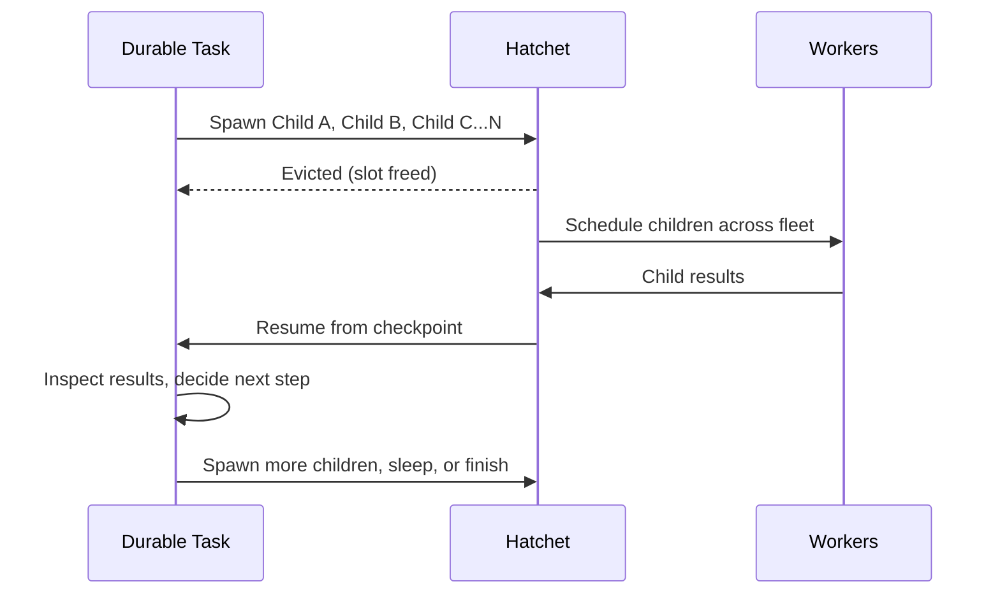

import { snippets } from "@/lib/generated/snippets";
import { Snippet } from "@/components/code";

import { Callout, Steps } from "nextra/components";
import DurableWorkflowDiagram from "@/components/DurableWorkflowDiagramWrapper";

# Durable Tasks

A durable task is a task that uses durable execution primitives. In Hatchet, durable tasks do two durable operations: they **wait** (for time or events), and they **spawn child tasks**. Every time one of those happens, Hatchet writes a checkpoint to the durable event log. On retries, Hatchet can replay from that checkpoint instead of re-running completed application logic, which gives your tasks something closer to exactly-once semantics than you'd get with many other task queue implementations.

Use durable tasks when the shape of work is not known upfront, when parts of the task are hard to make idempotent, or when execution might be interrupted and resumed later. Common examples are agentic loops (often with human-in-the-loop steps), dynamic workflows that choose child workflows at runtime, and long waits that should not hold worker slots. They can also be very simple: sleep, then continue; or wait for an event, then exit.

<Callout type="info">
  If you know the full graph of work upfront — every task and dependency is
  fixed before execution begins — use a
  [DAG](/v1/patterns/directed-acyclic-graphs) instead. You can always [mix
  both](/v1/patterns/mixing-patterns) in the same application.
</Callout>

## When to use durable tasks

| Scenario                               | Why durable?                                                                   |
| -------------------------------------- | ------------------------------------------------------------------------------ |
| **Agentic loops**                      | Spawn children, collect results, and continue in a loop without losing progress. |
| **Hard-to-idempotent steps**           | Replay from checkpoints instead of re-running already completed logic.         |
| **Runtime-selected workflows**         | Choose which child tasks/workflows to run based on intermediate results.       |
| **Long waits / human-in-the-loop**     | Wait for timeouts or approvals without holding worker resources.               |
| **Recovering from interruptions**      | Resume from checkpoints after worker restarts or crashes.                      |

## How it works

A durable task runs your code until it reaches a durable operation (a wait or a child spawn). At that point, Hatchet checkpoints progress. If the task is waiting, Hatchet can [evict](/v1/task-eviction) it and free the worker slot. When the wait is over, Hatchet re-queues the task, replays the durable event log, and resumes from the latest checkpoint.

Child spawning is a common use case, but it is not required.

This differs from a DAG, where every task and dependency is declared before execution starts. With durable tasks, your code can decide at runtime how many children to spawn, which branch to take, and whether to continue or stop.

<DurableWorkflowDiagram />

<Steps>

### Checkpoints

Each wait or child-spawn operation writes a checkpoint to the durable event log. That is the progress Hatchet uses for replay.

### Worker slot is freed during waits

When a durable task enters a wait, Hatchet [evicts](/v1/task-eviction) it from the worker. The slot is immediately available for other tasks.

### Task resumes from checkpoint

When the wait completes, Hatchet re-queues the task on any available worker. It replays the event log up to the last checkpoint and resumes execution from there. Completed operations are not run again.

</Steps>

## The durable context

When you declare a task as durable, it receives a durable context instead of a regular context. It includes everything in a normal context, plus the durable capabilities below:

| Capability                   | What it does                                                                                                                                 |
| ---------------------------- | -------------------------------------------------------------------------------------------------------------------------------------------- |
| **Sleep-based delays**       | Wait for a fixed duration. The original deadline is respected across restarts. See [Sleep & Delays](/v1/sleep).                               |
| **Event waits**              | Wait for an external event key, with optional [CEL filtering](https://github.com/google/cel-spec). See [Wait For Events](/v1/events).         |
| **Combined wait conditions** | Wait on combinations of sleep and event conditions, including "either/or" behavior. See [Conditions & Branching](/v1/conditions#or-groups).   |
| **Child spawning**           | Spawn a child task and wait for its result. The parent can be evicted while waiting. See [Child Spawning](/v1/child-spawning).                |

## Example

<Snippet src={snippets.python.durable.worker.create_a_durable_workflow} />

Now add tasks to the workflow. The first is a regular task; the second is a durable task that sleeps and waits for an event:

<Snippet src={snippets.python.durable.worker.add_durable_task} />

<Callout type="info">
  Declaring a task as durable gives the function a durable context instead of a
  regular context. That's the only declaration-level difference — the task
  still registers and runs on the same worker process as regular tasks.
</Callout>

If this task is interrupted at any point, it picks up from where it left off. For example, if it starts a 24-hour sleep and is interrupted after 23 hours, it only sleeps 1 more hour after restart. See [Introduction to Durable Execution](/v1/durable-execution) for a deeper walkthrough of replay.

### Waiting on multiple conditions

Durable tasks can combine multiple wait conditions using [or groups](/v1/conditions#or-groups). For example, you can continue as soon as an event arrives, or fall back to a timeout if nothing comes in time:

<Snippet
  src={snippets.python.durable.worker.add_durable_tasks_that_wait_for_or_groups}
/>

## Spawning child tasks

Child spawning is an optional way to build more dynamic workflows. A durable task can spawn any runnable — regular tasks, other durable tasks, or entire DAG workflows — wait for results, and then decide what to do next.

| Child type       | Example                                                                           |
| ---------------- | --------------------------------------------------------------------------------- |
| **Regular task** | Spawn a stateless task for a quick computation or API call.                       |
| **Durable task** | Spawn another durable task that has its own checkpoints, sleeps, and event waits. |
| **DAG workflow** | Spawn an entire multi-task workflow and wait for its final output.                |

The parent is evicted while children execute, so it consumes no resources while waiting. The number and type of children can be determined dynamically based on input, intermediate results, or model outputs.

See [Child Spawning](/v1/child-spawning) for full examples and [Worker Slots & Waiting](/v1/task-eviction) for how slot freeing works during waits.

<Callout type="info">
  For a deeper look at how durable execution works internally, see [this blog
  post](https://hatchet.run/blog/durable-execution).
</Callout>
