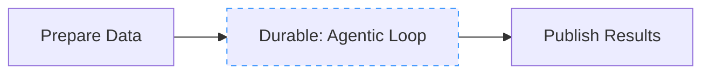
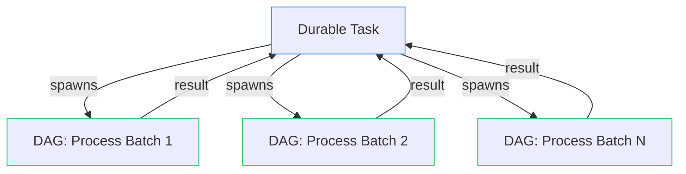
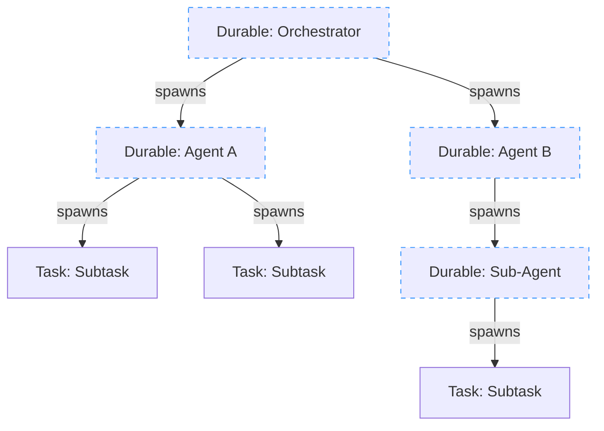

import { Callout } from "nextra/components";

# Choosing an Approach

The short answer: use a **DAG** for work whose shape you know upfront, and use a **durable task** for the parts that need runtime decisions. You can mix both in the same app — even in the same workflow.

| Scenario                                       | What to use                                  |
| ---------------------------------------------- | -------------------------------------------- |
| Fixed pipeline, every step is known            | DAG                                          |
| Fixed pipeline, but one step needs a long wait | DAG with a durable task node                 |
| Dynamic orchestration of known pipelines       | Durable task spawning DAGs                   |
| Fully dynamic, shape decided at runtime        | Durable task spawning tasks/durable tasks    |
| Agent that reasons and acts in a loop          | Durable task spawning children per iteration |

[DAGs](/v1/patterns/directed-acyclic-graphs) are simpler to reason about because the shape is predefined and intermediate results are cached. If your workflow can be expressed as a DAG, start there. Reach for a durable task when a static graph cannot express what you need.

<Callout type="info">
  You don't have to pick one approach for your whole application. Different
  workflows can use different patterns, and a single workflow can mix them.
  Start with the simplest thing that fits and add complexity only when you need
  it.
</Callout>

## Determinism in durable tasks

One important thing to keep in mind when writing durable tasks: the code between checkpoints must be deterministic. When a task is evicted and resumed, Hatchet replays the durable event log to rebuild state — it doesn't re-execute completed operations, but it does re-run the code path that led to each checkpoint.

This means a few things in practice:

- **Base decisions on checkpoint outputs**, not on external state that might change between runs (wall-clock time, database reads, random values). If a branch is taken on the first run, it must be taken again on replay.
- **Don't read outside state mid-function** in ways that assume a particular value that may differ between runs.
- **Push side effects into child tasks**. If you need to call external APIs, databases, or other services, do it in child tasks and wait on their results.

If you're ever unsure whether something is safe, ask yourself: "If this task was interrupted and replayed from the last checkpoint, would this code produce the same result?" If yes, you're fine.

## Combining both

### A durable task inside a DAG

A DAG workflow can include a durable task as one of its nodes. The durable task checkpoints and waits like any other, while the rest of the DAG proceeds according to its declared dependencies.

This is useful when most of your pipeline is a fixed graph but one step needs dynamic behavior, for example a pipeline where one stage runs an agentic loop that decides what to do at runtime.

The durable task (`Agentic Loop`) can spawn children, sleep, wait for events, or loop until a condition is met. When it completes, the downstream `Publish Results` task runs automatically.

### Spawning a DAG from a durable task

A durable task can spawn an entire DAG workflow as a child, wait for its result, and then continue. This lets you use procedural control flow to decide _which_ pipeline to run and _how many times_ to run it, while the pipeline itself is a well-defined graph.

The durable task decides at runtime how many batches to process, spawns a DAG workflow for each one, and collects the results. The DAG workflows run in parallel across your worker fleet while the durable task's slot is freed.

### Durable tasks spawning durable tasks

A durable task can spawn other durable tasks as children, each with their own checkpoints and event waits. This creates a tree of durable work that's entirely driven by runtime logic.

This pattern is ideal for agent-based systems where each level of the tree decides what to do next. Each durable task in the tree can sleep, wait for events, or spawn more children, and none of them hold a worker slot while waiting.
