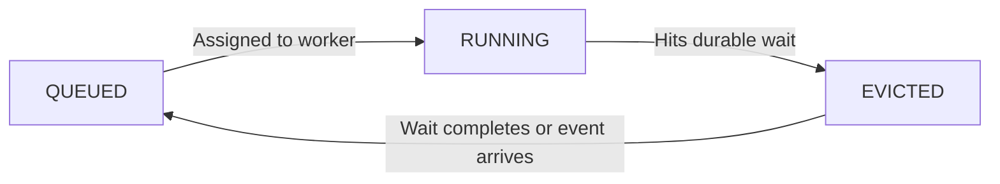

import { Callout, Tabs } from "nextra/components";
import UniversalTabs from "@/components/UniversalTabs";

# Worker Slots & Waiting

When a task needs to wait — for time, an event, or child completion — Hatchet has to decide what to do with the worker slot it is using. The answer depends on the kind of task you are running.

<UniversalTabs items={["Durable Tasks", "DAGs"]} optionKey="pattern">
<Tabs.Tab title="Durable Tasks">

## Task eviction

When a durable task enters a wait — for time, events, or child completion — Hatchet **evicts** it from the worker. The slot is released, the task's progress is saved in the durable event log, and the task stops consuming resources until the wait is over.

This is what makes durable tasks fundamentally different from regular tasks: a regular task holds a slot for the full duration of execution, even if it's just sleeping. A durable task gives the slot back the moment it starts waiting.

### How eviction works

1. **Task reaches a wait.** The durable task starts a durable wait.
2. **Checkpoint is written.** Hatchet records current progress in the durable event log.
3. **Worker slot is freed.** The task is evicted. The slot is immediately available for other work.
4. **Wait completes.** When the sleep expires or the expected event arrives, Hatchet re-queues the task.
5. **Task resumes on any available worker.** Hatchet replays the event log to the last checkpoint and continues from there.

The task doesn't need to resume on the same worker that originally ran it — any worker that has registered the task can pick it up.

### Why this matters

Without eviction, a task sleeping for 24 hours would hold a worker slot for the full duration. With eviction, the slot is freed immediately and can be used for other work.

This is especially important for:

- **Long waits** — Tasks sleeping for hours or days shouldn't tie up capacity.
- **Human-in-the-loop** — Waiting for a human to approve something could take minutes or weeks. There's no reason to hold a slot in the meantime.
- **Large fan-outs** — A parent that spawns thousands of children and waits for results can release its slot while the children run. Without this, the parent could starve the very children it's waiting on.

### Durable tasks get their own slot pool

Durable tasks consume slots from a **separate pool** than regular tasks. This prevents a deadlock that would otherwise be pretty easy to stumble into: if durable and regular tasks shared a pool, a durable task waiting on child tasks could hold the slot those children need to execute.

By keeping the pools separate, Hatchet ensures that a durable task waiting on children never starves the workers running those children.

### Eviction and determinism

Because a task can be evicted and resumed on a different worker at any time, the code between checkpoints must be [deterministic](/v1/patterns/durable-tasks). On resume, Hatchet replays the event log — it doesn't re-execute completed operations, but it does re-run the code path that led to each checkpoint. If the code has changed between the original run and the replay, the checkpoint sequence may not match, leading to unexpected behavior.

See [Durable Tasks](/v1/patterns/durable-tasks), [Sleep & Delays](/v1/sleep), and [Wait For Events](/v1/events) for concrete examples of waits that trigger eviction.

</Tabs.Tab>
<Tabs.Tab title="DAGs">

## No eviction needed

DAG tasks don't need eviction because they're **never assigned to a worker until they're actually ready to run**. A slot is only allocated once all of the task's conditions are satisfied — parent tasks complete, sleep durations elapse, expected events arrive.

Resources are only consumed during active execution, never during waits.

### How DAG scheduling works

1. **Task is pending.** The task exists in the workflow but isn't queued yet. No slot is allocated, no resources consumed.
2. **Conditions are met.** All parent tasks have completed, any sleep duration has elapsed, and any required events have arrived.
3. **Task is queued.** Only now does Hatchet place the task in the queue for worker assignment.
4. **Task runs to completion.** A worker picks it up, executes it, and the slot is freed.

Because DAG tasks are only scheduled when they're ready, there's no wasted capacity:

- **Sleep conditions** — A task that waits 24 hours after its parent completes doesn't hold a slot. It sits pending until the timer expires, then gets queued.
- **Event conditions** — A task waiting for an external event consumes no resources. When the event arrives, the task is queued.
- **Parent dependencies** — Tasks waiting on upstream results aren't queued until those results are available.

This is one of the things that makes DAGs simpler to reason about. You declare the conditions upfront, and Hatchet handles the timing. No eviction, no checkpointing, no replay — because the task never starts until it's ready to run all the way through.

<Callout type="info">
  If you need a task to start running and then pause partway through — for
  example, to wait for an event based on intermediate results — use a [durable
  task](/v1/patterns/durable-tasks) instead. DAG tasks run from start to finish
  once scheduled.
</Callout>

</Tabs.Tab>
</UniversalTabs>
