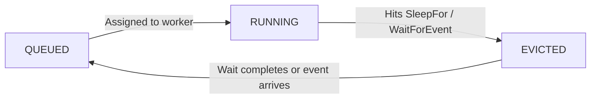

import { Callout, Tabs } from "nextra/components";
import UniversalTabs from "@/components/UniversalTabs";

# Resource Management During Waits

When a task needs to wait (for time, an event, or child results), how does Hatchet handle the worker slot? The answer depends on which pattern you're using.

<UniversalTabs items={["Durable Tasks", "DAGs"]} optionKey="pattern">
<Tabs.Tab title="Durable Tasks">

## Task Eviction

When a durable task enters a wait, whether from `SleepFor`, `WaitForEvent`, or `WaitFor`, Hatchet **evicts** the task from the worker. The worker slot is released, the task's progress is persisted in the durable event log, and the task does not consume slots or hold resources while it is idle.

This is what makes durable tasks fundamentally different from regular tasks: a regular task consumes a slot for the entire duration of execution, even if it's just sleeping. A durable task gives the slot back the moment it starts waiting.

### How eviction works

1. **Task reaches a wait.** The durable task calls `SleepFor`, `WaitForEvent`, or `WaitFor`.
2. **Checkpoint is written.** Hatchet records the current progress in the durable event log.
3. **Worker slot is freed.** The task is evicted from the worker. The slot is immediately available for other tasks.
4. **Wait completes.** When the sleep expires or the expected event arrives, Hatchet re-queues the task.
5. **Task resumes on any available worker.** A worker picks up the task, replays the event log to the last checkpoint, and continues execution from where it left off.

The resumed task does not need to run on the same worker that originally started it. Any worker that has registered the task can pick it up.

### Why eviction matters

Without eviction, a task that sleeps for 24 hours would consume a slot for the entire duration, wasting capacity that could be running other work. With eviction, the slot is freed immediately.

This is especially important for:

- **Long waits** — Tasks that sleep for hours or days should not hold slots.
- **Human-in-the-loop** — Waiting for a human to approve or respond could take minutes or weeks. Eviction ensures no resources are held in the meantime.
- **Large fan-outs** — A parent task that spawns thousands of children and waits for results can release its slot while the children run, preventing deadlocks where the parent holds resources that the children need.

### Configuring eviction policies

Durable tasks are evicted after waiting for a default duration—5 minutes in Python, 15 minutes in TypeScript. You can customize this by passing an eviction policy when defining the task.

There are three levers:

**TTL (Time-To-Live)**: How long a task waits before becoming eligible for eviction. When the TTL expires, Hatchet evicts the task, frees the slot, and automatically resumes when the wait condition is satisfied. Shorter TTLs free slots faster but cause more eviction overhead.

**Capacity-based eviction**: Whether Hatchet can evict this task when worker slots are under pressure. Set `allow_capacity_eviction=False` (Python) or `allowCapacityEviction: false` (TypeScript) for critical tasks that should not be interrupted. These tasks keep their slot until their wait completes normally.

**Priority**: When multiple tasks are candidates for capacity-based eviction, tasks with lower priority values are evicted first. Use this to protect important tasks relative to less critical ones.

<Callout type="info">
To prevent a task from ever being evicted, set `ttl` to `None` (Python) or `undefined` (TypeScript) and disable capacity eviction. This is useful for tasks holding critical state that cannot be checkpointed, but the task will consume a slot for the entire wait duration.
</Callout>

### EvictionPolicy reference

<UniversalTabs items={["Python", "TypeScript"]} optionKey="sdk">
<Tabs.Tab title="Python">

Pass an `eviction_policy` to the `durable_task` decorator:

| Parameter | Type | Default | Description |
| --- | --- | --- | --- |
| `ttl` | `timedelta \| None` | `5 minutes` | Maximum wait duration before TTL-based eviction. Set to `None` to disable. |
| `priority` | `int` | `0` | Lower values are evicted first under capacity pressure. |
| `allow_capacity_eviction` | `bool` | `True` | Whether the task can be evicted under slot pressure. |

</Tabs.Tab>
<Tabs.Tab title="TypeScript">

Pass an `evictionPolicy` to `hatchet.durableTask()`:

| Parameter | Type | Default | Description |
| --- | --- | --- | --- |
| `ttl` | `Duration \| undefined` | `'15m'` | Maximum wait duration before TTL-based eviction. Set to `undefined` to disable. |
| `priority` | `number` | `0` | Lower values are evicted first under capacity pressure. |
| `allowCapacityEviction` | `boolean` | `true` | Whether the task can be evicted under slot pressure. |

</Tabs.Tab>
</UniversalTabs>

### Separate slot pools

Durable tasks consume slots from a **separate slot pool** than regular tasks. This prevents a common deadlock: if durable and regular tasks shared the same pool, a durable task waiting on child tasks could hold the very slot those children need to execute.

By isolating slot pools, Hatchet ensures that durable tasks waiting on children never starve the workers that need to run those children.

### Eviction and determinism

Because a task may be evicted and resumed on a different worker at any time, the code between checkpoints must be [deterministic](/v1/patterns/mixing-patterns#determinism-in-durable-tasks). On resume, Hatchet replays the event log; it does not re-execute completed operations. If the code has changed between the original run and the replay, the checkpoint sequence may not match, leading to unexpected behavior.

### Server-initiated eviction

The Hatchet engine can also trigger eviction when it detects a **stale invocation**. This happens when a worker loses connectivity (missed heartbeats) and Hatchet re-queues the task to another worker. The original worker might still be running—just disconnected. When it reconnects, the engine notices the invocation is outdated and sends an eviction notification.

#### How stale invocation detection works

Each time a durable task is evicted and resumed, its **invocation count** increments. Workers report their invocation count in status updates. If the engine sees a worker reporting a lower count than current, it knows that worker is running stale code.

1. **Worker A starts the task.** Invocation count is 1.
2. **Worker A loses connectivity.** Heartbeats stop arriving.
3. **Hatchet re-queues the task.** Worker B picks it up. Invocation count becomes 2.
4. **Worker A reconnects.** It reports invocation count 1.
5. **Engine detects the mismatch.** It sends a server eviction notification to Worker A.
6. **Worker A cancels the stale task.** Only Worker B continues.

#### Why server-initiated eviction matters

Without this mechanism, two workers could run the same task simultaneously—a "split-brain" scenario. This could cause:

- **Duplicate side effects** — Both workers might call external APIs or write to databases.
- **Race conditions** — Both might try to complete the same checkpoint, leading to conflicts.
- **Wasted resources** — The stale worker consumes a slot for work that will be discarded.

Server-initiated eviction ensures only the most recent invocation runs. Stale invocations are cancelled as soon as they're detected.

</Tabs.Tab>
<Tabs.Tab title="DAGs">

## No Eviction Needed

DAG tasks do not require eviction because they are **never assigned to a worker until they can actually run**. A worker slot is only allocated when all of the task's conditions are met: parent tasks have completed, sleep durations have elapsed, and expected events have arrived.

This means resources are only consumed during active execution, never during waits.

### How DAG scheduling works

1. **Task is pending.** The task exists in the workflow but is not queued. No worker slot is allocated. No resources are consumed.
2. **Conditions are met.** All parent tasks have completed, any sleep duration has elapsed, and any required events have arrived.
3. **Task is queued.** Only now does Hatchet place the task in the queue for worker assignment.
4. **Task runs to completion.** A worker picks up the task, executes it, and the slot is freed.

### Why this matters

Because DAG tasks are only scheduled when ready, there is no wasted capacity:

- **Sleep conditions** — A task that waits 24 hours after its parent completes does not hold a slot. It sits in a pending state until the timer expires, then gets queued.
- **Event conditions** — A task waiting for an external event consumes no resources. When the event arrives, the task is queued and assigned a slot.
- **Parent dependencies** — Tasks waiting on upstream results are not queued until those results are available.

This is one of the advantages of DAGs: the scheduling model is simpler. You declare the conditions upfront, and Hatchet handles the timing. There is no eviction, no checkpointing, and no replay, because the task never starts until it's ready to run straight through.

<Callout type="info">
  If you need a task to start running and then pause partway through (for
  example, to wait for an event based on intermediate results), use a [durable
  task](/v1/patterns/durable-task-execution) instead. DAG tasks run from start
  to finish once scheduled.
</Callout>

</Tabs.Tab>
</UniversalTabs>
