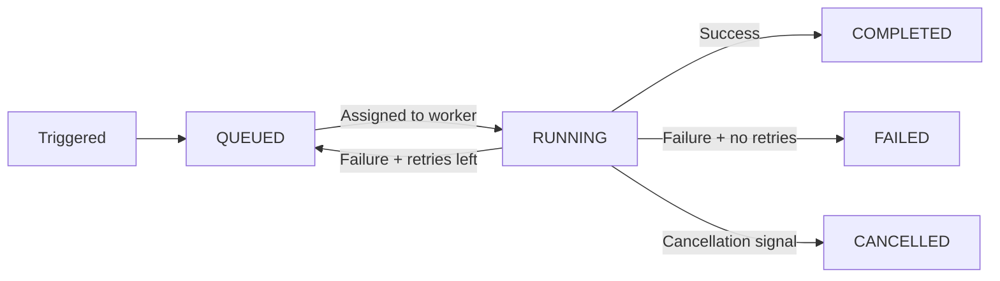

import { snippets } from "@/lib/generated/snippets";
import { Snippet } from "@/components/code";
import { Callout, Tabs } from "nextra/components";
import UniversalTabs from "@/components/UniversalTabs";
import Keywords from "@/components/Keywords";

# Tasks

The fundamental unit of work in Hatchet is a **task**. At its most basic level, a task is just a function. You can invoke a task on its own (a "standalone" task), or compose tasks into a larger [workflow](/v1/workflows).

## Defining a task

All that's needed to define a task in Hatchet is a function and a name (only required in some SDKs).

<UniversalTabs items={["Python", "Typescript", "Go", "Ruby"]}>
  <Tabs.Tab title="Python">
    <Snippet
      src={snippets.python.quickstart.workflows.first_task.simple_task}
    />
  </Tabs.Tab>
  <Tabs.Tab title="Typescript">
    <Snippet src={snippets.typescript.simple.workflow.declaring_a_task} />
  </Tabs.Tab>
  <Tabs.Tab title="Go">
    <Snippet src={snippets.go.simple.main.declaring_a_task} />
  </Tabs.Tab>
  <Tabs.Tab title="Ruby">
    <Snippet src={snippets.ruby.quickstart.workflows.first_task.simple_task} />
  </Tabs.Tab>
</UniversalTabs>

Once you define and register a task on a [worker](/v1/workers), you can [trigger it in a variety of ways.](/v1/running-your-task)

## Task lifecycle

When a task is triggered, it moves through three phases: queued, running, and a terminal state (cancelled, failed, or succeeded).

## Triggering a task

The object returned from a task definition supports several trigger methods:

| Method                                                   | What it does                                            |
| -------------------------------------------------------- | ------------------------------------------------------- |
| [Run-and-wait](/v1/running-your-task#run-and-wait)       | Trigger the task and wait for the result.               |
| [Fire-and-forget](/v1/running-your-task#fire-and-forget) | Enqueue the task and return immediately.                |
| [Schedule](/v1/scheduled-runs)                           | Schedule the task to run at a specific time.            |
| [Cron](/v1/cron-runs)                                    | Run the task on a recurring schedule.                   |
| [Bulk run](/v1/bulk-run)                                 | Trigger many instances of the task at once.             |
| [Run-on-event](/v1/external-events/run-on-event)         | Trigger the task automatically when an event is pushed. |
| [Webhook](/v1/webhooks)                                  | Trigger the task from an external HTTP request.         |

## Configuring a task

You can configure tasks to handle common problems in distributed systems. For example, you can automatically retry a task when an external API returns a transient error, or limit how many instances run concurrently to prevent overwhelming downstream systems.

| Concept                                                    | What it does                                               |
| ---------------------------------------------------------- | ---------------------------------------------------------- |
| [Retries](/v1/retry-policies)                              | Retry the task on failure, with optional backoff.          |
| [Timeouts](/v1/timeouts)                                   | Limit how long a task may wait to be scheduled or to run.  |
| [Concurrency](/v1/concurrency)                             | Limit how many runs of this task execute at once.          |
| [Rate limits](/v1/rate-limits)                             | Throttle task execution over a time window.                |
| [Priority](/v1/priority)                                   | Influence scheduling order relative to other queued tasks. |
| [Worker affinity](/v1/advanced-assignment/worker-affinity) | Prefer or require specific workers for this task.          |

## Input and output

Every task receives an **input** - a JSON-serializable object passed when the task is triggered. The value that is returned from the task becomes the task's **output**, which callers receive when they await the result.

When a task is part of a [workflow](/v1/workflows), downstream tasks can access its output through the context object, so data flows naturally from one task to the next. See [Accessing Parent Task Outputs](/v1/workflows#accessing-parent-task-outputs) for details.

## The context object

Every task function receives a **context** alongside its input. The context provides a number of pieces of data and helper methods that might be useful to the task's runtime logic:

- **Runtime information** like the task's run ID, workflow ID, and more.
- **Check for cancellation** and respond to it gracefully ([Cancellation](/v1/cancellation)).
- **Refresh timeouts** if a long-running operation needs more time ([Timeouts](/v1/timeouts)).
- **Release a worker slot** early to free capacity for other tasks ([Manual Slot Release](/v1/advanced-assignment/manual-slot-release)).

## How tasks execute on workers

Tasks don't run on their own — [workers](/v1/workers) execute them. A worker is a long-running process that registers one or more tasks with Hatchet. When you trigger a task, Hatchet places it in a queue and assigns it to an available worker that has registered that task.

Each worker has a fixed number of **slots** that determine how many tasks it can run concurrently. When all slots are occupied, new tasks stay queued until a slot opens up. This behavior is further configurable with [concurrency limits](/v1/concurrency), [rate limits](/v1/rate-limits), and [priority](/v1/priority).

If tasks need to run on specific workers — for example, because a worker has a GPU or a particular model loaded in memory — [worker affinity](/v1/advanced-assignment/worker-affinity) or [sticky assignment](/v1/advanced-assignment/sticky-assignment) let you route tasks to workers matching those criteria.

<Keywords keywords="task, workflow, context" />
