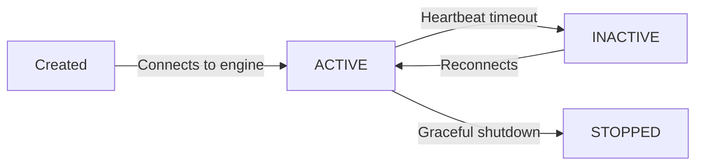

import { snippets } from "@/lib/generated/snippets";
import { Snippet } from "@/components/code";
import { Callout, Tabs } from "nextra/components";
import UniversalTabs from "@/components/UniversalTabs";

# Workers

Workers are the processes that actually execute your [tasks](/v1/tasks). Each worker is a long-running process in your infrastructure that maintains a persistent gRPC connection to the Hatchet engine. Workers receive task assignments, run your code, and report results back. You can run them locally during development, in containers, or on VMs - and scale them independently from the rest of your stack.

## Declaring a worker

A worker needs a name and a set of tasks to handle. Call the `worker` method on the Hatchet client with both.

<UniversalTabs items={["Python", "Typescript", "Go", "Ruby"]}>
  <Tabs.Tab title="Python">
    <Snippet src={snippets.python.dag.worker.declare_a_worker} />
  </Tabs.Tab>
  <Tabs.Tab title="Typescript">
    <Snippet src={snippets.typescript.simple.worker.declaring_a_worker} />
  </Tabs.Tab>
  <Tabs.Tab title="Go">
    <Snippet src={snippets.go.simple.main.starting_a_worker} />
  </Tabs.Tab>
  <Tabs.Tab title="Ruby">
    <Snippet src={snippets.ruby.dag.worker.declare_a_worker} />
  </Tabs.Tab>
</UniversalTabs>

When a worker starts, it registers each of its tasks with the Hatchet engine. From that point on, Hatchet knows to route matching tasks to that worker. Multiple workers can register the same task - Hatchet distributes work across all of them.

## Starting a worker

<Tabs items={["CLI (recommended)", "Script"]}>
  <Tabs.Tab value="cli" label="CLI (recommended)">

The fastest way to run a worker during development is with the Hatchet CLI. This handles authentication and hot-reloads your worker when code changes:

```bash
hatchet worker dev
```

  </Tabs.Tab>
  <Tabs.Tab value="script" label="Script">

You can also run the worker script directly. This requires a `HATCHET_CLIENT_TOKEN` environment variable. You can generate an API token from the Hatchet dashboard by navigating to the **Settings** tab and clicking **API Tokens**. Click **Generate API Token** to create a new token, and do not share it publicly.

```bash
export HATCHET_CLIENT_TOKEN="<your-client-token>"
```

If you are a self-hosted user without TLS enabled, also set:

```bash
export HATCHET_CLIENT_TLS_STRATEGY=none
```

Then run your worker:

<UniversalTabs items={["Python", "Typescript", "Go", "Ruby"]} variant="hidden">
  <Tabs.Tab title="Python">
```bash
python worker.py
```
  </Tabs.Tab>
  <Tabs.Tab title="Typescript">

Add a script to your `package.json`:

```json
"scripts": {
  "start:worker": "ts-node src/worker.ts"
}
```

Then run it:

```bash
npm run start:worker
```

  </Tabs.Tab>
  <Tabs.Tab title="Go">
```bash
go run main.go
```
  </Tabs.Tab>
  <Tabs.Tab title="Ruby">
```bash
bundle exec ruby worker.rb
```
  </Tabs.Tab>
</UniversalTabs>

  </Tabs.Tab>
</Tabs>

Once the worker starts, you will see logs confirming it is connected:

```
[INFO]  🪓 -- STARTING HATCHET...
[DEBUG] 🪓 -- 'test-worker' waiting for ['simpletask:step1']
[DEBUG] 🪓 -- acquired action listener: efc4aaf2-...
[DEBUG] 🪓 -- sending heartbeat
```

<Callout type="info">
  For self-hosted users, you may need to set additional gRPC configuration
  options. See the [Self-Hosting](/self-hosting/worker-configuration-options)
  docs for details.
</Callout>

## Worker lifecycle

A worker moves through four phases during its lifetime:



- **ACTIVE** - the worker is connected and accepting tasks.
- **INACTIVE** - the engine has not received a heartbeat within the expected window. Tasks assigned to this worker will be reassigned.
- **STOPPED** - the worker shut down gracefully. In-flight tasks are allowed to complete before the process exits.

Hatchet uses heartbeats to monitor worker health. Workers send a heartbeat every **4 seconds**. If the engine does not receive a heartbeat for **30 seconds**, the worker is marked INACTIVE and its in-flight tasks are re-queued for other workers to pick up.

Common reasons a worker misses heartbeats:

- **Process crash** - the worker process exits unexpectedly (OOM kill, unhandled exception, SIGKILL).
- **Network disruption** - the connection between the worker and the Hatchet engine is interrupted (DNS failure, firewall change, cloud network blip).
- **Blocked main thread** - a long-running synchronous computation (e.g. CPU-intensive work, a blocking FFI call) starves the heartbeat loop and prevents it from sending on time.

## Slots

Every worker has a fixed number of **slots** that control how many tasks it can run concurrently. You configure them with the `slots` option on the worker. If you set `slots=5`, the worker will run up to five tasks at the same time. Any additional tasks wait in the queue until a slot opens up.

Slots are a **local** limit - they protect the individual worker process from overcommitting its CPU, memory, or event loop. [Concurrency controls](/v1/concurrency) are a **global** limit across your entire fleet - use them to prevent a single tenant or use-case from monopolizing capacity, or to respect the limits of an external resource like a third-party API or database connection pool. The two work together: concurrency controls decide how many runs Hatchet will allow to be active; slots decide how many of those runs each individual worker is willing to accept.

### Choosing a slot count

Start with a slot count that matches the degree of parallelism your worker can sustain. For CPU-heavy tasks, that is typically the number of available cores. For I/O-heavy tasks (HTTP calls, database queries), you can safely go higher because most of the time is spent waiting.

<Callout type="info">
  Adding slots is only helpful up to the point where the worker is not
  bottlenecked by another resource. If your worker is CPU-bound, memory-bound,
  or waiting on network I/O, more slots will just increase contention. Monitor
  memory usage and event loop lag after changing slot counts - if either climbs,
  you have gone too far.
</Callout>

### Slot types

Workers manage multiple slot pools. By default, there are two:

- **default** - used by regular tasks declared with `@hatchet.task()` or `workflow.task()`
- **durable** - used by [durable tasks](/v1/patterns/durable-task-execution) declared with `@hatchet.durable_task()` or `workflow.durable_task()`

This separation prevents deadlocks. Durable tasks spawn child tasks and wait for their results. If both shared the same pool, a durable task could consume all slots while waiting for children that can never run - there would be no slots left.

With separate pools, a durable task waiting for children does not block regular tasks. Children execute in the default pool while the parent waits in the durable pool.

Configure slot counts with the `slots` parameter (for the default pool) and `durable_slots` parameter (for the durable pool) when creating a worker. See the [Python SDK reference](/reference/python/client#worker) or [TypeScript SDK reference](/reference/typescript/client) for details.

<Callout type="info">
  If you don't use durable tasks, only the default pool matters. The durable pool is allocated but stays unused.
</Callout>

## Scaling workers

You can increase throughput in two ways: add more slots to a single worker, or run more worker processes. In most workloads, horizontal scaling (more workers) is the simplest path because each worker brings its own pool of slots and its own resources.

When running in Kubernetes or a similar orchestrator, you can autoscale workers based on queue depth using the [Task Stats API](/v1/autoscaling-workers). Hatchet also supports [KEDA integration](/v1/autoscaling-workers#autoscaling-with-keda) for event-driven autoscaling.

## Task assignment

By default, Hatchet distributes tasks to any available worker that has registered the task. You can influence this behavior in several ways:

| Concept                                                            | What it does                                                    |
| ------------------------------------------------------------------ | --------------------------------------------------------------- |
| [Worker Affinity](/v1/advanced-assignment/worker-affinity)         | Prefer or require specific workers based on labels and weights. |
| [Sticky Assignment](/v1/advanced-assignment/sticky-assignment)     | Pin related tasks in a workflow to the same worker.             |
| [Manual Slot Release](/v1/advanced-assignment/manual-slot-release) | Free a worker slot before the task function returns.            |

These are useful when a worker has specialized hardware (a GPU, a loaded ML model), or when co-locating related tasks on the same worker avoids redundant setup.

## Running in production

In development, the fastest way to run a worker is `hatchet worker dev`, which handles authentication and hot-reloads your code on changes. In production, you'll run workers as standalone processes or containers.

| Concept                                         | What it does                                                            |
| ----------------------------------------------- | ----------------------------------------------------------------------- |
| [Running with Docker](/v1/docker)               | Containerize workers for deployment.                                    |
| [Autoscaling Workers](/v1/autoscaling-workers)  | Scale workers dynamically based on queue depth.                         |
| [Worker Health Checks](/v1/worker-healthchecks) | Expose `/health` and `/metrics` endpoints for monitoring.               |
| [Preparing for Production](/v1/production)      | Operational best practices for monitoring, error handling, and scaling. |

## Workers and tasks

Workers and tasks have a many-to-many relationship. A single worker can register many tasks, and a single task can be registered on many workers. This means you can organize your workers by resource requirements, deployment boundary, or any other criterion - and Hatchet handles routing tasks to the right place.

If you haven't already, read about [tasks](/v1/tasks) to understand how work is defined and configured.
