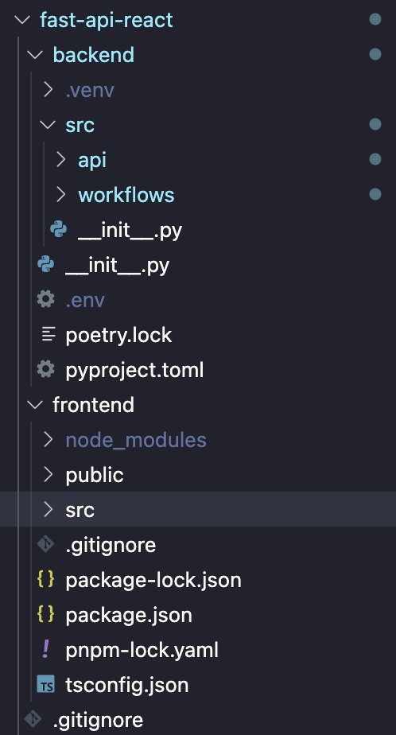

# Build a Fullstack RAG Chatbot with Hatchet and FastAPI

In this tutorial, we'll walk through the steps to implement a Retrevial Augmented Generation (RAG) Chatbot to answer questions based on the contents of a website.

This tutorial covers the following skills:

- serving user requests with FastAPI and Hatchet
- real-time progress streaming using Hatchet
- advanced LLM prompt-chaining and RAG design
- basic webscraping with requests and Beautiful Soup

## Prerequisites

This tutorial assumes you have a working understanding of Python, FastAPI, and React/Typescript.

- Python 3.8 or higher
- Poetry (`pip install poetry`)

We'll be splitting the backend into two services:

1. API which serves the FastAPI endpoints
2. Workflows which serve the Hatchet workers and workflows

Here's what our project directory structure should look like as we build:


{/* TODO .env TOKENS */}

## Init Poetry

Start by initializing a new Poetry project with `poetry init`.

Next, add the following dependences and scripts to your `pyproject.toml` in your project root:

```
[tool.poetry.dependencies]
python = "^3.8"
python-dotenv = "^1.0.0"
uvicorn = {extras = ["standard"], version = "^0.27.0"}
fastapi = "^0.109.0"
openai = "^1.11.0"
beautifulsoup4 = "^4.12.3"
requests = "^2.31.0"
urllib3 = "1.26.15"
hatchet-sdk = "0.10.5"

[tool.poetry.scripts]
api = "src.api.main:start"
hatchet = "src.workflows.main:start"
```

[View Complete File on GitHub](https://github.com/hatchet-dev/hatchet-python-quickstart/blob/main/fast-api-react/backend/pyproject.toml)

Finally, install the dependences with:
`poetry install`

## [Next Steps: Define a Hatchet Workflow and Worker →](./building-the-workflow.mdx)
