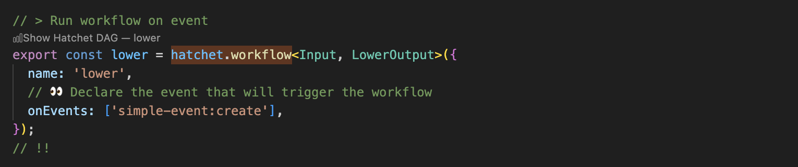
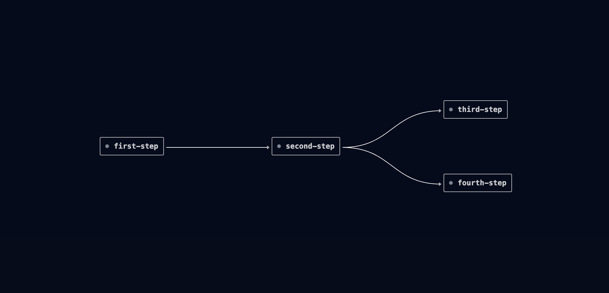

# Hatchet VSCode Extension

This is an extension for [Hatchet](https://github.com/hatchet-dev/hatchet) which allows visualization of Hatchet [DAGs](https://docs.hatchet.run/v1/patterns/directed-acyclic-graphs). This works with Hatchet's Python, Typescript, Go and Ruby SDKs.

## Usage

After installation, each Hatchet DAG definition will show a button `Show Hatchet DAG`:

This will then open a webview showing the DAG definition. As you update your definition, the webview will automatically stay up to date:

## Reporting issues

You can report issues in our [Github issues](https://github.com/hatchet-dev/hatchet/issues).
