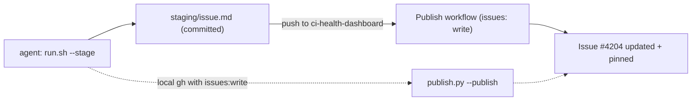

# CI Health Dashboard

A deterministic-first tool that mines GitHub Actions data into a pinned
[CI Health Dashboard](https://github.com/hatchet-dev/hatchet/issues) issue:
failure trends, the top failing jobs and tests, a flaky-vs-deterministic and
PR-vs-main classification, an LLM-labelled likely cause, and a "recent wins"
section of `ci-health` PRs.

Scripts do all the measuring. The agent only labels the *cause* of failure
signatures it has not seen before — that agent workflow is the
`ci-health-dashboard` skill (`.cursor/skills/ci-health-dashboard/SKILL.md`); this
README documents the tool the skill drives. State is cached locally so reruns are
cheap; `rm -rf .cache/` regenerates everything.

## Requirements

- [`uv`](https://docs.astral.sh/uv/) (each script is a self-contained PEP 723 script)
- `gh` authenticated with `repo` scope (`gh auth status`)

## Pipeline

| Stage | Script | LLM? | What it does |
| --- | --- | --- | --- |
| 1 | `collect.py` | no | Incrementally fetch runs + per-attempt jobs into `.cache/` |
| 2 | `parse_logs.py` | no | Download failed-step logs once; extract failing tests + signatures |
| 3 | `aggregate.py` | no | Top-10 jobs/tests, flaky/deterministic, PR/main, daily trend -> `out/analysis.json` |
| 4 | `wins.py` | no | Last 5 merged / open `ci-health` PRs -> `out/analysis.json` |
| - | `classify.py` | **yes** | Agent labels the cause of *new* signatures (cached by signature) |
| 5 | `render.py` | no | Build `out/issue.md` (tables + Mermaid trend) |
| 6 | `publish.py` | no | Update + pin the canonical dashboard issue in place (`--publish` to apply) |

## Modes

- **Local** (default): generates `out/issue.md` and never touches GitHub state.
- **Stage** (`--stage`): also copies the body to `staging/issue.md`. Committing and
  pushing that file to the `ci-health-dashboard` branch triggers the
  `Publish CI Health Dashboard` GitHub Action, which has `issues: write` and updates
  the issue. This is the path for unattended runs (the Cursor automation / cloud
  agent token can create issues but **cannot edit** them).
- **Publish** (`--publish`): edits the canonical issue in place and pins it, directly
  from `publish.py`. Requires a `gh` token with `issues: write` (e.g. running locally
  as yourself). The canonical issue is `config.DASHBOARD_ISSUE`, currently
  [#4204](https://github.com/hatchet-dev/hatchet/issues/4204); override with
  `publish.py --issue <n>`.

### Publishing topology



## Usage

```bash
# LOCAL MODE: deterministic stages + render -> out/issue.md (no GitHub writes)
bash run.sh

# classify any new failure signatures (the agent step; see the skill)
uv run classify.py pending            # JSON of unclassified signatures + sample errors
uv run classify.py set --hash <h> --category "<category>" --reason "<one line>"

# re-render with the new classifications
uv run render.py

# STAGE MODE: render + copy to staging/issue.md; commit & push to publish via CI
bash run.sh --stage
git add staging/issue.md && git commit -m "chore(ci): refresh CI health dashboard" \
  && git push origin HEAD:ci-health-dashboard

# PUBLISH MODE (direct): only when your gh has issues:write
uv run publish.py --publish           # dry run without --publish first
```

`classify.py` is the interface; deciding the category and reason is the agent
step, defined by the `ci-health-dashboard` skill.

## Cache

`.cache/` (gitignored, regenerable):

- `runs/<run_id>.json` — run metadata + per-attempt jobs (gating workflows)
- `job-failures/<job_id>.json` — parsed failing tests for one failed job
- `classifications.json` — signature -> {category, reason} (append-only)
- `meta.json` — last-collect timestamp + window

Completed runs/jobs/logs are immutable, so cached entries are never re-fetched.

A failure **signature** is
`workflow / job(matrix-stripped) / failing-step / normalized-error-line`
(digits, UUIDs, durations, ports masked). It is the dedup key for both trend
counting and classification.

## Scheduled Cursor Automation (suggested)

Create via the Automations editor (Agents Window):

- **Trigger:** cron, daily (e.g. `0 7 * * *`)
- **Repo / branch:** `hatchet-dev/hatchet` / the `ci-health-dashboard` branch
- **Prompt:**

  > Use the `ci-health-dashboard` skill to refresh and publish the dashboard:
  > run the deterministic pipeline, classify any new failure signatures, render,
  > stage the body, and push it to the `ci-health-dashboard` branch so the publish
  > workflow updates the issue.

The agent workflow itself is defined as a project skill at
`.cursor/skills/ci-health-dashboard/SKILL.md`. Notes:

- The automation's git checkout can only run scripts committed to the branch, so
  push the branch before relying on the schedule.
- The Cursor cloud token can create issues but cannot edit them, so the agent does
  **not** call `publish.py --publish` directly — it stages `staging/issue.md` and
  pushes; `.github/workflows/ci-health-dashboard-publish.yml` (which has
  `issues: write`) performs the actual issue update.
- `push`-triggered and `workflow_dispatch` workflows run from the branch where the
  workflow file lives, so this works before the tooling is merged. GitHub only runs
  `schedule:` (and surfaces `workflow_dispatch` in the UI) from the **default
  branch**, so keep the refresh cadence in the Cursor Automation until/unless this
  lands on `main`.

## Labeling wins

Apply the `ci-health` label to PRs that fix CI/test flakiness so they surface in
the dashboard's wins section.
