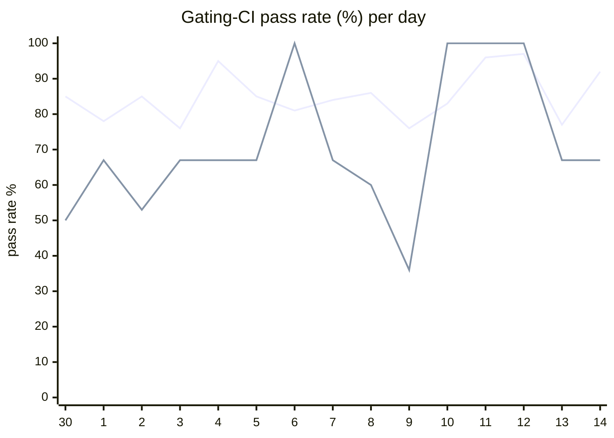

# CI Health Dashboard

_Window: last 14 days (trend + pass rate) · tables: last 24h · updated 2026-07-14T07:06:51Z · auto-generated, do not edit by hand._

**Gating-CI pass rate** — PR: 82% (1967/2394) · main: 62% (69/112)

## Gating-CI pass-rate trend

_X-axis = day of month (Jun 30 → Jul 14). Two lines: **CI** (PR gating-CI runs, generally the upper line) and **main** (post-merge main runs, lower). Y-axis = % of that day's gating-CI runs that passed._

## Top 10 failing jobs (last 24h)

| # | job | workflow | fails | recovered | runs | fail rate | flaky? | scope | cause |
| --- | --- | --- | --- | --- | --- | --- | --- | --- | --- |
| 1 | `generate` | test | 16 | 0 | 38 | 42% | flaky | PR | **infra/CI** — generate job Check for diff: protobuf/codegen outputs drift from committed files |
| 2 | `integration` | test | 10 | 0 | 38 | 26% | flaky | main + PR | **flaky test** — TestValidateOAuthState_EmptyStateBypass fails on duplicate Tenant_pkey (test DB isolation) |
| 3 | `build` | frontend / app | 7 | 0 | 24 | 29% | flaky | PR | **product bug** — Frontend org-invites TypeScript build errors on frontend/app workflow |
| 4 | `dashboard-arm` | build | 7 | 0 | 35 | 20% | flaky | PR | **product bug** — Docker dashboard-arm build fails: npm run build hits frontend org-invites TS errors |
| 5 | `dashboard-amd` | build | 7 | 0 | 35 | 20% | flaky | PR | **product bug** — Docker dashboard-amd build fails: npm run build hits frontend org-invites TS errors |
| 6 | `lite-amd` | build | 7 | 0 | 35 | 20% | flaky | PR | **product bug** — Docker lite-amd build fails: npm run build hits frontend org-invites TS errors |
| 7 | `lite-arm` | build | 7 | 0 | 35 | 20% | flaky | PR | **product bug** — Docker lite-arm build fails: npm run build hits frontend org-invites TS errors |
| 8 | `authdisabled` | build | 7 | 0 | 35 | 20% | flaky | PR | **product bug** — Docker authdisabled build fails: npm run build hits frontend org-invites TS errors |
| 9 | `frontend` | build | 7 | 0 | 35 | 20% | flaky | PR | **product bug** — Frontend org-invites TS errors in new-organization-saver-form (Organization union mismatch) |
| 10 | `unit` | test | 4 | 0 | 38 | 10% | flaky | PR | **product bug** — RBAC TestAuthorizeTenantOperations nil deref in Authorizer.IsAuthorized (pkg/auth/rbac) |

## Top 10 failing tests (last 24h)

| # | test | job | fails | runs | fail rate | flaky? | scope | cause |
| --- | --- | --- | --- | --- | --- | --- | --- | --- |
| 1 | `(unparsed)` | `generate` | 16 | 38 | 42% | flaky | PR | **infra/CI** — generate job Check for diff: protobuf/codegen outputs drift from committed files |
| 2 | `(unparsed)` | `build` | 7 | 24 | 29% | flaky | PR | **product bug** — Frontend org-invites TypeScript build errors on frontend/app workflow |
| 3 | `(unparsed)` | `dashboard-arm` | 7 | 35 | 20% | flaky | PR | **product bug** — Docker dashboard-arm build fails: npm run build hits frontend org-invites TS errors |
| 4 | `(unparsed)` | `dashboard-amd` | 7 | 35 | 20% | flaky | PR | **product bug** — Docker dashboard-amd build fails: npm run build hits frontend org-invites TS errors |
| 5 | `(unparsed)` | `authdisabled` | 7 | 35 | 20% | flaky | PR | **product bug** — Docker authdisabled build fails: npm run build hits frontend org-invites TS errors |
| 6 | `(unparsed)` | `frontend` | 7 | 35 | 20% | flaky | PR | **product bug** — Frontend org-invites TS errors in new-organization-saver-form (Organization union mismatch) |
| 7 | `(unparsed)` | `lite-arm` | 6 | 35 | 17% | flaky | PR | **product bug** — Docker lite-arm build fails: npm run build hits frontend org-invites TS errors |
| 8 | `(unparsed)` | `lite-amd` | 5 | 35 | 14% | flaky | PR | **product bug** — Docker lite-amd build fails: npm run build hits frontend org-invites TS errors |
| 9 | `TestValidateOAuthState_EmptyStateBypass` | `integration` | 4 | 38 | 10% | flaky | main + PR | **flaky test** — TestValidateOAuthState_EmptyStateBypass fails on duplicate Tenant_pkey (test DB isolation) |
| 10 | `(unparsed)` | `load-deadlock` | 4 | 38 | 10% | flaky | PR | **flaky test** — load-deadlock goleak reports unexpected goroutines in hatchet-loadtest after long run |

## Recent CI-health wins (`ci-health`)

**Recently merged**

- https://github.com/hatchet-dev/hatchet/pull/4239
- https://github.com/hatchet-dev/hatchet/pull/4238
- https://github.com/hatchet-dev/hatchet/pull/4218
- https://github.com/hatchet-dev/hatchet/pull/4213
- https://github.com/hatchet-dev/hatchet/pull/4165

**Open**

_No open `ci-health` PRs yet._

---
_Trend and pass-rate totals cover the last 14 days; job/test tables cover the last 24h._ **fails** = gating runs where the job/test failed · **recovered** = failed on a first attempt but passed on re-run (a flakiness signal) · **runs** = total gating runs of that workflow · **fail rate** = fails ÷ runs · **flaky** = recovered on re-run or intermittent across runs; **deterministic** = fails every time it runs · **scope** = whether failures were seen on PR, main, or main + PR.
