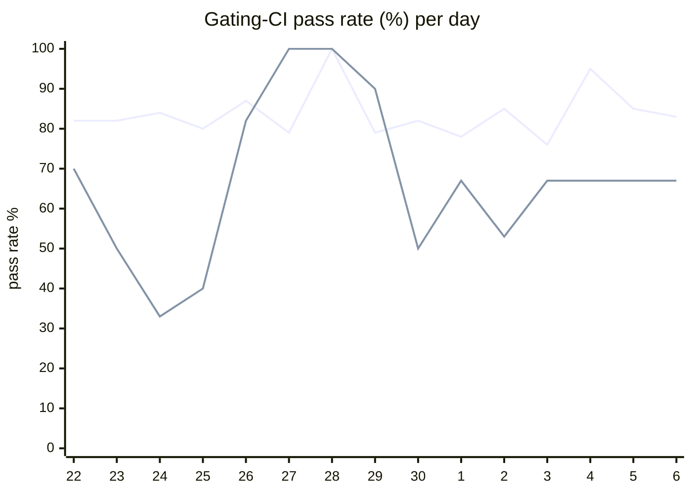

# CI Health Dashboard

_Window: last 14 days (trend + pass rate) · tables: last 24h · updated 2026-07-06T07:08:02Z · auto-generated, do not edit by hand._

**Gating-CI pass rate** — PR: 82% (1598/1947) · main: 63% (62/99)

## Gating-CI pass-rate trend

_X-axis = day of month (Jun 22 → Jul 06). Two lines: **CI** (PR gating-CI runs, generally the upper line) and **main** (post-merge main runs, lower). Y-axis = % of that day's gating-CI runs that passed._

## Top 10 failing jobs (last 24h)

| # | job | workflow | fails | recovered | runs | fail rate | flaky? | scope | cause |
| --- | --- | --- | --- | --- | --- | --- | --- | --- | --- |
| 1 | `e2e-pgmq` | test | 3 | 0 | 8 | 38% | flaky | PR | **flaky test** — Durable eviction e2e intermittently fails on task status polling |
| 2 | `test-templates` | cli-e2e-tests | 2 | 0 | 4 | 50% | flaky | PR | **timeout** — CLI quickstart template suite fails when go_go subtest times out (~500s total) |
| 3 | `test` | python | 2 | 0 | 8 | 25% | flaky | PR | **flaky test** — test_waits races on random_number vs skipped condition output |
| 4 | `lint` | frontend / app | 1 | 0 | 6 | 17% | flaky | PR | **infra/CI** — Prettier/eslint formatting drift on frontend V1LogLineLevel union type |
| 5 | `cypress` | frontend / app | 1 | 0 | 6 | 17% | flaky | PR | **flaky test** — Cypress tenant-invite-decline cannot find Decline button within 15s |
| 6 | `generate` | test | 1 | 0 | 8 | 12% | flaky | PR | **infra/CI** — Codegen check-for-diff: committed hatchetembed dashboard assets out of sync |
| 7 | `lint` | lint all | 1 | 0 | 13 | 8% | flaky | PR | **infra/CI** — pre-commit embed-dashboard hook fails rebuilding hatchetembed assets on PR |

## Top 10 failing tests (last 24h)

| # | test | job | fails | runs | fail rate | flaky? | scope | cause |
| --- | --- | --- | --- | --- | --- | --- | --- | --- |
| 1 | `TestQuickstartTemplates` | `test-templates` | 2 | 4 | 50% | flaky | PR | **timeout** — CLI quickstart template suite fails when go_go subtest times out (~500s total) |
| 2 | `TestQuickstartTemplates/go_go` | `test-templates` | 2 | 4 | 50% | flaky | PR | **timeout** — Go quickstart template subtest runs ~311s then fails waiting for Hatchet task |
| 3 | `examples/conditions/test_conditions.py::test_waits` | `test` | 2 | 8 | 25% | flaky | PR | **flaky test** — test_waits races on random_number vs skipped condition output |
| 4 | `TestMultipleEvictionCycle` | `e2e-pgmq` | 2 | 8 | 25% | flaky | PR | **flaky test** — Durable eviction e2e intermittently fails on task status polling |
| 5 | `(unparsed)` | `lint` | 1 | 6 | 17% | flaky | PR | **infra/CI** — Prettier/eslint formatting drift on frontend V1LogLineLevel union type |
| 6 | `(unparsed)` | `cypress` | 1 | 6 | 17% | flaky | PR | **flaky test** — Cypress tenant-invite-decline cannot find Decline button within 15s |
| 7 | `TestDurableReplayReset` | `e2e-pgmq` | 1 | 8 | 12% | flaky | PR | **flaky test** — Durable replay reset e2e flakes polling terminal task status |
| 8 | `TestDurableReplayReset/node_2` | `e2e-pgmq` | 1 | 8 | 12% | flaky | PR | **flaky test** — Durable replay reset e2e subtest flakes on status polling (404/not-found races) |
| 9 | `(unparsed)` | `generate` | 1 | 8 | 12% | flaky | PR | **infra/CI** — Codegen check-for-diff: committed hatchetembed dashboard assets out of sync |
| 10 | `(unparsed)` | `lint` | 1 | 8 | 12% | flaky | PR | **infra/CI** — Prettier formatting drift on TypeScript DurableTaskEvent union types |

## Recent CI-health wins (`ci-health`)

**Recently merged**

- https://github.com/hatchet-dev/hatchet/pull/4239
- https://github.com/hatchet-dev/hatchet/pull/4238
- https://github.com/hatchet-dev/hatchet/pull/4218
- https://github.com/hatchet-dev/hatchet/pull/4213
- https://github.com/hatchet-dev/hatchet/pull/4165

**Open**

_No open `ci-health` PRs yet._

---
_Trend and pass-rate totals cover the last 14 days; job/test tables cover the last 24h._ **fails** = gating runs where the job/test failed · **recovered** = failed on a first attempt but passed on re-run (a flakiness signal) · **runs** = total gating runs of that workflow · **fail rate** = fails ÷ runs · **flaky** = recovered on re-run or intermittent across runs; **deterministic** = fails every time it runs · **scope** = whether failures were seen on PR, main, or main + PR.
