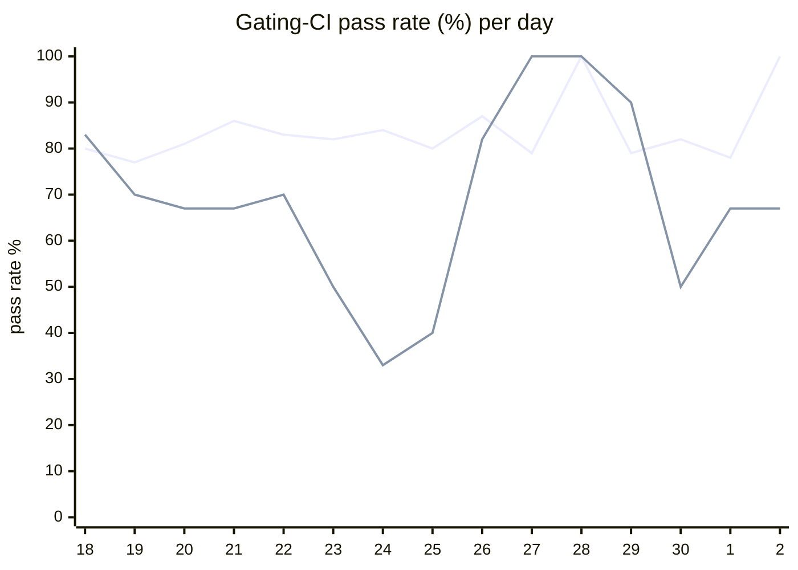

# CI Health Dashboard

_Window: last 14 days (trend + pass rate) · tables: last 24h · updated 2026-07-02T07:07:27Z · auto-generated, do not edit by hand._

**Gating-CI pass rate** — PR: 82% (1357/1661) · main: 66% (73/110)

## Gating-CI pass-rate trend

_X-axis = day of month (Jun 18 → Jul 02). Two lines: **CI** (PR gating-CI runs, generally the upper line) and **main** (post-merge main runs, lower). Y-axis = % of that day's gating-CI runs that passed._

## Top 10 failing jobs (last 24h)

| # | job | workflow | fails | recovered | runs | fail rate | flaky? | scope | cause |
| --- | --- | --- | --- | --- | --- | --- | --- | --- | --- |
| 1 | `integration` | test | 8 | 0 | 28 | 29% | flaky | main + PR | **product bug** — is_dag_orchestrator NOT NULL constraint violation in scheduling integration test |
| 2 | `generate` | test | 4 | 0 | 28 | 14% | flaky | PR | **infra/CI** — Generate job Check-for-diff failed; committed codegen out of sync |
| 3 | `load-pgbouncer` | test | 4 | 0 | 28 | 14% | flaky | PR | **flaky test** — TestLoadCLI load test intermittently fails under pgbouncer race/load |
| 4 | `cypress` | frontend / app | 3 | 0 | 14 | 21% | flaky | PR | **flaky test** — Cypress cy.first() DOM timeout in tenant-switching UI spec |
| 5 | `e2e-pgmq` | test | 3 | 0 | 28 | 11% | flaky | main + PR | **flaky test** — TestMultipleEvictionCycle timing-sensitive e2e-pgmq eviction assertion |
| 6 | `test` | python | 2 | 0 | 22 | 9% | flaky | PR | **product bug** — Durable sleep cancel replay pytest fails with FailedTaskRunExceptionGroup |
| 7 | `old-engine-new-sdk` | python | 2 | 0 | 22 | 9% | flaky | PR | **unknown** — Git fetch branch listing noise; old-engine-new-sdk job cancelled without actionable error |
| 8 | `old-engine-new-sdk` | typescript | 2 | 0 | 22 | 9% | flaky | PR | **unknown** — Git fetch branch listing noise; old-engine-new-sdk job cancelled without actionable error |
| 9 | `rampup` | test | 2 | 0 | 28 | 7% | flaky | PR | **product bug** — Durable events listener rollback unit test failing on durable-tasks PR |
| 10 | `e2e` | test | 2 | 0 | 28 | 7% | flaky | PR | **infra/CI** — E2E job timed out waiting for Hatchet engine/API to become ready |

## Top 10 failing tests (last 24h)

| # | test | job | fails | runs | fail rate | flaky? | scope | cause |
| --- | --- | --- | --- | --- | --- | --- | --- | --- |
| 1 | `examples/durable/test_durable.py::test_durable_sleep_cancel_replay` | `test` | 6 | 22 | 27% | flaky | PR | **product bug** — Durable sleep cancel replay pytest fails with FailedTaskRunExceptionGroup |
| 2 | `examples/bug_tests/payload_bug_on_replay/test_payload_replay_bug.py::test_payload_replay_bug` | `test` | 6 | 22 | 27% | flaky | PR | **product bug** — Payload replay bug test fails with FailedTaskRunExceptionGroup on durable-tasks PR |
| 3 | `TestLoadCLI` | `load-pgbouncer` | 6 | 28 | 21% | flaky | main + PR | **flaky test** — TestLoadCLI load test intermittently fails under pgbouncer race/load |
| 4 | `TestLoadCLI/test_with_DAG` | `load-pgbouncer` | 6 | 28 | 21% | flaky | main + PR | **timeout** — TestLoadCLI/test_with_DAG hit 400s subtest timeout under load-pgbouncer |
| 5 | `TestConcurrency_GroupRoundRobin` | `integration` | 6 | 28 | 21% | flaky | PR | **product bug** — is_dag_orchestrator NOT NULL constraint violation in scheduling integration test |
| 6 | `(unparsed)` | `load-pgbouncer` | 4 | 28 | 14% | flaky | main + PR | **unknown** — Captured go test command echo from load-pgbouncer; no distinct failure line |
| 7 | `(unparsed)` | `cypress` | 3 | 14 | 21% | flaky | PR | **flaky test** — Cypress cy.first() DOM timeout in tenant-switching UI spec |
| 8 | `(unparsed)` | `generate` | 3 | 28 | 11% | flaky | PR | **infra/CI** — Generate job Check-for-diff failed; committed codegen out of sync |
| 9 | `(unparsed)` | `old-engine-new-sdk` | 2 | 22 | 9% | flaky | PR | **unknown** — Git fetch branch listing noise; old-engine-new-sdk job cancelled without actionable error |
| 10 | `(unparsed)` | `old-engine-new-sdk` | 2 | 22 | 9% | flaky | PR | **unknown** — Git fetch branch listing noise; old-engine-new-sdk job cancelled without actionable error |

## Recent CI-health wins (`ci-health`)

**Recently merged**

- https://github.com/hatchet-dev/hatchet/pull/4239
- https://github.com/hatchet-dev/hatchet/pull/4238
- https://github.com/hatchet-dev/hatchet/pull/4218
- https://github.com/hatchet-dev/hatchet/pull/4213
- https://github.com/hatchet-dev/hatchet/pull/4165

**Open**

_No open `ci-health` PRs yet._

---
_Trend and pass-rate totals cover the last 14 days; job/test tables cover the last 24h._ **fails** = gating runs where the job/test failed · **recovered** = failed on a first attempt but passed on re-run (a flakiness signal) · **runs** = total gating runs of that workflow · **fail rate** = fails ÷ runs · **flaky** = recovered on re-run or intermittent across runs; **deterministic** = fails every time it runs · **scope** = whether failures were seen on PR, main, or main + PR.
