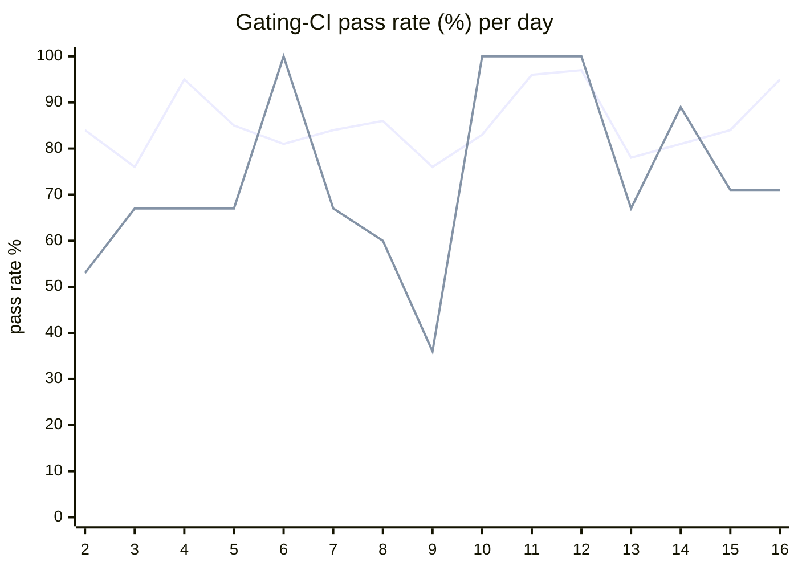

# CI Health Dashboard

_Window: last 14 days (trend + pass rate) · tables: last 24h · updated 2026-07-16T07:09:24Z · auto-generated, do not edit by hand._

**Gating-CI pass rate** — PR: 82% (2123/2583) · main: 68% (84/123)

## Gating-CI pass-rate trend

_X-axis = day of month (Jul 02 → Jul 16). Two lines: **CI** (PR gating-CI runs, generally the upper line) and **main** (post-merge main runs, lower). Y-axis = % of that day's gating-CI runs that passed._

## Top 10 failing jobs (last 24h)

| # | job | workflow | fails | recovered | runs | fail rate | flaky? | scope | cause |
| --- | --- | --- | --- | --- | --- | --- | --- | --- | --- |
| 1 | `unit` | test | 7 | 0 | 39 | 18% | flaky | main + PR | **flaky test** — Scheduler unit test latency threshold flake (2.107s vs 2.1s max on replenish timeouts) |
| 2 | `build` | frontend / app | 4 | 0 | 19 | 21% | flaky | PR | **product bug** — Frontend org-invites TypeScript errors (Organization union mismatch in new-organization-saver-form) |
| 3 | `authdisabled` | build | 4 | 0 | 29 | 14% | flaky | PR | **product bug** — Docker build fails on frontend TS compile errors during dashboard (authdisabled) image build |
| 4 | `frontend` | build | 4 | 0 | 29 | 14% | flaky | PR | **product bug** — Frontend org-invites TypeScript errors (Organization union mismatch in new-organization-saver-form) |
| 5 | `lite-amd` | build | 4 | 0 | 29 | 14% | flaky | PR | **product bug** — Docker build fails on frontend TS compile errors (org-invites API/type drift), not Alpine apk |
| 6 | `dashboard-amd` | build | 4 | 0 | 29 | 14% | flaky | PR | **product bug** — Docker build fails on frontend TS compile errors during dashboard-amd image build |
| 7 | `lite-arm` | build | 4 | 0 | 29 | 14% | flaky | PR | **product bug** — Docker build fails on frontend TS compile errors during lite-arm image build |
| 8 | `dashboard-arm` | build | 4 | 0 | 29 | 14% | flaky | PR | **product bug** — Docker build fails on frontend TS compile errors during dashboard-arm image build |
| 9 | `integration` | test | 3 | 0 | 39 | 8% | flaky | PR | **product bug** — Scheduling integration test hits NOT NULL violation on v1_task.is_dag_orchestrator column |
| 10 | `generate` | test | 3 | 0 | 39 | 8% | flaky | PR | **infra/CI** — generate job Check for diff fails (committed generated/prettier output drift) |

## Top 10 failing tests (last 24h)

| # | test | job | fails | runs | fail rate | flaky? | scope | cause |
| --- | --- | --- | --- | --- | --- | --- | --- | --- |
| 1 | `TestScheduler_TryAssign_NotStarvedByRepeatedReplenishTimeouts` | `unit` | 6 | 39 | 15% | flaky | main + PR | **flaky test** — Scheduler unit test latency threshold flake (2.107s vs 2.1s max on replenish timeouts) |
| 2 | `(unparsed)` | `test` | 4 | 8 | 50% | flaky | PR | **infra/CI** — Ruby examples bundle install fails in frozen mode (Gemfile.lock out of sync) |
| 3 | `(unparsed)` | `build` | 4 | 19 | 21% | flaky | PR | **product bug** — Frontend org-invites TypeScript errors (Organization union mismatch in new-organization-saver-form) |
| 4 | `(unparsed)` | `authdisabled` | 4 | 29 | 14% | flaky | PR | **product bug** — Docker build fails on frontend TS compile errors during dashboard (authdisabled) image build |
| 5 | `(unparsed)` | `dashboard-arm` | 4 | 29 | 14% | flaky | PR | **product bug** — Docker build fails on frontend TS compile errors during dashboard-arm image build |
| 6 | `(unparsed)` | `frontend` | 4 | 29 | 14% | flaky | PR | **product bug** — Frontend org-invites TypeScript errors (Organization union mismatch in new-organization-saver-form) |
| 7 | `(unparsed)` | `lite-amd` | 4 | 29 | 14% | flaky | PR | **product bug** — Docker build fails on frontend TS compile errors (org-invites API/type drift), not Alpine apk |
| 8 | `(unparsed)` | `dashboard-amd` | 4 | 29 | 14% | flaky | PR | **product bug** — Docker build fails on frontend TS compile errors during dashboard-amd image build |
| 9 | `(unparsed)` | `lint` | 3 | 23 | 13% | flaky | PR | **infra/CI** — TypeScript SDK lint fails prettier/prettier on durable task event union formatting |
| 10 | `(unparsed)` | `lite-arm` | 3 | 29 | 10% | flaky | PR | **product bug** — Docker build fails on frontend TS compile errors during lite-arm image build |

## Recent CI-health wins (`ci-health`)

**Recently merged**

- https://github.com/hatchet-dev/hatchet/pull/4239
- https://github.com/hatchet-dev/hatchet/pull/4238
- https://github.com/hatchet-dev/hatchet/pull/4218
- https://github.com/hatchet-dev/hatchet/pull/4213
- https://github.com/hatchet-dev/hatchet/pull/4165

**Open**

_No open `ci-health` PRs yet._

---
_Trend and pass-rate totals cover the last 14 days; job/test tables cover the last 24h._ **fails** = gating runs where the job/test failed · **recovered** = failed on a first attempt but passed on re-run (a flakiness signal) · **runs** = total gating runs of that workflow · **fail rate** = fails ÷ runs · **flaky** = recovered on re-run or intermittent across runs; **deterministic** = fails every time it runs · **scope** = whether failures were seen on PR, main, or main + PR.
