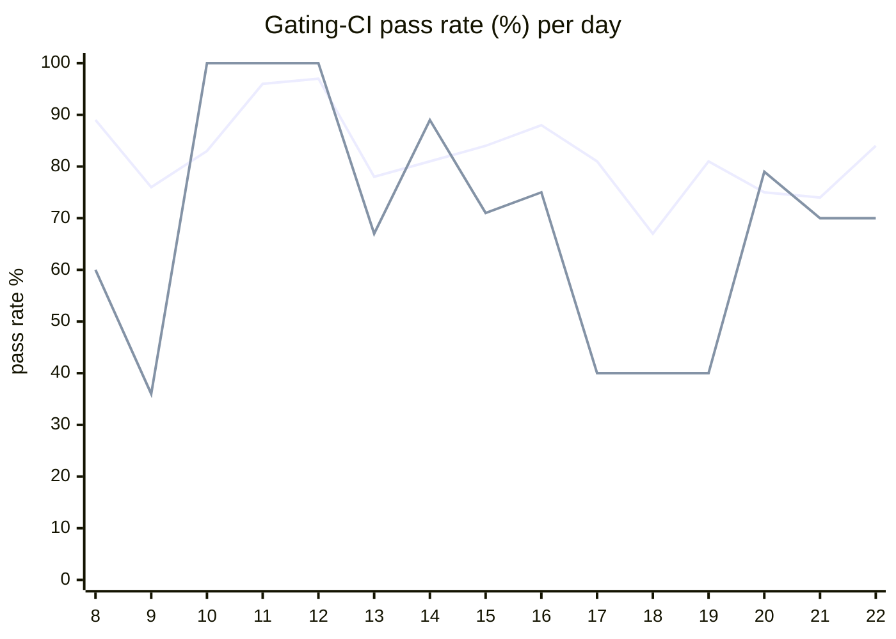

# CI Health Dashboard

_Window: last 14 days (trend + pass rate) · tables: last 24h · updated 2026-07-22T07:06:52Z · auto-generated, do not edit by hand._

**Gating-CI pass rate** — PR: 81% (2209/2732) · main: 70% (96/138)

## Gating-CI pass-rate trend

_X-axis = day of month (Jul 08 → Jul 22). Two lines: **CI** (PR gating-CI runs, generally the upper line) and **main** (post-merge main runs, lower). Y-axis = % of that day's gating-CI runs that passed._

## Top 10 failing jobs (last 24h)

| # | job | workflow | fails | recovered | runs | fail rate | flaky? | scope | cause |
| --- | --- | --- | --- | --- | --- | --- | --- | --- | --- |
| 1 | `lint` | ruby | 10 | 0 | 25 | 40% | flaky | PR | **infra/CI** — Ruby SDK generated bindings validation out of date |
| 2 | `integration` | test | 8 | 0 | 34 | 24% | flaky | main + PR | **flaky test** — msgqueue sub-buffer test times out sending messages under CI load |
| 3 | `unit` | test | 7 | 0 | 34 | 21% | flaky | main + PR | **flaky test** — scheduler TryAssign starvation test flakes on replenish timeout timing |
| 4 | `lint` | typescript | 6 | 0 | 31 | 19% | flaky | PR | **infra/CI** — TypeScript SDK generated bindings check failed (throw error) |
| 5 | `load-online-migrate` | test | 4 | 0 | 34 | 12% | flaky | PR | **infra/CI** — load-online-migrate timed out waiting for engine gRPC port 7077 |
| 6 | `generate` | test | 4 | 0 | 34 | 12% | flaky | PR | **infra/CI** — generate check-for-diff failed (prettier/format drift in frontend) |
| 7 | `cypress` | frontend / app | 3 | 0 | 30 | 10% | flaky | PR | **flaky test** — Cypress auth/UI specs fail on element visibility/timeouts |
| 8 | `compile` | go | 2 | 0 | 27 | 7% | flaky | PR | **product bug** — Go SDK examples fail compile: undefined types.BatchConfig on batch-flush branch |
| 9 | `lint` | frontend / app | 2 | 0 | 30 | 7% | flaky | PR | **infra/CI** — frontend prettier lint drift on getThemeToDisplay ternary formatting |
| 10 | `e2e-pgmq` | test | 2 | 0 | 34 | 6% | flaky | PR | **flaky test** — durable eviction e2e race: second eviction assertion fails intermittently |

## Top 10 failing tests (last 24h)

| # | test | job | fails | runs | fail rate | flaky? | scope | cause |
| --- | --- | --- | --- | --- | --- | --- | --- | --- |
| 1 | `(unparsed)` | `lint` | 9 | 25 | 36% | flaky | PR | **infra/CI** — Ruby SDK generated bindings validation out of date |
| 2 | `(unparsed)` | `lint` | 8 | 31 | 26% | flaky | PR | **infra/CI** — TypeScript SDK generated bindings check failed (throw error) |
| 3 | `examples/batch_assign/test_batch_assign.py::test_completes_all_tasks_with_large_payloads` | `test` | 5 | 27 | 18% | flaky | PR | **flaky test** — batch_assign large-payload test hits 1m batch timeout under CI load |
| 4 | `(unparsed)` | `lint` | 4 | 27 | 15% | flaky | PR | **infra/CI** — Python SDK generated bindings check-for-diff failed |
| 5 | `(unparsed)` | `test-e2e` | 4 | 31 | 13% | flaky | main + PR | **infra/CI** — TypeScript e2e protoc install action unable to get latest version |
| 6 | `TestScheduler_TryAssign_NotStarvedByRepeatedReplenishTimeouts` | `unit` | 4 | 34 | 12% | flaky | PR | **flaky test** — scheduler TryAssign starvation test flakes on replenish timeout timing |
| 7 | `(unparsed)` | `load-online-migrate` | 4 | 34 | 12% | flaky | PR | **infra/CI** — load-online-migrate timed out waiting for engine gRPC port 7077 |
| 8 | `examples/conditions/test_conditions.py::test_waits` | `test` | 3 | 27 | 11% | flaky | PR | **flaky test** — conditions test_waits expects skipped branch but random_number path ran |
| 9 | `(unparsed)` | `cypress` | 3 | 30 | 10% | flaky | PR | **flaky test** — Cypress auth/UI specs fail on element visibility/timeouts |
| 10 | `(unparsed)` | `generate` | 3 | 34 | 9% | flaky | PR | **infra/CI** — generate check-for-diff failed (prettier/format drift in frontend) |

## Recent CI-health wins (`ci-health`)

**Recently merged**

- https://github.com/hatchet-dev/hatchet/pull/4239
- https://github.com/hatchet-dev/hatchet/pull/4238
- https://github.com/hatchet-dev/hatchet/pull/4218
- https://github.com/hatchet-dev/hatchet/pull/4213
- https://github.com/hatchet-dev/hatchet/pull/4165

**Open**

_No open `ci-health` PRs yet._

---
_Trend and pass-rate totals cover the last 14 days; job/test tables cover the last 24h._ **fails** = gating runs where the job/test failed · **recovered** = failed on a first attempt but passed on re-run (a flakiness signal) · **runs** = total gating runs of that workflow · **fail rate** = fails ÷ runs · **flaky** = recovered on re-run or intermittent across runs; **deterministic** = fails every time it runs · **scope** = whether failures were seen on PR, main, or main + PR.
